# Madrid Air Quality Analytics Pipeline

## Advanced Coding for Data Analytics (2025/2026): LUISS Guido Carli

> Dataset: METRAQ Air Quality Dataset (Madrid) - 64,881,744 hourly rows · 24 monitoring stations · January 2001 to December 2024  
> Source: David María-Arribas et al., https://huggingface.co/datasets/dmariaa70/METRAQ-Air-Quality

## Table of Contents

1. [Project Overview & Goals](#1-project-overview--goals)
2. [Dataset Description](#2-dataset-description)
3. [How to Run](#3-how-to-run)
4. [Repository Structure](#4-repository-structure)
5. [Task 1 - Load Data & Inspect Structure](#5-task-1--load-data--inspect-structure)
6. [Task 2 - Missingness & Data Quality](#6-task-2--missingness--data-quality)
7. [Task 3 - Imputation](#7-task-3--imputation)
8. [Task 4 - Temporal Analysis](#8-task-4--temporal-analysis)
9. [Task 5 - Spatial Network](#9-task-5--spatial-network)
10. [Task 6 - Correlation Network](#10-task-6--correlation-network)
11. [Task 7 - Propagation Modeling (Optional)](#11-task-7--propagation-modeling-optional)
12. [Task 8 - Parallelization](#12-task-8--parallelization)
13. [Task 9 - Forecasting Model (Optional)](#13-task-9--forecasting-model-optional)
14. [Task 10 - Final Visualization](#14-task-10--final-visualization)
15. [Global Design Decisions & Constants](#15-global-design-decisions--constants)
16. [Scalability & Reproducibility](#16-scalability--reproducibility)

## 1. Project Overview & Goals

Air quality is a major public-health concern across European cities. Exposure to pollutants such as NO₂, &lt;PM10, and SO₂ is linked to respiratory and cardiovascular disease, making evidence-based monitoring and analysis essential for city planners and health authorities.

This project implements a complete analytics pipeline for Madrid air quality using the METRAQ dataset. The pipeline is designed to answer three overarching questions :

1. What are the current pollution patterns in Madrid?, addressed through temporal analysis (Task 4), spatial analysis (Task 5), and final visualizations (Task 10).
2. Which areas are most affected?, addressed through the spatial network and community detection (Task 5), per-sensor correlation analysis (Task 6), and the diffusion model's per-sensor error map (Task 7).
3. What are the relationships between pollution and other variables (weather, traffic)?, addressed through correlation network analysis (Task 6), parallelized correlation matrices (Task 8), and the forecasting model (Task 9).

The pipeline covers all mandatory tasks (1-6, 8, 10) plus both optional tasks (7 and 9). Every result is fully reproducible by running a single Python script.

## 2. Dataset Description

### Schema

Every row represents one hourly measurement at one sensor:

<table style="border-collapse:collapse;width:100%;background:#ffffff;margin:10px 0;">
  <thead><tr>
    <th style="background:#ffffff;padding:6px 14px;border:1px solid #cccccc;font-weight:bold;text-align:left;">Column</th>
    <th style="background:#ffffff;padding:6px 14px;border:1px solid #cccccc;font-weight:bold;text-align:left;">Type</th>
    <th style="background:#ffffff;padding:6px 14px;border:1px solid #cccccc;font-weight:bold;text-align:left;">Description</th>
  </tr></thead>
  <tbody>
  <tr>
    <td style="background:#ffffff;padding:6px 14px;border:1px solid #cccccc;text-align:left;">`sensor_id`</td>
    <td style="background:#ffffff;padding:6px 14px;border:1px solid #cccccc;text-align:left;">int32</td>
    <td style="background:#ffffff;padding:6px 14px;border:1px solid #cccccc;text-align:left;">Unique numeric ID of the monitoring station</td>
  </tr>
  <tr>
    <td style="background:#ffffff;padding:6px 14px;border:1px solid #cccccc;text-align:left;">`sensor_name`</td>
    <td style="background:#ffffff;padding:6px 14px;border:1px solid #cccccc;text-align:left;">category</td>
    <td style="background:#ffffff;padding:6px 14px;border:1px solid #cccccc;text-align:left;">Human-readable station name (e.g., "Plaza de España")</td>
  </tr>
  <tr>
    <td style="background:#ffffff;padding:6px 14px;border:1px solid #cccccc;text-align:left;">`utm_x`</td>
    <td style="background:#ffffff;padding:6px 14px;border:1px solid #cccccc;text-align:left;">float32</td>
    <td style="background:#ffffff;padding:6px 14px;border:1px solid #cccccc;text-align:left;">UTM easting coordinate (metres, ETRS89 zone 30N)</td>
  </tr>
  <tr>
    <td style="background:#ffffff;padding:6px 14px;border:1px solid #cccccc;text-align:left;">`utm_y`</td>
    <td style="background:#ffffff;padding:6px 14px;border:1px solid #cccccc;text-align:left;">float32</td>
    <td style="background:#ffffff;padding:6px 14px;border:1px solid #cccccc;text-align:left;">UTM northing coordinate</td>
  </tr>
  <tr>
    <td style="background:#ffffff;padding:6px 14px;border:1px solid #cccccc;text-align:left;">`magnitude_id`</td>
    <td style="background:#ffffff;padding:6px 14px;border:1px solid #cccccc;text-align:left;">int16</td>
    <td style="background:#ffffff;padding:6px 14px;border:1px solid #cccccc;text-align:left;">Numeric code for the measured variable</td>
  </tr>
  <tr>
    <td style="background:#ffffff;padding:6px 14px;border:1px solid #cccccc;text-align:left;">`magnitude_name`</td>
    <td style="background:#ffffff;padding:6px 14px;border:1px solid #cccccc;text-align:left;">category</td>
    <td style="background:#ffffff;padding:6px 14px;border:1px solid #cccccc;text-align:left;">Variable name (e.g., "NO2", "TEMP", "TI_IDW")</td>
  </tr>
  <tr>
    <td style="background:#ffffff;padding:6px 14px;border:1px solid #cccccc;text-align:left;">`entry_date`</td>
    <td style="background:#ffffff;padding:6px 14px;border:1px solid #cccccc;text-align:left;">datetime</td>
    <td style="background:#ffffff;padding:6px 14px;border:1px solid #cccccc;text-align:left;">Timestamp of the measurement (hourly resolution)</td>
  </tr>
  <tr>
    <td style="background:#ffffff;padding:6px 14px;border:1px solid #cccccc;text-align:left;">`value`</td>
    <td style="background:#ffffff;padding:6px 14px;border:1px solid #cccccc;text-align:left;">float32</td>
    <td style="background:#ffffff;padding:6px 14px;border:1px solid #cccccc;text-align:left;">Observed or interpolated value</td>
  </tr>
  <tr>
    <td style="background:#ffffff;padding:6px 14px;border:1px solid #cccccc;text-align:left;">`is_interpolated`</td>
    <td style="background:#ffffff;padding:6px 14px;border:1px solid #cccccc;text-align:left;">bool</td>
    <td style="background:#ffffff;padding:6px 14px;border:1px solid #cccccc;text-align:left;">`True` = originally missing, filled by METRAQ; `False` = real measurement</td>
  </tr>
  </tbody>
</table>

### Variable Categories

The 36 distinct variables are classified into three categories in `classify_variable()`:

Air Quality (14 pollutants):
&lt;PM10, &lt;PM2.5, `BENCENO`, `CO`, `ETILBENCENO`, `HIDROCARBS_NO_METANICOS`, `HIDROCARBS_TOTALES`, `METANO`, `NO`, `NO2`, `NOX`, `O3`, `SO2`, `TOLUENO`

Meteorology (7 variables):
`DV` (wind direction), `HR` (relative humidity), `PRE` (atmospheric pressure), `PRECIPITACION` (rainfall), `RS` (solar radiation), `TEMP` (air temperature), `VV` (wind speed)

Traffic (15 variables - 3 dimensions × 5 interpolation methods):
`TI_*` = traffic intensity, `SP_*` = average speed, `OC_*` = road occupancy/congestion.
Suffixes: `IDW`, `KRIGING`, `RBF_GAUSSIAN`, `RBF_LINEAR`, `RBF_MULTIQUADRIQ`.

### Dataset Size

<table style="border-collapse:collapse;width:100%;background:#ffffff;margin:10px 0;">
  <thead><tr>
    <th style="background:#ffffff;padding:6px 14px;border:1px solid #cccccc;font-weight:bold;text-align:left;">Category</th>
    <th style="background:#ffffff;padding:6px 14px;border:1px solid #cccccc;font-weight:bold;text-align:left;">Rows</th>
    <th style="background:#ffffff;padding:6px 14px;border:1px solid #cccccc;font-weight:bold;text-align:left;">Percentage</th>
  </tr></thead>
  <tbody>
  <tr>
    <td style="background:#ffffff;padding:6px 14px;border:1px solid #cccccc;text-align:left;">Traffic</td>
    <td style="background:#ffffff;padding:6px 14px;border:1px solid #cccccc;text-align:left;">30,507,768</td>
    <td style="background:#ffffff;padding:6px 14px;border:1px solid #cccccc;text-align:left;">47.0%</td>
  </tr>
  <tr>
    <td style="background:#ffffff;padding:6px 14px;border:1px solid #cccccc;text-align:left;">Air quality</td>
    <td style="background:#ffffff;padding:6px 14px;border:1px solid #cccccc;text-align:left;">25,535,832</td>
    <td style="background:#ffffff;padding:6px 14px;border:1px solid #cccccc;text-align:left;">39.4%</td>
  </tr>
  <tr>
    <td style="background:#ffffff;padding:6px 14px;border:1px solid #cccccc;text-align:left;">Meteorology</td>
    <td style="background:#ffffff;padding:6px 14px;border:1px solid #cccccc;text-align:left;">8,838,144</td>
    <td style="background:#ffffff;padding:6px 14px;border:1px solid #cccccc;text-align:left;">13.6%</td>
  </tr>
  <tr>
    <td style="background:#ffffff;padding:6px 14px;border:1px solid #cccccc;text-align:left;">Total</td>
    <td style="background:#ffffff;padding:6px 14px;border:1px solid #cccccc;text-align:left;">64,881,744</td>
    <td style="background:#ffffff;padding:6px 14px;border:1px solid #cccccc;text-align:left;">100%</td>
  </tr>
  </tbody>
</table>

### Critical Note on Variable Availability

Not all 36 variables span the full 24-year period:

<table style="border-collapse:collapse;width:100%;background:#ffffff;margin:10px 0;">
  <thead><tr>
    <th style="background:#ffffff;padding:6px 14px;border:1px solid #cccccc;font-weight:bold;text-align:left;">Variable group</th>
    <th style="background:#ffffff;padding:6px 14px;border:1px solid #cccccc;font-weight:bold;text-align:left;">Available from</th>
    <th style="background:#ffffff;padding:6px 14px;border:1px solid #cccccc;font-weight:bold;text-align:left;">Available to</th>
  </tr></thead>
  <tbody>
  <tr>
    <td style="background:#ffffff;padding:6px 14px;border:1px solid #cccccc;text-align:left;">Air quality (NO2, NO, NOX, O3, etc.)</td>
    <td style="background:#ffffff;padding:6px 14px;border:1px solid #cccccc;text-align:left;">2001-01-01</td>
    <td style="background:#ffffff;padding:6px 14px;border:1px solid #cccccc;text-align:left;">2024-12-31</td>
  </tr>
  <tr>
    <td style="background:#ffffff;padding:6px 14px;border:1px solid #cccccc;text-align:left;">&lt;PM2.5</td>
    <td style="background:#ffffff;padding:6px 14px;border:1px solid #cccccc;text-align:left;">2003-01-01</td>
    <td style="background:#ffffff;padding:6px 14px;border:1px solid #cccccc;text-align:left;">2024-12-31</td>
  </tr>
  <tr>
    <td style="background:#ffffff;padding:6px 14px;border:1px solid #cccccc;text-align:left;">METANO, HIDROCARBS</td>
    <td style="background:#ffffff;padding:6px 14px;border:1px solid #cccccc;text-align:left;">2001-01-01</td>
    <td style="background:#ffffff;padding:6px 14px;border:1px solid #cccccc;text-align:left;">2020-12-31</td>
  </tr>
  <tr>
    <td style="background:#ffffff;padding:6px 14px;border:1px solid #cccccc;text-align:left;">Traffic (all 15 variables)</td>
    <td style="background:#ffffff;padding:6px 14px;border:1px solid #cccccc;text-align:left;">2015-01-01</td>
    <td style="background:#ffffff;padding:6px 14px;border:1px solid #cccccc;text-align:left;">2023-2024</td>
  </tr>
  <tr>
    <td style="background:#ffffff;padding:6px 14px;border:1px solid #cccccc;text-align:left;">Meteorology (all 7 variables)</td>
    <td style="background:#ffffff;padding:6px 14px;border:1px solid #cccccc;text-align:left;">2019-01-01</td>
    <td style="background:#ffffff;padding:6px 14px;border:1px solid #cccccc;text-align:left;">2024-12-31</td>
  </tr>
  </tbody>
</table>
This is why the forecasting model (Task 9) is constrained to 2019-2024: meteorological features are required as predictors but only available from 2019.

## 3. How to Run

### Requirements

```bash
pip install numpy pandas matplotlib seaborn networkx scipy scikit-learn
pip install pyarrow  # optional, for faster Task 8 partitioning
```

### Execution

```bash
python madrid.py /path/to/METRAQ-Air-Quality/
```

Accepts either a directory of yearly CSVs (`metraq_aq-2001.csv` … `metraq_aq-2024.csv`) or a single CSV (sample mode). Auto-creates `figures/`, `corr_matrices/`, and `partitions/`.


### Helper Functions & Constants

```python
import os
import sys
import glob
import time
import hashlib
import warnings
import gc
from concurrent.futures import ProcessPoolExecutor, as_completed
from concurrent.futures.process import BrokenProcessPool

os.environ.setdefault("OPENBLAS_NUM_THREADS", "1")
os.environ.setdefault("OMP_NUM_THREADS", "1")
os.environ.setdefault("MKL_NUM_THREADS", "1")
os.environ.setdefault("NUMEXPR_NUM_THREADS", "1")

import numpy as np
import pandas as pd
import matplotlib.pyplot as plt
import matplotlib.patches as mpatches
import seaborn as sns
import networkx as nx

from scipy.stats import kruskal, ks_2samp
from scipy.spatial.distance import cdist
from sklearn.metrics import mean_absolute_error, mean_squared_error
from sklearn.linear_model import Ridge
from sklearn.ensemble import RandomForestRegressor
from sklearn.preprocessing import StandardScaler
from sklearn.pipeline import Pipeline
from networkx.algorithms.community import greedy_modularity_communities

warnings.filterwarnings("ignore", category=FutureWarning)
warnings.filterwarnings("ignore", category=UserWarning,    module="matplotlib")
warnings.filterwarnings("ignore", category=RuntimeWarning, module="numpy")


DTYPES = {
"sensor_id":      "int32",
"sensor_name":    "category",
"utm_x":          "float32",
"utm_y":          "float32",
"magnitude_id":   "int16",
"magnitude_name": "category",
"value":          "float32",
"is_interpolated":"bool",
}

UNITS = {
"NO2":          "ug/m3",
"O3":           "ug/m3",
"<PM10":        "ug/m3",
"<PM2.5":       "ug/m3",
"SO2":          "ug/m3",
"CO":           "mg/m3",
"NO":           "ug/m3",
"NOX":          "ug/m3",
"TEMP":         "C",
"HR":           "%",
"PRE":          "hPa",
"VV":           "m/s",
"RS":           "W/m2",
"PRECIPITACION":"mm",
}

AIR_QUALITY_SET = {
"CO", "NO", "NO2", "NOX", "SO2", "<PM10", "<PM2.5", "O3",
"TOLUENO", "BENCENO", "ETILBENCENO", "HIDROCARBS_TOTALES",
"METANO", "HIDROCARBS_NO_METANICOS",
}
METEOROLOGY_SET = {"VV", "DV", "TEMP", "HR", "PRE", "RS", "PRECIPITACION"}

ZERO_IMPOSSIBLE = {"PRE"}

NEVER_NEGATIVE = {
"CO", "NO", "NO2", "NOX", "SO2", "<PM10", "<PM2.5", "O3",
"TOLUENO", "BENCENO", "ETILBENCENO", "HIDROCARBS_TOTALES",
"METANO", "HIDROCARBS_NO_METANICOS",
"VV", "HR", "PRE", "RS", "PRECIPITACION",
}

SELECTED_POLLUTANTS = ["NO2", "O3", "<PM10", "SO2"]

KNN_K    = 3
CORR_THR = 0.60

TASK3_EVAL_MAX_SENSORS = 8
TASK3_EVAL_N_SEEDS = 2
TASK3_EVAL_MASK_FRAC = 0.03
TASK3_DISTRIBUTION_MAX_POINTS = 50000

TASK8_MAX_WORKERS = 2
TASK8_WORKER_CHUNK_SIZE = 25000
TASK8_CORR_MIN_PERIODS = 168

PLOT_MAX_POINTS_PER_VARIABLE = 100000


USE_PARTITIONS = True

METHOD_DISPLAY_LABELS = {
"ffill_bfill_24h": "ffill_bfill_24h (non-causal; biased lower bound)",
}


def load_dataset(path: str) -> pd.DataFrame:


if os.path.isfile(path):
    print(f"[load_dataset] Single-file mode: {path}")
    return pd.read_csv(path, dtype=DTYPES, parse_dates=["entry_date"])

if os.path.isdir(path):
    year_files = sorted(glob.glob(os.path.join(path, "metraq_aq-*.csv")))
    if not year_files:
        raise FileNotFoundError(
            f"[load_dataset] Directory '{path}' contains no metraq_aq-*.csv files.\n"
            f"  Download the dataset from https://huggingface.co/datasets/dmariaa70/METRAQ-Air-Quality\n"
            f"  and place the yearly CSV files inside that folder."
        )
    print(f"[load_dataset] Directory mode: found {len(year_files)} yearly files in '{path}'")
    chunks = []
    for f in year_files:
        print(f"  reading {os.path.basename(f)} …", end="\r", flush=True)
        chunks.append(pd.read_csv(f, dtype=DTYPES, parse_dates=["entry_date"]))
    print()
    df = pd.concat(chunks, ignore_index=True)
    print(f"[load_dataset] Concatenated {len(df):,} rows from {len(year_files)} files.")
    return df

raise FileNotFoundError(
    f"[load_dataset] Path not found: '{path}'\n"
    f"  Pass either a CSV file or the directory containing the yearly CSV files."
)


def count_duplicate_measurement_rows(data_path: str, fallback_df: pd.DataFrame) -> int:
subset = ["sensor_id", "magnitude_id", "entry_date"]
dtype_subset = {
    "sensor_id": DTYPES["sensor_id"],
    "magnitude_id": DTYPES["magnitude_id"],
}

if os.path.isdir(data_path):
    total = 0
    for f in sorted(glob.glob(os.path.join(data_path, "metraq_aq-*.csv"))):
        part = pd.read_csv(
            f,
            usecols=subset,
            dtype=dtype_subset,
            parse_dates=["entry_date"],
        )
        total += int(part.duplicated(subset=subset, keep=False).sum())
    return total

if len(fallback_df) <= 5_000_000:
    return int(fallback_df.duplicated(subset=subset, keep=False).sum())

part = pd.read_csv(
    data_path,
    usecols=subset,
    dtype=dtype_subset,
    parse_dates=["entry_date"],
)
return int(part.duplicated(subset=subset, keep=False).sum())


def classify_variable(name: str) -> str:
if pd.isna(name):             return "other"
if name in AIR_QUALITY_SET:   return "air_quality"
if name in METEOROLOGY_SET:   return "meteorology"
if str(name).startswith(("TI_", "SP_", "OC_")): return "traffic"
return "other"


def display_method_label(method: str) -> str:
return METHOD_DISPLAY_LABELS.get(method, method)


def classify_variable_column(series: pd.Series) -> pd.Series:
output_categories = ["air_quality", "meteorology", "traffic", "other"]
output_code = {name: i for i, name in enumerate(output_categories)}

if not isinstance(series.dtype, pd.CategoricalDtype):
    series = series.astype("category")

source_categories = series.cat.categories
source_codes = series.cat.codes.to_numpy(copy=False)
mapped_codes = np.array(
    [output_code[classify_variable(cat)] for cat in source_categories],
    dtype=np.int8,
)
result_codes = np.full(len(series), output_code["other"], dtype=np.int8)
valid = source_codes >= 0
result_codes[valid] = mapped_codes[source_codes[valid]]

return pd.Series(
    pd.Categorical.from_codes(result_codes, categories=output_categories),
    index=series.index,
    name="category",
)


def describe_values_by_variable(df: pd.DataFrame) -> pd.DataFrame:
columns = ["count", "mean", "std", "min", "25%", "50%", "75%", "max"]
values = df["value"].to_numpy(copy=False)
variables = df["magnitude_name"]

rows = []
row_index = []

def describe_array(var, group_values):
    if group_values.size == 0:
        return

    valid_mask = ~np.isnan(group_values)
    count = int(valid_mask.sum())

    if count == 0:
        stats = [0.0, np.nan, np.nan, np.nan, np.nan, np.nan, np.nan, np.nan]
    else:
        valid_values = group_values if count == len(group_values) else group_values[valid_mask]
        q25, q50, q75 = np.percentile(valid_values, [25, 50, 75])
        stats = [
            float(count),
            float(np.mean(valid_values, dtype=np.float64)),
            float(np.std(valid_values, ddof=1, dtype=np.float64)) if count > 1 else np.nan,
            float(np.min(valid_values)),
            float(q25),
            float(q50),
            float(q75),
            float(np.max(valid_values)),
        ]

    row_index.append(var)
    rows.append(stats)

if isinstance(variables.dtype, pd.CategoricalDtype):
    codes = variables.cat.codes.to_numpy(copy=False)
    for code, var in enumerate(variables.cat.categories):
        describe_array(var, values[codes == code])
else:
    variable_values = variables.to_numpy(copy=False)
    for var in variables.dropna().drop_duplicates():
        describe_array(var, values[variable_values == var])

return pd.DataFrame(
    rows,
    index=pd.Index(row_index, name="magnitude_name"),
    columns=columns,
)


def compute_outlier_mask(series: pd.Series, k: float = 3.0) -> pd.Series:

q1, q3 = series.quantile(0.25), series.quantile(0.75)
iqr = q3 - q1
if pd.isna(iqr) or iqr == 0:
    return pd.Series(False, index=series.index)
return (series < q1 - k * iqr) | (series > q3 + k * iqr)


def knn_impute(pol_original: pd.DataFrame,
           sensors_pos:  pd.DataFrame,
           k:            int = KNN_K) -> pd.DataFrame:


col_str  = [str(c) for c in pol_original.columns]
pos      = sensors_pos.copy()
pos["sensor_name"] = pos["sensor_name"].astype(str)
pos      = pos[pos["sensor_name"].isin(col_str)].set_index("sensor_name")


known_str  = [s for s in col_str if s in pos.index]
if len(known_str) < 2:
    return pol_original.copy()


str_to_orig = {str(c): c for c in pol_original.columns}
known_orig  = [str_to_orig[s] for s in known_str]

coords = pos.loc[known_str, ["utm_x", "utm_y"]].values.astype(float)
dist_m = cdist(coords, coords)
n      = len(known_str)


np.fill_diagonal(dist_m, np.inf)


knn_idx = np.argsort(dist_m, axis=1)[:, :k]


data = pol_original[known_orig].values.astype(float)
T    = data.shape[0]

for t in range(T):
    observed_row = data[t].copy()
    filled_row   = data[t].copy()
    nan_mask     = np.isnan(observed_row)
    if not nan_mask.any():
        continue

    for i in np.where(nan_mask)[0]:
        nn_i  = knn_idx[i]
        avail = nn_i[~np.isnan(observed_row[nn_i])]
        if len(avail) == 0:
            continue

        dists   = dist_m[i, avail] + 1e-6
        weights = 1.0 / dists
        weights /= weights.sum()
        filled_row[i] = float(np.dot(weights, observed_row[avail]))
    data[t] = filled_row

result = pol_original.copy()
result[known_orig] = data


for col in known_orig:
    expanding_fallback = pol_original[col].expanding(min_periods=1).mean().shift(1)
    result[col] = result[col].fillna(expanding_fallback)

return result


def extract_imputed_values(filled_wide: pd.DataFrame,
                        mask_missing: pd.DataFrame) -> pd.DataFrame:


mask_aligned = (
    mask_missing.reindex(index=filled_wide.index, columns=filled_wide.columns)
    .fillna(False)
    .astype(bool)
)
value_stack = filled_wide.stack(future_stack=True)
mask_stack = mask_aligned.stack(future_stack=True)
return (
    value_stack.loc[mask_stack]
    .rename("imputed_value")
    .reset_index()
)


def sample_values(series: pd.Series,
              max_points: int = TASK3_DISTRIBUTION_MAX_POINTS,
              seed: int = 42) -> pd.Series:
values = series.dropna()
if len(values) > max_points:
    return values.sample(n=max_points, random_state=seed)
return values


def evaluate_pseudo_gaps(series: pd.Series,
                      method_name: str,
                      seed: int = 42,
                      mask_frac: float = TASK3_EVAL_MASK_FRAC,
                      n_seeds: int = TASK3_EVAL_N_SEEDS):


all_rmse, all_mae, all_neval, all_ntotal = [], [], [], []

for s_off in range(n_seeds):
    rng          = np.random.default_rng(seed + s_off)
    observed_idx = series.dropna().index
    if len(observed_idx) < 50:
        return None

    n_mask     = max(10, int(len(observed_idx) * mask_frac))
    masked_idx = rng.choice(observed_idx, size=n_mask, replace=False)

    truth       = series.loc[masked_idx].copy()
    test_series = series.copy()
    test_series.loc[masked_idx] = np.nan

    if method_name == "ffill_bfill_24h":
        pred = test_series.ffill(limit=24).bfill(limit=24)
    elif method_name == "rolling_24h_past":
        expanding_fallback = test_series.expanding(min_periods=1).mean().shift(1)
        rolled = test_series.rolling(window=24, min_periods=1, center=False).mean()
        pred   = test_series.fillna(rolled).fillna(expanding_fallback)
    else:
        return None

    y_true = truth.values
    y_pred = pred.loc[masked_idx].values
    valid  = ~(np.isnan(y_true) | np.isnan(y_pred))
    if valid.sum() < 5:
        continue

    all_rmse.append(float(np.sqrt(mean_squared_error(y_true[valid], y_pred[valid]))))
    all_mae.append(float(mean_absolute_error(y_true[valid], y_pred[valid])))
    all_neval.append(int(valid.sum()))
    all_ntotal.append(int(n_mask))

if not all_rmse:
    return None

return {
    "method":         method_name,
    "rmse":           float(np.mean(all_rmse)),
    "mae":            float(np.mean(all_mae)),
    "n_evaluated":    int(round(np.mean(all_neval))),
    "n_masked_total": int(round(np.mean(all_ntotal))),
    "n_seeds":        len(all_rmse),
}


def evaluate_knn_pseudo_gaps(pol_original: pd.DataFrame,
                          sensors_pos:  pd.DataFrame,
                          k:            int   = KNN_K,
                          seed:         int   = 42,
                          mask_frac:    float = TASK3_EVAL_MASK_FRAC,
                          n_seeds:      int   = TASK3_EVAL_N_SEEDS,
                          eval_sensors=None) -> list:


results = []

col_str  = [str(c) for c in pol_original.columns]
pos      = sensors_pos.copy()
pos["sensor_name"] = pos["sensor_name"].astype(str)
pos      = pos[pos["sensor_name"].isin(col_str)].set_index("sensor_name")
known_str = [s for s in col_str if s in pos.index]
if len(known_str) < 2:
    return results

str_to_orig = {str(c): c for c in pol_original.columns}
known_orig  = [str_to_orig[s] for s in known_str]
known_pos   = {s: i for i, s in enumerate(known_str)}
coords      = pos.loc[known_str, ["utm_x", "utm_y"]].values.astype(float)
dist_m      = cdist(coords, coords)
np.fill_diagonal(dist_m, np.inf)
eval_sensors = pol_original.columns if eval_sensors is None else eval_sensors

for sensor in eval_sensors:
    sensor_str = str(sensor)
    if sensor_str not in known_pos:
        continue
    sensor = str_to_orig[sensor_str]
    sensor_i = known_pos[sensor_str]
    neighbor_idx = [
        i for i in np.argsort(dist_m[sensor_i])
        if np.isfinite(dist_m[sensor_i, i])
    ][:k]
    if not neighbor_idx:
        continue
    neighbor_cols = [known_orig[i] for i in neighbor_idx]
    neighbor_dist = dist_m[sensor_i, neighbor_idx]
    neighbor_w = 1.0 / (neighbor_dist + 1e-6)

    s            = pol_original[sensor]
    observed_idx = s.dropna().index
    if len(observed_idx) < 50:
        continue

    seed_rmse, seed_mae, seed_neval, seed_ntotal = [], [], [], []
    for s_off in range(n_seeds):
        rng        = np.random.default_rng(seed + s_off)
        n_mask     = max(10, int(len(observed_idx) * mask_frac))
        masked_idx = rng.choice(observed_idx, size=n_mask, replace=False)
        truth      = s.loc[masked_idx].copy()

        neighbor_vals = pol_original.loc[masked_idx, neighbor_cols].values.astype(float)
        valid_neighbors = ~np.isnan(neighbor_vals)
        weights = valid_neighbors * neighbor_w
        denom = weights.sum(axis=1)
        y_pred = np.full(len(masked_idx), np.nan)
        has_neighbor = denom > 0
        if has_neighbor.any():
            y_pred[has_neighbor] = (
                np.nansum(neighbor_vals[has_neighbor] * weights[has_neighbor], axis=1)
                / denom[has_neighbor]
            )
        if (~has_neighbor).any():
            test_series = s.copy()
            test_series.loc[masked_idx] = np.nan
            fallback = test_series.expanding(min_periods=1).mean().shift(1)
            y_pred[~has_neighbor] = fallback.loc[masked_idx[~has_neighbor]].values

        y_true = truth.values
        valid  = ~(np.isnan(y_true) | np.isnan(y_pred))
        if valid.sum() < 5:
            continue

        seed_rmse.append(float(np.sqrt(mean_squared_error(y_true[valid], y_pred[valid]))))
        seed_mae.append(float(mean_absolute_error(y_true[valid], y_pred[valid])))
        seed_neval.append(int(valid.sum()))
        seed_ntotal.append(int(n_mask))

    if not seed_rmse:
        continue

    results.append({
        "method":         "knn",
        "rmse":           float(np.mean(seed_rmse)),
        "mae":            float(np.mean(seed_mae)),
        "n_evaluated":    int(round(np.mean(seed_neval))),
        "n_masked_total": int(round(np.mean(seed_ntotal))),
        "n_seeds":        len(seed_rmse),
        "sensor_name":    sensor,
    })

return results


def summarize_graph(G: nx.Graph, name: str = "graph") -> dict:
n_nodes      = G.number_of_nodes()
n_edges      = G.number_of_edges()
density      = nx.density(G)                     if n_nodes > 1 else np.nan
is_conn      = nx.is_connected(G)                if n_nodes > 0 else False
n_components = nx.number_connected_components(G) if n_nodes > 0 else 0
avg_degree   = np.mean([d for _, d in G.degree()]) if n_nodes > 0 else np.nan
avg_clust    = nx.average_clustering(G)          if n_nodes > 0 else np.nan

if is_conn:
    avg_sp = nx.average_shortest_path_length(G)
elif n_nodes > 0 and n_edges > 0:
    lcc    = G.subgraph(max(nx.connected_components(G), key=len)).copy()
    avg_sp = nx.average_shortest_path_length(lcc)
else:
    avg_sp = np.nan

def _r(v): return round(v, 4) if not np.isnan(v) else np.nan

return {
    "graph_name":        name,
    "n_nodes":           n_nodes,
    "n_edges":           n_edges,
    "density":           _r(density),
    "is_connected":      is_conn,
    "n_components":      n_components,
    "avg_degree":        round(avg_degree, 2) if not np.isnan(avg_degree) else np.nan,
    "avg_clustering":    _r(avg_clust),
    "avg_shortest_path": _r(avg_sp),
}


def build_threshold_graph(sensors_df, dist_array, threshold):
G     = nx.Graph()
names = sensors_df["sensor_name"].tolist()
for _, row in sensors_df.iterrows():
    G.add_node(row["sensor_name"], pos=(row["utm_x"], row["utm_y"]))
n = len(names)
for i in range(n):
    for j in range(i + 1, n):
        if dist_array[i, j] <= threshold:
            G.add_edge(names[i], names[j], weight=float(dist_array[i, j]))
return G


def build_knn_graph(sensors_df, dist_array, k):
G     = nx.Graph()
names = sensors_df["sensor_name"].tolist()
for _, row in sensors_df.iterrows():
    G.add_node(row["sensor_name"], pos=(row["utm_x"], row["utm_y"]))
n = len(names)
for i in range(n):
    nn_idx = np.argsort(dist_array[i])[1: k + 1]
    for j in nn_idx:
        G.add_edge(names[i], names[j], weight=float(dist_array[i, j]))
return G


def build_corr_graph(corr_matrix: pd.DataFrame, threshold: float,
                 use_abs: bool = True) -> nx.Graph:


sensors = corr_matrix.columns.tolist()
G = nx.Graph()
G.add_nodes_from(sensors)
n = len(sensors)
for i in range(n):
    for j in range(i + 1, n):
        c = corr_matrix.iloc[i, j]
        if np.isnan(c):
            continue
        keep = (abs(c) >= threshold) if use_abs else (c >= threshold)
        if keep:
            G.add_edge(
                sensors[i], sensors[j],
                weight=float(abs(c) if use_abs else c),
                corr=float(c),
            )
return G


def plot_all_variable_distributions(df, category, ncols=4, save_prefix=""):
if isinstance(df["magnitude_name"].dtype, pd.CategoricalDtype):
    var_lookup = {str(v): v for v in df["magnitude_name"].cat.categories}
    vars_in_cat = sorted(
        str(v) for v in df["magnitude_name"].cat.categories
        if classify_variable(v) == category
    )
else:
    var_lookup = {}
    vars_in_cat = sorted(
        str(v) for v in df["magnitude_name"].drop_duplicates()
        if classify_variable(v) == category
    )
if not vars_in_cat:
    print(f"No variables found for category: {category}")
    return
nrows = (len(vars_in_cat) + ncols - 1) // ncols
fig, axes = plt.subplots(nrows, ncols, figsize=(ncols * 4, nrows * 3))
axes = np.array(axes).flatten()
for i, var in enumerate(vars_in_cat):
    match_value = var_lookup.get(var, var)
    sub = df.loc[df["magnitude_name"] == match_value, "value"].dropna()
    if len(sub) > PLOT_MAX_POINTS_PER_VARIABLE:
        sub = sub.sample(n=PLOT_MAX_POINTS_PER_VARIABLE, random_state=42)
    axes[i].hist(sub, bins=40, color="steelblue", edgecolor="none")
    axes[i].set_title(var, fontsize=9)
    axes[i].set_xlabel("Value")
    axes[i].set_ylabel("Frequency")
for j in range(len(vars_in_cat), len(axes)):
    axes[j].set_visible(False)
plt.suptitle(f"Distribution of all {category} variables", fontsize=13)
plt.tight_layout()
if save_prefix:
    plt.savefig(f"figures/{save_prefix}_distributions.png",
                dpi=150, bbox_inches="tight")
plt.close()


def compute_sensor_variable_missing_matrix(df: pd.DataFrame) -> pd.DataFrame:
if isinstance(df["sensor_name"].dtype, pd.CategoricalDtype):
    sensors = list(df["sensor_name"].cat.categories)
else:
    sensors = list(df["sensor_name"].drop_duplicates())

if isinstance(df["magnitude_name"].dtype, pd.CategoricalDtype):
    variables = list(df["magnitude_name"].cat.categories)
else:
    variables = list(df["magnitude_name"].drop_duplicates())

result = pd.DataFrame(np.nan, index=sensors, columns=variables, dtype=np.float32)

for var in variables:
    sub = df.loc[
        df["magnitude_name"] == var,
        ["sensor_name", "is_interpolated"],
    ]
    if len(sub) == 0:
        continue
    rates = sub.groupby("sensor_name", sort=False, observed=True)["is_interpolated"].mean()
    result.loc[rates.index, var] = rates.astype(np.float32)

return result


def count_consecutive_gaps(bool_array: np.ndarray) -> list:
gaps, length = [], 0
for val in bool_array:
    if val:
        length += 1
    elif length > 0:
        gaps.append(length)
        length = 0
if length > 0:
    gaps.append(length)
return gaps


def compute_calendar_gap_lengths(group: pd.DataFrame) -> list:


group    = group.sort_values("entry_date").copy()
full_idx = pd.date_range(
    start=group["entry_date"].min(),
    end=group["entry_date"].max(),
    freq="h"
)
status = (
    group.set_index("entry_date")["is_interpolated"]
    .sort_index()
    .reindex(full_idx)
    .fillna(True)
    .astype(bool)
)
return count_consecutive_gaps(status.values)


def choose_best_imputation_method(eval_df: pd.DataFrame,
                               pollutant: str) -> str:


CAUSAL_METHODS = ["knn", "rolling_24h_past"]

sub = eval_df[
    (eval_df["magnitude_name"] == pollutant) &
    (eval_df["method"].isin(CAUSAL_METHODS))
].copy()

if len(sub) == 0:
    return "rolling_24h_past"


def _weighted_rmse(g):
    w = g["n_evaluated"].fillna(0)
    return float(np.average(g["rmse"], weights=w)) if w.sum() > 0 else float(g["rmse"].mean())

method_rank = sub.groupby("method").apply(_weighted_rmse).sort_values()
return method_rank.index[0]


def station_normalized_temporal_mean(data: pd.DataFrame,
                                 freq: str,
                                 value_col: str = "value") -> pd.Series:


if len(data) == 0:
    return pd.Series(dtype=float)

per_sensor = (
    data.groupby(
        ["sensor_name", pd.Grouper(key="entry_date", freq=freq)],
        observed=True,
    )[value_col]
    .mean()
)
if len(per_sensor) == 0:
    return pd.Series(dtype=float)
return per_sensor.groupby(level="entry_date").mean().sort_index()


def station_normalized_group_mean(data: pd.DataFrame,
                              group_cols,
                              value_col: str = "value") -> pd.Series:


if len(data) == 0:
    return pd.Series(dtype=float)

if isinstance(group_cols, str):
    group_cols = [group_cols]
else:
    group_cols = list(group_cols)

per_sensor = (
    data.groupby(["sensor_name"] + group_cols, observed=True)[value_col]
    .mean()
)
if len(per_sensor) == 0:
    return pd.Series(dtype=float)
return per_sensor.groupby(level=group_cols).mean().sort_index()


def build_stable_sensor_subset(sub: pd.DataFrame,
                             coverage_threshold: float = 0.80) -> list:


month_counts = (
    sub.assign(month=sub["entry_date"].dt.to_period("M"))
    .groupby("sensor_name")["month"].nunique()
    .sort_values(ascending=False)
)
if len(month_counts) == 0:
    return []
max_months = month_counts.max()
stable     = month_counts[
    month_counts >= coverage_threshold * max_months
].index.tolist()
if not stable:
    stable = month_counts[month_counts == max_months].index.tolist()
return stable


def utm_pos(sensor: str, sensors_df: pd.DataFrame) -> tuple:
row = sensors_df[sensors_df["sensor_name"].astype(str) == str(sensor)]
if len(row):
    return float(row["utm_x"].iloc[0]), float(row["utm_y"].iloc[0])
return (0.0, 0.0)


def draw_network(G, pos, comm_map, title, save_path):


has_communities = len(comm_map) > 0
fig, ax = plt.subplots(figsize=(12, 10))

if has_communities:
    n_comm   = max(comm_map.values()) + 1
    cmap     = plt.colormaps.get_cmap("tab10").resampled(n_comm)
    node_col = [cmap(comm_map.get(nd, 0)) for nd in G.nodes()]
    legend   = [mpatches.Patch(facecolor=cmap(i), label=f"Community {i}")
                for i in range(n_comm)]
    nx.draw_networkx_edges(G, pos, alpha=0.5, edge_color="grey", width=1.5, ax=ax)
    nx.draw_networkx_nodes(G, pos, node_color=node_col, node_size=400, ax=ax)
    ax.legend(handles=legend, loc="lower right", fontsize=8, title="Communities")
else:
    nx.draw_networkx_edges(G, pos, alpha=0.5, edge_color="grey", width=1.5, ax=ax)
    nx.draw_networkx_nodes(G, pos, node_color="lightgrey",
                           node_size=400, edgecolors="black", ax=ax)
    ax.text(0.02, 0.98, "No communities detected at this threshold",
            transform=ax.transAxes, fontsize=9, va="top",
            bbox=dict(facecolor="white", alpha=0.8, edgecolor="grey"))

nx.draw_networkx_labels(G, pos, font_size=7, font_weight="bold", ax=ax)
ax.set_title(title)
ax.set_xlabel("UTM X (km)")
ax.set_ylabel("UTM Y (km)")
ax.xaxis.set_major_formatter(plt.FuncFormatter(lambda x, _: f"{x/1000:.0f}"))
ax.yaxis.set_major_formatter(plt.FuncFormatter(lambda y, _: f"{y/1000:.0f}"))
plt.tight_layout()
plt.savefig(save_path, dpi=150, bbox_inches="tight")
plt.close()


# Task 8


def precompute_yearly_partitions(data_path: str,
                              out_dir: str = "partitions") -> dict:


if os.path.isdir(data_path):
    year_files: dict = {}
    for f in sorted(glob.glob(os.path.join(data_path, "metraq_aq-*.csv"))):
        basename = os.path.basename(f)
        try:
            year = int(basename.replace("metraq_aq-", "").replace(".csv", ""))
            year_files[year] = f
        except ValueError:
            continue
    if year_files:
        print(f"[Partitioning] Input is a directory : using {len(year_files)} "
              f"existing yearly files directly (no re-splitting needed).")
        return year_files


os.makedirs(out_dir, exist_ok=True)
year_files = {}

try:
    import pyarrow.parquet as pq
    use_parquet = True
except ImportError:
    use_parquet = False


ext = ".parquet" if use_parquet else ".csv"
existing = {
    int(fn.split("_")[1].split(".")[0]): os.path.join(out_dir, fn)
    for fn in os.listdir(out_dir)
    if fn.startswith("year_") and fn.endswith(ext)
}
if existing:
    print(f"[Partitioning] Found {len(existing)} existing year files in "
          f"'{out_dir}/' : skipping rescan (remove the folder to force "
          f"a rebuild).")
    return existing

print(f"[Partitioning] Reading {data_path} in chunks …")
buffers: dict = {}
reader = pd.read_csv(
    data_path, dtype=DTYPES, parse_dates=["entry_date"],
    chunksize=500_000,
)
for ch in reader:
    for yr, grp in ch.groupby(ch["entry_date"].dt.year):
        buffers.setdefault(yr, []).append(grp)

for yr, parts in sorted(buffers.items()):
    combined = pd.concat(parts, ignore_index=True)
    if use_parquet:
        path = os.path.join(out_dir, f"year_{yr}.parquet")
        combined.to_parquet(path, index=False)
    else:
        path = os.path.join(out_dir, f"year_{yr}.csv")
        combined.to_csv(path, index=False)
    year_files[yr] = path
    print(f"  year {yr}: {len(combined):,} rows → {path}")

print(f"[Partitioning] Done. {len(year_files)} year files written to '{out_dir}/'")
return year_files


# Task 8


def _worker_yearly_sensor_corr(args):


year, sensor_name, data_path = args
try:


    CHUNK_SIZE   = TASK8_WORKER_CHUNK_SIZE
    USE_COLS     = ["sensor_name", "magnitude_name",
                    "entry_date", "value", "is_interpolated"]
    relevant_chunks = []
    if str(data_path).lower().endswith(".parquet"):
        try:
            ch = pd.read_parquet(
                data_path,
                columns=USE_COLS,
                filters=[("sensor_name", "==", str(sensor_name))],
            )
        except Exception:
            ch = pd.read_parquet(data_path, columns=USE_COLS)
        ch["entry_date"] = pd.to_datetime(ch["entry_date"])
        mask = (
            (ch["sensor_name"].astype(str) == str(sensor_name)) &
            (ch["entry_date"].dt.year == year)
        )
        sub = ch.loc[mask]
        if len(sub):
            relevant_chunks.append(sub)
    else:
        reader = pd.read_csv(
            data_path,
            dtype=DTYPES,
            parse_dates=["entry_date"],
            usecols=USE_COLS,
            chunksize=CHUNK_SIZE,
        )
        for ch in reader:
            mask = (
                (ch["sensor_name"].astype(str) == str(sensor_name)) &
                (ch["entry_date"].dt.year == year)
            )
            sub = ch.loc[mask]
            if len(sub):
                relevant_chunks.append(sub)

    if not relevant_chunks:
        return None
    chunk = pd.concat(relevant_chunks, ignore_index=True)

    if len(chunk) < 10:
        return None

    wide = chunk.pivot_table(
        index="entry_date", columns="magnitude_name",
        values="value", aggfunc="mean",
    )
    if wide.shape[1] < 2:
        return None


    observed = wide.notna().astype(np.int16)
    pair_counts = observed.T @ observed
    upper_mask = np.triu(np.ones(pair_counts.shape, dtype=bool), k=1)
    overlap_upper = (
        pair_counts
        .where(upper_mask)
        .stack(future_stack=True)
        .dropna()
    )

    corr_mat = wide.corr(min_periods=TASK8_CORR_MIN_PERIODS)


    safe_sensor = str(sensor_name).replace("/", "_").replace(" ", "_")
    out_dir     = "corr_matrices"
    os.makedirs(out_dir, exist_ok=True)
    out_path    = os.path.join(out_dir, f"corr_{year}_{safe_sensor}.csv")
    corr_mat.to_csv(out_path)


    matrix_hash = hashlib.sha256(
        corr_mat.round(6).to_csv().encode()
    ).hexdigest()[:16]

    upper = (
        corr_mat
        .where(upper_mask)
        .stack(future_stack=True)
        .dropna()
    )
    valid_overlap = overlap_upper.reindex(upper.index).dropna()
    near_min_pairs = int(
        ((valid_overlap >= TASK8_CORR_MIN_PERIODS)
         & (valid_overlap < 2 * TASK8_CORR_MIN_PERIODS)).sum()
    ) if len(valid_overlap) else 0
    return {
        "year":             year,
        "sensor_name":      sensor_name,
        "n_candidate_pairs": len(overlap_upper),
        "n_pairs":          len(upper),
        "mean_corr":        round(float(upper.mean()), 4),
        "pct_abs_above_06": round(float((upper.abs() > 0.6).mean() * 100), 2),
        "min_pair_hours":   int(valid_overlap.min()) if len(valid_overlap) else np.nan,
        "median_pair_hours": round(float(valid_overlap.median()), 1)
                             if len(valid_overlap) else np.nan,
        "n_near_min_pairs": near_min_pairs,
        "matrix_path":      out_path,
        "matrix_hash":      matrix_hash,
    }
except Exception as exc:
    return {"year": year, "sensor_name": sensor_name, "error": str(exc)}
```

### Key Configuration Constants

<table style="border-collapse:collapse;width:100%;background:#ffffff;margin:10px 0;">
  <thead><tr>
    <th style="background:#ffffff;padding:6px 14px;border:1px solid #cccccc;font-weight:bold;text-align:left;">Constant</th>
    <th style="background:#ffffff;padding:6px 14px;border:1px solid #cccccc;font-weight:bold;text-align:left;">Value</th>
    <th style="background:#ffffff;padding:6px 14px;border:1px solid #cccccc;font-weight:bold;text-align:left;">Justification</th>
  </tr></thead>
  <tbody>
  <tr>
    <td style="background:#ffffff;padding:6px 14px;border:1px solid #cccccc;text-align:left;">`SELECTED_POLLUTANTS`</td>
    <td style="background:#ffffff;padding:6px 14px;border:1px solid #cccccc;text-align:left;">`["NO2","O3","&lt;PM10","SO2"]`</td>
    <td style="background:#ffffff;padding:6px 14px;border:1px solid #cccccc;text-align:left;">EU Air Quality Directive primary pollutants; full 24-year coverage</td>
  </tr>
  <tr>
    <td style="background:#ffffff;padding:6px 14px;border:1px solid #cccccc;text-align:left;">`KNN_K`</td>
    <td style="background:#ffffff;padding:6px 14px;border:1px solid #cccccc;text-align:left;">`3`</td>
    <td style="background:#ffffff;padding:6px 14px;border:1px solid #cccccc;text-align:left;">Balances noise reduction vs. geographic specificity</td>
  </tr>
  <tr>
    <td style="background:#ffffff;padding:6px 14px;border:1px solid #cccccc;text-align:left;">`CORR_THR`</td>
  <td style="background:#ffffff;padding:6px 14px;border:1px solid #cccccc;text-align:left;">`0.60`</td>
  <td style="background:#ffffff;padding:6px 14px;border:1px solid #cccccc;text-align:left;">Meaningful association threshold; r² = 0.36, connected pairs share about 36% variance</td>
  </tr>
  <tr>
    <td style="background:#ffffff;padding:6px 14px;border:1px solid #cccccc;text-align:left;">`TASK3_EVAL_MAX_SENSORS`</td>
    <td style="background:#ffffff;padding:6px 14px;border:1px solid #cccccc;text-align:left;">`8`</td>
    <td style="background:#ffffff;padding:6px 14px;border:1px solid #cccccc;text-align:left;">Limits pseudo-gap evaluation cost; top-8 data-rich sensors</td>
  </tr>
  <tr>
    <td style="background:#ffffff;padding:6px 14px;border:1px solid #cccccc;text-align:left;">`TASK3_EVAL_N_SEEDS`</td>
    <td style="background:#ffffff;padding:6px 14px;border:1px solid #cccccc;text-align:left;">`2`</td>
    <td style="background:#ffffff;padding:6px 14px;border:1px solid #cccccc;text-align:left;">Averages over 2 random masks to reduce RMSE variance</td>
  </tr>
  <tr>
    <td style="background:#ffffff;padding:6px 14px;border:1px solid #cccccc;text-align:left;">`TASK3_EVAL_MASK_FRAC`</td>
    <td style="background:#ffffff;padding:6px 14px;border:1px solid #cccccc;text-align:left;">`0.03`</td>
    <td style="background:#ffffff;padding:6px 14px;border:1px solid #cccccc;text-align:left;">Masks 3% of observed values, enough to measure fit</td>
  </tr>
  <tr>
    <td style="background:#ffffff;padding:6px 14px;border:1px solid #cccccc;text-align:left;">`TASK8_MAX_WORKERS`</td>
    <td style="background:#ffffff;padding:6px 14px;border:1px solid #cccccc;text-align:left;">`2`</td>
    <td style="background:#ffffff;padding:6px 14px;border:1px solid #cccccc;text-align:left;">Set to physical core count; adjust for your machine</td>
  </tr>
  <tr>
    <td style="background:#ffffff;padding:6px 14px;border:1px solid #cccccc;text-align:left;">`TASK8_CORR_MIN_PERIODS`</td>
    <td style="background:#ffffff;padding:6px 14px;border:1px solid #cccccc;text-align:left;">`168`</td>
    <td style="background:#ffffff;padding:6px 14px;border:1px solid #cccccc;text-align:left;">≥ 1 week hourly data per variable pair before trusting correlation</td>
  </tr>
  <tr>
    <td style="background:#ffffff;padding:6px 14px;border:1px solid #cccccc;text-align:left;">`USE_PARTITIONS`</td>
    <td style="background:#ffffff;padding:6px 14px;border:1px solid #cccccc;text-align:left;">`True`</td>
    <td style="background:#ffffff;padding:6px 14px;border:1px solid #cccccc;text-align:left;">Each Task 8 worker reads only its year's file, not the full 64M rows</td>
  </tr>
  </tbody>
</table>

## 4. Repository Structure

```
madrid.py                            # Single script implementing all 10 tasks
README.md                            # This file
figures/                             # All output plots + one CSV summary
corr_matrices/                       # Per-year/sensor correlation CSVs generated by Task 8
partitions/                          # Year-split data files for Task 8 I/O
```

## 5. Task 1: Load Data & Inspect Structure

### Goal

Understand schema, scale, time coverage, and statistical properties before any analysis. This prevents errors such as using a variable with only 3 years of data in a 24-year trend, or treating traffic RBF-Gaussian values (which collapse near zero) as physically meaningful.


### Code

```python
# Task 1


print("TASK 1: LOAD DATA AND INSPECT STRUCTURE")
print("\nTime coverage")
print("Start date:", df["entry_date"].min())
print("End   date:", df["entry_date"].max())

print("\nUnique counts")
print("Sensors  :", df["sensor_name"].nunique())
print("Variables:", df["magnitude_name"].nunique())

print("\nVariables by category")
for cat in ["air_quality", "meteorology", "traffic", "other"]:
    if isinstance(df["magnitude_name"].dtype, pd.CategoricalDtype):
        vals = sorted(
            str(v) for v in df["magnitude_name"].cat.categories
            if classify_variable(v) == cat
        )
    else:
        vals = sorted(
            str(v) for v in df["magnitude_name"].drop_duplicates()
            if classify_variable(v) == cat
        )
    print(f"\n{cat} ({len(vals)}):")
    print(vals)

print("\nVariable availability (first / last timestamps)")
availability_summary = (
    df.groupby("magnitude_name")["entry_date"]
    .agg(first_seen="min", last_seen="max", n_rows="size")
    .sort_values("first_seen")
)
print(availability_summary.to_string())


print("\nShared time window for selected pollutants")
_shared_starts, _shared_ends = {}, {}
for _pol in SELECTED_POLLUTANTS:
    _mask = df["magnitude_name"] == _pol
    if _mask.any():
        _dates = df.loc[_mask, "entry_date"]
        _shared_starts[_pol] = _dates.min()
        _shared_ends[_pol]   = _dates.max()

if _shared_starts:
    _common_start = max(_shared_starts.values())
    _common_end   = min(_shared_ends.values())
    print(f"Common window for {SELECTED_POLLUTANTS}:")
    print(f"  Start : {_common_start.date()}")
    print(f"  End   : {_common_end.date()}")
    print("  Note  : Cross-pollutant analyses use this window.")
else:
    _common_start = df["entry_date"].min()
    _common_end   = df["entry_date"].max()

print("\nDescriptive statistics : per variable within each category")
desc_by_var = describe_values_by_variable(df).round(3)
for cat in ["air_quality", "meteorology", "traffic"]:
    vars_in_cat = [
        v for v in desc_by_var.index
        if classify_variable(v) == cat
    ]
    if not vars_in_cat:
        continue
    print(f"\n[{cat}]")
    print(desc_by_var.loc[vars_in_cat].to_string())


no2_t1             = df.loc[
    df["magnitude_name"] == "NO2",
    ["sensor_name", "entry_date", "value"],
].copy()
stable_no2_sensors = build_stable_sensor_subset(no2_t1, coverage_threshold=0.80)

print("\nStable-sensor check for NO2")
print("    Metric: sensors present in >=80% of the months covered by the most active sensor")
print("    (month-count fraction, not within-month hourly fill rate)")
print(f"Total NO2 sensors                      : {no2_t1['sensor_name'].nunique()}")
print(f"Stable sensors (>=80% of max months)   : {len(stable_no2_sensors)}")

no2_monthly_all    = station_normalized_temporal_mean(no2_t1, freq="ME")
no2_t1_stable      = no2_t1[no2_t1["sensor_name"].isin(stable_no2_sensors)].copy()
no2_monthly_stable = station_normalized_temporal_mean(no2_t1_stable, freq="ME")
no2_active_sensors = (
    no2_t1.assign(month=no2_t1["entry_date"].dt.to_period("M"))
    .groupby("month")["sensor_name"].nunique().to_timestamp()
)

fig, axes = plt.subplots(2, 1, figsize=(14, 9), sharex=True)
axes[0].plot(no2_monthly_all.index,    no2_monthly_all.values,    label="All sensors")
axes[0].plot(no2_monthly_stable.index, no2_monthly_stable.values, label="Stable sensors only")
axes[0].set_title("NO2 monthly mean: all sensors vs stable-sensor subset")
axes[0].set_ylabel(f"NO2 ({UNITS.get('NO2', '')})")
axes[0].legend(); axes[0].grid(True, alpha=0.3)
axes[1].plot(no2_active_sensors.index, no2_active_sensors.values)
axes[1].set_title("Number of active NO2 sensors by month")
axes[1].set_ylabel("Active sensors"); axes[1].set_xlabel("Date")
axes[1].grid(True, alpha=0.3)
plt.tight_layout()
plt.savefig("figures/task1_no2_monthly.png", dpi=150, bbox_inches="tight")
plt.close()

for cat in ["air_quality", "meteorology", "traffic"]:
    plot_all_variable_distributions(df, cat, ncols=4,
                                    save_prefix=f"task1_{cat}")
```

### Why Memory-Efficient dtypes

Default Pandas inference uses float64/object everywhere. By specifying `DTYPES` at load time (`int32` for IDs, `category` for string columns, `float32` for coordinates and values), the in-memory footprint drops ~4×. At 64M rows this is the difference between ~4 GB and ~16 GB RAM, critical on a workstation. `category` dtype is especially efficient for `sensor_name` (24 unique values in 64M rows) and `magnitude_name` (36 unique values).

### Terminal Results

```
[load_dataset] Directory mode: found 24 yearly files
Concatenated 64,881,744 rows from 24 files.

Shape: (64,881,744, 10)
Sensors: 24  |  Variables: 36

Category counts:
  traffic        30,507,768
  air_quality    25,535,832
  meteorology     8,838,144

Time coverage: 2001-01-01 00:00:00 -> 2024-12-31 23:00:00
```

Shared window for selected pollutants [NO2, O3, &lt;PM10, SO2]: 2001-01-01 -> 2024-12-31. All four pollutants span the full period, so no window restriction is needed for cross-pollutant analyses.

Stable-sensor check for NO2: 13 of 24 sensors are present in ≥80% of the months covered by the most active sensor. This filter is applied throughout Task 4 to prevent composition effects as the sensor network expands over time.

### Descriptive Statistics

Air quality variables:

<table style="border-collapse:collapse;width:100%;background:#ffffff;margin:10px 0;">
  <thead><tr>
    <th style="background:#ffffff;padding:6px 14px;border:1px solid #cccccc;font-weight:bold;text-align:left;">Variable</th>
    <th style="background:#ffffff;padding:6px 14px;border:1px solid #cccccc;font-weight:bold;text-align:left;">Count</th>
    <th style="background:#ffffff;padding:6px 14px;border:1px solid #cccccc;font-weight:bold;text-align:left;">Mean</th>
    <th style="background:#ffffff;padding:6px 14px;border:1px solid #cccccc;font-weight:bold;text-align:left;">Std</th>
    <th style="background:#ffffff;padding:6px 14px;border:1px solid #cccccc;font-weight:bold;text-align:left;">Median</th>
    <th style="background:#ffffff;padding:6px 14px;border:1px solid #cccccc;font-weight:bold;text-align:left;">Max</th>
  </tr></thead>
  <tbody>
  <tr>
    <td style="background:#ffffff;padding:6px 14px;border:1px solid #cccccc;text-align:left;">NO2</td>
    <td style="background:#ffffff;padding:6px 14px;border:1px solid #cccccc;text-align:left;">4,128,864</td>
    <td style="background:#ffffff;padding:6px 14px;border:1px solid #cccccc;text-align:left;">39.06 µg/m³</td>
    <td style="background:#ffffff;padding:6px 14px;border:1px solid #cccccc;text-align:left;">30.42</td>
    <td style="background:#ffffff;padding:6px 14px;border:1px solid #cccccc;text-align:left;">31</td>
    <td style="background:#ffffff;padding:6px 14px;border:1px solid #cccccc;text-align:left;">586</td>
  </tr>
  <tr>
    <td style="background:#ffffff;padding:6px 14px;border:1px solid #cccccc;text-align:left;">O3</td>
    <td style="background:#ffffff;padding:6px 14px;border:1px solid #cccccc;text-align:left;">2,323,032</td>
    <td style="background:#ffffff;padding:6px 14px;border:1px solid #cccccc;text-align:left;">47.53 µg/m³</td>
    <td style="background:#ffffff;padding:6px 14px;border:1px solid #cccccc;text-align:left;">32.91</td>
    <td style="background:#ffffff;padding:6px 14px;border:1px solid #cccccc;text-align:left;">46</td>
    <td style="background:#ffffff;padding:6px 14px;border:1px solid #cccccc;text-align:left;">235</td>
  </tr>
  <tr>
    <td style="background:#ffffff;padding:6px 14px;border:1px solid #cccccc;text-align:left;">&lt;PM10</td>
    <td style="background:#ffffff;padding:6px 14px;border:1px solid #cccccc;text-align:left;">2,077,584</td>
    <td style="background:#ffffff;padding:6px 14px;border:1px solid #cccccc;text-align:left;">22.11 µg/m³</td>
    <td style="background:#ffffff;padding:6px 14px;border:1px solid #cccccc;text-align:left;">20.34</td>
    <td style="background:#ffffff;padding:6px 14px;border:1px solid #cccccc;text-align:left;">17</td>
    <td style="background:#ffffff;padding:6px 14px;border:1px solid #cccccc;text-align:left;">721</td>
  </tr>
  <tr>
    <td style="background:#ffffff;padding:6px 14px;border:1px solid #cccccc;text-align:left;">SO2</td>
    <td style="background:#ffffff;padding:6px 14px;border:1px solid #cccccc;text-align:left;">1,779,480</td>
    <td style="background:#ffffff;padding:6px 14px;border:1px solid #cccccc;text-align:left;">8.29 µg/m³</td>
    <td style="background:#ffffff;padding:6px 14px;border:1px solid #cccccc;text-align:left;">7.32</td>
    <td style="background:#ffffff;padding:6px 14px;border:1px solid #cccccc;text-align:left;">7</td>
    <td style="background:#ffffff;padding:6px 14px;border:1px solid #cccccc;text-align:left;">199</td>
  </tr>
  <tr>
    <td style="background:#ffffff;padding:6px 14px;border:1px solid #cccccc;text-align:left;">NO</td>
    <td style="background:#ffffff;padding:6px 14px;border:1px solid #cccccc;text-align:left;">4,128,864</td>
    <td style="background:#ffffff;padding:6px 14px;border:1px solid #cccccc;text-align:left;">23.71 µg/m³</td>
    <td style="background:#ffffff;padding:6px 14px;border:1px solid #cccccc;text-align:left;">52.17</td>
    <td style="background:#ffffff;padding:6px 14px;border:1px solid #cccccc;text-align:left;">6</td>
    <td style="background:#ffffff;padding:6px 14px;border:1px solid #cccccc;text-align:left;">1502</td>
  </tr>
  </tbody>
</table>
Meteorology, notable anomalies:

<table style="border-collapse:collapse;width:100%;background:#ffffff;margin:10px 0;">
  <thead><tr>
    <th style="background:#ffffff;padding:6px 14px;border:1px solid #cccccc;font-weight:bold;text-align:left;">Variable</th>
    <th style="background:#ffffff;padding:6px 14px;border:1px solid #cccccc;font-weight:bold;text-align:left;">Min recorded</th>
    <th style="background:#ffffff;padding:6px 14px;border:1px solid #cccccc;font-weight:bold;text-align:left;">Expected range</th>
    <th style="background:#ffffff;padding:6px 14px;border:1px solid #cccccc;font-weight:bold;text-align:left;">Assessment</th>
  </tr></thead>
  <tbody>
  <tr>
    <td style="background:#ffffff;padding:6px 14px;border:1px solid #cccccc;text-align:left;">TEMP</td>
    <td style="background:#ffffff;padding:6px 14px;border:1px solid #cccccc;text-align:left;">−318 °C</td>
    <td style="background:#ffffff;padding:6px 14px;border:1px solid #cccccc;text-align:left;">−10 to 45 °C</td>
    <td style="background:#ffffff;padding:6px 14px;border:1px solid #cccccc;text-align:left;">Sensor hardware fault</td>
  </tr>
  <tr>
    <td style="background:#ffffff;padding:6px 14px;border:1px solid #cccccc;text-align:left;">HR</td>
    <td style="background:#ffffff;padding:6px 14px;border:1px solid #cccccc;text-align:left;">−149%</td>
    <td style="background:#ffffff;padding:6px 14px;border:1px solid #cccccc;text-align:left;">0-100%</td>
    <td style="background:#ffffff;padding:6px 14px;border:1px solid #cccccc;text-align:left;">Sensor fault</td>
  </tr>
  <tr>
    <td style="background:#ffffff;padding:6px 14px;border:1px solid #cccccc;text-align:left;">PRE</td>
    <td style="background:#ffffff;padding:6px 14px;border:1px solid #cccccc;text-align:left;">0 hPa</td>
    <td style="background:#ffffff;padding:6px 14px;border:1px solid #cccccc;text-align:left;">880-1050 hPa</td>
    <td style="background:#ffffff;padding:6px 14px;border:1px solid #cccccc;text-align:left;">414 records, impossible vacuum</td>
  </tr>
  <tr>
    <td style="background:#ffffff;padding:6px 14px;border:1px solid #cccccc;text-align:left;">VV</td>
    <td style="background:#ffffff;padding:6px 14px;border:1px solid #cccccc;text-align:left;">0 m/s (max 989 m/s)</td>
    <td style="background:#ffffff;padding:6px 14px;border:1px solid #cccccc;text-align:left;">0-30 m/s</td>
    <td style="background:#ffffff;padding:6px 14px;border:1px solid #cccccc;text-align:left;">Extreme outlier</td>
  </tr>
  </tbody>
</table>
These anomalies motivate the physical validity checks in Task 2.

### Figure: task1_no2_monthly.png

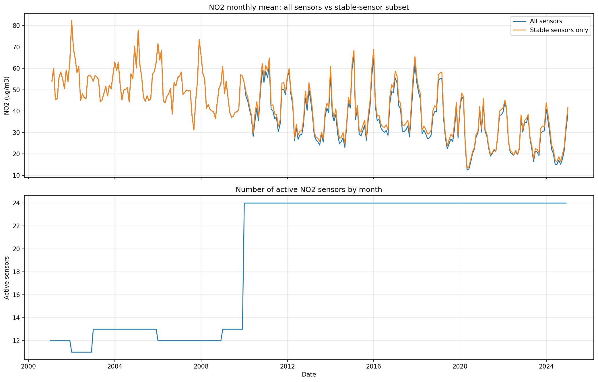

Two panels. Top: monthly mean NO2 (µg/m³) 2001-2024 comparing all sensors (blue) vs. stable-sensor subset (orange). Bottom: count of active NO2 sensors by month.

Verifies that apparent trends are not caused by network expansion. If new sensors join in areas with lower pollution, the city-wide mean would artificially decline even if individual stations showed no change. The near-identical blue/orange lines confirm this composition bias is minimal.

A clear long-run decline from ~55 µg/m³ (2001) to ~30 µg/m³ (2020-2024). COVID-19 lockdown dip visible in 2020. Bottom panel shows sensor count growing from ~10 (2001) to 24 (by 2010), confirming why the stable-sensor filter is necessary.

### Figure: task1_air_quality_distributions.png

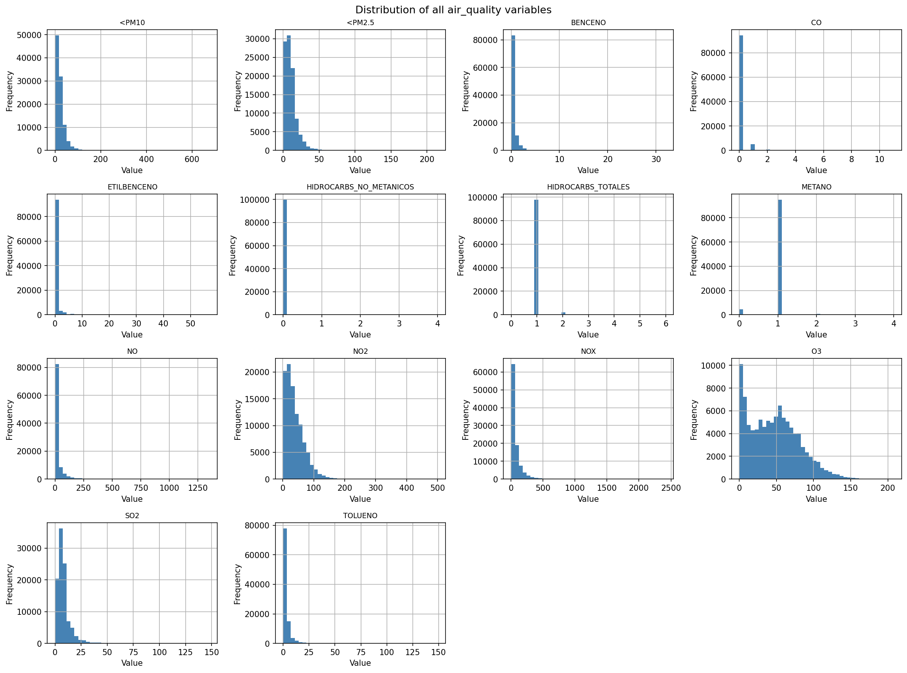

Histograms for all 14 air quality variables (40 bins each, max 100,000 points sampled for rendering speed).

Distribution inspection reveals the empirical range, identifies sensor faults at extreme values, and informs downstream model choices.

NO, NO2, NOX: Strongly right-skewed. Rush-hour spikes create long tails; most hours are low.
O3: Bimodal, near zero at night (consumed by NO via titration), moderate-high during daylight photochemical production.
CO: Degenerate, near-zero, modern Madrid vehicles produce almost no measurable CO.
HIDROCARBS_TOTALES: Tight cluster at ~1 ppm, constant background.
BENCENO, TOLUENO, ETILBENCENO: Near-zero-centered, consistent with benzene-family VOCs at trace concentrations.

### Figure: task1_meteorology_distributions.png

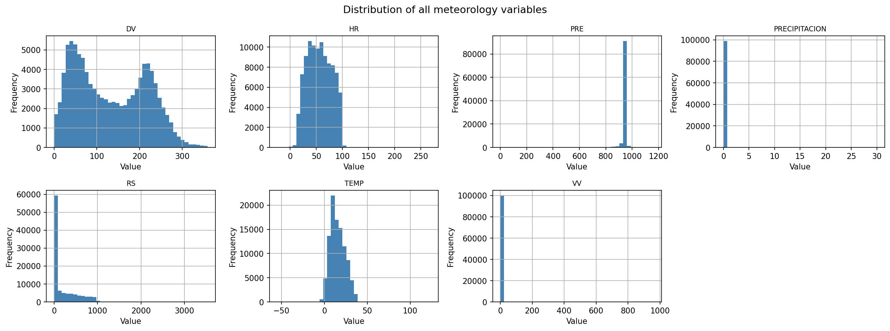

Histograms for 7 meteorological variables.

Meteorological variables are predictors in Tasks 8 and 9. Understanding their distributions reveals which need transformation and which contain artifacts.

TEMP: Approximately normal, centred at ~15°C, Madrid's temperate continental climate.
HR: Bimodal, dry summer (~40%) vs. humid winter/spring (~75%).
VV: Heavy right skew. Most hours calm; rare windy episodes. 989 m/s max = sensor fault.
DV: Roughly uniform 0-360° with mild SW preference (Atlantic flow over Iberian plateau).
PRE: Normal around 936 hPa (Madrid at 667m elevation). 414 records at 0 hPa are physically impossible, flagged in Task 2.
RS: Bimodal: zero at night, high at midday. Slight negative values are calibration artefacts.
PRECIPITACION: Zero-inflated (Madrid is semi-arid); long tail from storm events.

### Figure: task1_traffic_distributions.png

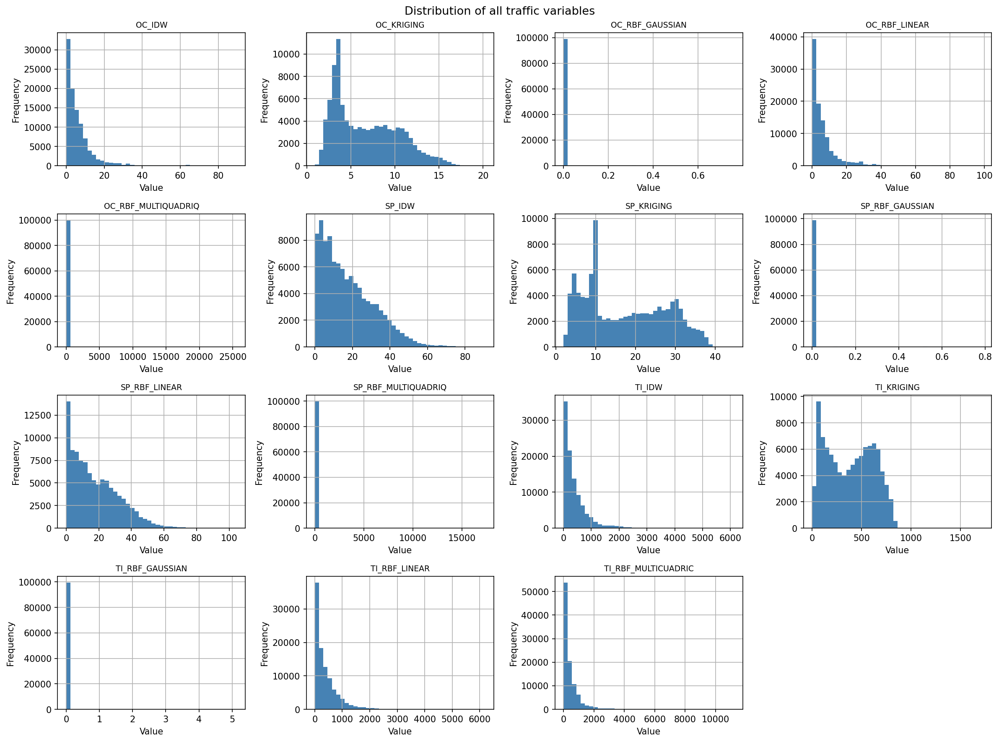

Histograms for all 15 traffic variables (3 categories × 5 interpolation methods).

Immediately reveals which interpolation methods produce physically meaningful values and which are numerically unstable, critical before using traffic as predictors.

RBF-Gaussian (TI, SP, OC): Distributions collapse entirely to near-zero. Gaussian basis functions decay as exp(−r²/ε²), for a sparse city-wide sensor network, they predict near-zero everywhere away from support points. Physically useless.
RBF-Multiquadric (TI): Extreme outliers up to ~2.8×10¹⁸ vehicles/hour, clear numerical overflow. Excluded from predictive models.
IDW and Kriging: Produce physically reasonable distributions (250-400 veh/h for TI, 15-25 km/h for SP, 5-8% for OC). These are the traffic variables used in Tasks 8 and 9.
RBF-Linear: Also reasonable, as the linear basis function avoids oscillation artifacts.

## 6. Task 2: Missingness & Data Quality

### Goal

Quantify original missingness using the `is_interpolated` flag, characterize its temporal and spatial structure, and detect physically invalid or inconsistent values.


### Code

```python
# Task 2


print("TASK 2: MISSINGNESS AND DATA QUALITY")
print("\nMissingness reconstructed from is_interpolated")
missing_by_var = (
    df.groupby("magnitude_name", sort=False, observed=True)["is_interpolated"]
    .agg(["sum", "mean", "count"])
    .reset_index()
    .rename(columns={"sum": "n_original_missing", "mean": "missing_rate"})
    .sort_values("missing_rate", ascending=False)
)

print(missing_by_var.to_string(index=False))

sensor_var_missing = compute_sensor_variable_missing_matrix(df)
plt.figure(figsize=(16, 8))
sns.heatmap(sensor_var_missing, cmap="viridis")
plt.title("Original missingness rate by sensor x variable")
plt.xlabel("Variable"); plt.ylabel("Sensor")
plt.tight_layout()
plt.savefig("figures/task2_missingness_sensor_var.png", dpi=150, bbox_inches="tight")
plt.close()

print("\nTemporal missingness heatmap (monthly resolution)")
missing_month = df["entry_date"].dt.to_period("M")
ts_missing = (
    df.groupby([missing_month, "magnitude_name"], sort=False, observed=True)["is_interpolated"]
    .mean()
    .reset_index(name="is_interpolated")
)
ts_missing["entry_date"] = ts_missing["entry_date"].dt.to_timestamp()
pivot_missing = ts_missing.pivot(
    index="entry_date", columns="magnitude_name", values="is_interpolated"
)
plt.figure(figsize=(16, 8))
sns.heatmap(pivot_missing.T, cmap="magma",
            cbar_kws={"label": "Missingness rate (monthly avg)"})
plt.title("Temporal missingness by variable : monthly resolution")
plt.xlabel("Month"); plt.ylabel("Variable")
plt.tight_layout()
plt.savefig("figures/task2_missingness_temporal.png", dpi=150, bbox_inches="tight")
plt.close()

print("\nConsecutive temporal gap analysis (full hourly calendar)")
print("Scope: air_quality only : ~181M rows on full dataset otherwise")
gap_stats   = []
if isinstance(df["magnitude_name"].dtype, pd.CategoricalDtype):
    aq_vars_present = [
        v for v in df["magnitude_name"].cat.categories
        if str(v) in AIR_QUALITY_SET
    ]
else:
    aq_vars_present = [
        v for v in df["magnitude_name"].drop_duplicates()
        if str(v) in AIR_QUALITY_SET
    ]
for var in aq_vars_present:
    var_rows = df.loc[
        df["magnitude_name"] == var,
        ["sensor_name", "entry_date", "is_interpolated"],
    ]
    for sensor in var_rows["sensor_name"].drop_duplicates():
        group = var_rows.loc[
            var_rows["sensor_name"] == sensor,
            ["entry_date", "is_interpolated"],
        ]
        gaps = compute_calendar_gap_lengths(group)
        if gaps:
            gap_stats.append({
                "sensor_name":        sensor, "magnitude_name": var,
                "n_gaps":             len(gaps),
                "max_gap_hours":      int(max(gaps)),
                "mean_gap_hours":     round(float(np.mean(gaps)), 1),
                "total_missing_hours":int(sum(gaps)),
            })
gap_df = pd.DataFrame(gap_stats).sort_values("max_gap_hours", ascending=False)
print(gap_df.head(20).to_string(index=False))
print("\nTop 10 by longest consecutive gap")
print(gap_df[["sensor_name","magnitude_name",
              "max_gap_hours","n_gaps","total_missing_hours"]]
      .head(10).to_string(index=False))

exact_zero_mask = (
    ~df["is_interpolated"] &
    (df["value"] == 0.0) &
    df["magnitude_name"].isin(ZERO_IMPOSSIBLE)
)
print(f"\nPhysically impossible zeros (PRE=0 hPa): {int(exact_zero_mask.sum())}")

zero_real_mask = ~df["is_interpolated"] & (df["value"] == 0.0)
zero_counts_by_var = (
    df.loc[zero_real_mask, "magnitude_name"]
    .value_counts(sort=True)
)
print("\nZero real measurements per variable (informational : most are valid):")
print(zero_counts_by_var.head(15))

EPSILON = 1e-4
near_zero_nonzero_real_mask = (
    ~df["is_interpolated"] & (df["value"].abs() < EPSILON) & (df["value"] != 0.0)
)
print(f"\nNear-zero nonzero real measurements (|value| < {EPSILON}): "
      f"{int(near_zero_nonzero_real_mask.sum())}")

if isinstance(df["magnitude_name"].dtype, pd.CategoricalDtype):
    negative_vars = [
        v for v in df["magnitude_name"].cat.categories
        if str(v) in NEVER_NEGATIVE or str(v).startswith(("TI_", "OC_", "SP_"))
    ]
else:
    negative_vars = [
        v for v in df["magnitude_name"].drop_duplicates()
        if str(v) in NEVER_NEGATIVE or str(v).startswith(("TI_", "OC_", "SP_"))
    ]
negative_impossible_mask = (
    df["magnitude_name"].isin(negative_vars) & (df["value"] < 0)
)
print(f"\nNegative values where impossible: {int(negative_impossible_mask.sum())}")

invalid_hr_mask = (
    (df["magnitude_name"] == "HR") &
    ((df["value"] < 0) | (df["value"] > 100))
)
invalid_dv_mask = (
    (df["magnitude_name"] == "DV") &
    ((df["value"] < 0) | (df["value"] > 360))
)
invalid_prec_mask = (
    (df["magnitude_name"] == "PRECIPITACION") & (df["value"] < 0)
)
print("\nBounded-range validity checks")
print(f"Invalid HR   (outside 0-100%): {int(invalid_hr_mask.sum())}")
print(f"Invalid DV   (outside 0-360): {int(invalid_dv_mask.sum())}")
print(f"Invalid PREC (< 0 mm)       : {int(invalid_prec_mask.sum())}")

duplicate_rows = count_duplicate_measurement_rows(DATA_PATH_RUNTIME, df)
print(f"\nDuplicate rows on (sensor_id, magnitude_id, entry_date): "
      f"{duplicate_rows}")

sensor_coord_check = (
    df.groupby("sensor_name")[["utm_x","utm_y"]].nunique()
    .rename(columns={"utm_x":"n_unique_utm_x","utm_y":"n_unique_utm_y"})
)
coord_issues = sensor_coord_check[
    (sensor_coord_check["n_unique_utm_x"] > 1) |
    (sensor_coord_check["n_unique_utm_y"] > 1)
]
print(f"Sensors with inconsistent coordinates: {len(coord_issues)}")


outlier_rows = []
if isinstance(df["magnitude_name"].dtype, pd.CategoricalDtype):
    outlier_vars = df["magnitude_name"].cat.categories
else:
    outlier_vars = df["magnitude_name"].drop_duplicates()
for var in outlier_vars:
    var_rows = df.loc[df["magnitude_name"] == var, ["sensor_name", "value"]]
    n_outliers = 0
    for sensor in var_rows["sensor_name"].drop_duplicates():
        vals = var_rows.loc[var_rows["sensor_name"] == sensor, "value"]
        n_outliers += int(compute_outlier_mask(vals, k=3.0).sum())
    outlier_rows.append({
        "magnitude_name": var,
        "n_outliers": n_outliers,
    })
outlier_counts = (
    pd.DataFrame(outlier_rows)
    .sort_values("n_outliers", ascending=False)
)
print("\nOutlier count per variable (IQR k=3, per sensor)")
print(outlier_counts.head(15).to_string(index=False))

neg_counts  = df.loc[negative_impossible_mask, "magnitude_name"].value_counts(sort=False).rename("n_impossible_negatives")
zero_counts = df.loc[exact_zero_mask, "magnitude_name"].value_counts(sort=False).rename("n_exact_zero_suspicious")
bounded_parts = [s for s in [
    df.loc[invalid_hr_mask, "magnitude_name"].value_counts(sort=False),
    df.loc[invalid_dv_mask, "magnitude_name"].value_counts(sort=False),
    df.loc[invalid_prec_mask, "magnitude_name"].value_counts(sort=False),
] if len(s) > 0]
bounded_counts = (
    pd.concat(bounded_parts).groupby(level=0).sum().rename("n_bounded_range_invalid")
    if bounded_parts else pd.Series(dtype=int, name="n_bounded_range_invalid")
)
quality_summary = (
    pd.concat([neg_counts, zero_counts, bounded_counts,
               outlier_counts.set_index("magnitude_name")["n_outliers"]], axis=1)
    .fillna(0).astype(int).reset_index()
    .sort_values(["n_bounded_range_invalid","n_impossible_negatives","n_outliers"],
                 ascending=False)
)
print("\nFinal quality summary")
print(quality_summary.head(20).to_string(index=False))
```

### Why `is_interpolated` and Not NaN

METRAQ has filled every missing value before release, there are zero NaN values in the raw data. The `is_interpolated == True` flag marks positions that were originally absent and filled by the dataset authors. We reverse-engineer original missingness from this flag, stripping `is_interpolated == True` entries before applying our own imputation. This is the correct methodology: we treat METRAQ's interpolation as the "official" fill that we will compare against.

### Why Distinguish Temporal vs. Sensor-Specific Gaps

the two types have different causes and require different imputation strategies:
Sensor-specific gaps (one station missing while others report): ideal for spatial KNN, which uses neighboring sensors at the same timestamp.
Temporal gaps (long consecutive outages): KNN fails here; temporal methods (rolling mean) or cross-pollutant approaches are needed.

### Missingness by Variable

```
         magnitude_name   missing_rate
                    PRE       87.68%  <- meteorology only from 2019
                     RS       87.61%
                     DV       83.63%
                     VV       83.58%
          PRECIPITACION       79.29%
                     HR       54.64%
                   TEMP       51.07%
            ETILBENCENO        5.39%
                <PM2.5         3.43%
                  <PM10        2.86%
                    NO2        1.76%
             TI_KRIGING        0.00%  <- traffic: always zero by construction
```

Meteorological variables show 50-88% missing because they were introduced in 2019: (17 pre-2019 years / 24 total years) ≈ 71% of the time series is necessarily interpolated from sparse post-2019 observations. All traffic variables have 0% missingness, they are the output of interpolation algorithms by construction, so there is no concept of "originally missing" for them.

### Consecutive Gap Analysis (Top 10 by Max Gap)

```
     sensor_name   magnitude  max_gap_h  n_gaps  total_missing_h
      Villaverde         SO2     31,226     340           38,229
      Villaverde          NO     31,226     416           38,457
      Villaverde         NOX     31,226     417           38,458
      Villaverde         NO2     31,226     417           38,458
      Villaverde          O3     31,226   1,053           39,324
Escuelas Aguirre   HIDROCARBS    19,697     450           21,876
Escuelas Aguirre      METANO     19,697     445           21,796
Escuelas Aguirre     TOLUENO     16,148   1,161           22,578
Escuelas Aguirre      BENCENO    16,148     988           22,055
```

31,226 consecutive hours ≈ 3.57 years at Villaverde (all major pollutants simultaneously absent). This station was completely offline from approximately 2004 to 2008. This gap is too long for any 24-hour temporal imputation method, only spatial KNN (borrowing from neighbor stations) can bridge it. This finding directly informed the method selection in Task 3.

### Physical Validity Checks

```
Physically impossible zeros (PRE = 0 hPa):     414  <- atmospheric pressure cannot be zero
Negative values where impossible:              684
  -> HR: 504 records (humidity cannot be negative)
  -> RS:  180 records (solar radiation cannot be negative in non-calibration hours)

Bounded-range violations:
  Invalid HR (outside 0-100%): 771
  Invalid DV (outside 0-360°):   0  <- wind direction is clean
  Invalid PREC (< 0 mm):         0  <- precipitation is clean

Duplicate rows on (sensor_id, magnitude_id, entry_date): 0
Sensors with inconsistent coordinates:                    0
```

IQR outliers (k=3 per sensor), top 5:

<table style="border-collapse:collapse;width:100%;background:#ffffff;margin:10px 0;">
  <thead><tr>
    <th style="background:#ffffff;padding:6px 14px;border:1px solid #cccccc;font-weight:bold;text-align:left;">Variable</th>
    <th style="background:#ffffff;padding:6px 14px;border:1px solid #cccccc;font-weight:bold;text-align:left;">n_outliers</th>
    <th style="background:#ffffff;padding:6px 14px;border:1px solid #cccccc;font-weight:bold;text-align:left;">Cause</th>
  </tr></thead>
  <tbody>
  <tr>
    <td style="background:#ffffff;padding:6px 14px;border:1px solid #cccccc;text-align:left;">NO</td>
    <td style="background:#ffffff;padding:6px 14px;border:1px solid #cccccc;text-align:left;">338,123</td>
    <td style="background:#ffffff;padding:6px 14px;border:1px solid #cccccc;text-align:left;">Real pollution spikes (combustion)</td>
  </tr>
  <tr>
    <td style="background:#ffffff;padding:6px 14px;border:1px solid #cccccc;text-align:left;">NOX</td>
    <td style="background:#ffffff;padding:6px 14px;border:1px solid #cccccc;text-align:left;">162,031</td>
    <td style="background:#ffffff;padding:6px 14px;border:1px solid #cccccc;text-align:left;">Real spikes (NO + NO2)</td>
  </tr>
  <tr>
    <td style="background:#ffffff;padding:6px 14px;border:1px solid #cccccc;text-align:left;">PRE</td>
    <td style="background:#ffffff;padding:6px 14px;border:1px solid #cccccc;text-align:left;">73,339</td>
    <td style="background:#ffffff;padding:6px 14px;border:1px solid #cccccc;text-align:left;">Sensor malfunctions</td>
  </tr>
  <tr>
    <td style="background:#ffffff;padding:6px 14px;border:1px solid #cccccc;text-align:left;">OC_RBF_MULTIQUADRIQ</td>
    <td style="background:#ffffff;padding:6px 14px;border:1px solid #cccccc;text-align:left;">72,812</td>
    <td style="background:#ffffff;padding:6px 14px;border:1px solid #cccccc;text-align:left;">Numerical interpolation artefacts</td>
  </tr>
  <tr>
    <td style="background:#ffffff;padding:6px 14px;border:1px solid #cccccc;text-align:left;">OC_RBF_GAUSSIAN</td>
    <td style="background:#ffffff;padding:6px 14px;border:1px solid #cccccc;text-align:left;">57,145</td>
    <td style="background:#ffffff;padding:6px 14px;border:1px solid #cccccc;text-align:left;">Numerical artefacts</td>
  </tr>
  </tbody>
</table>
NO and NOX outliers are mostly real pollution episodes, short-duration high-concentration rush-hour events, not sensor faults. The IQR method flags them because the distribution is heavily right-skewed, not because the values are erroneous.

### Figure: task2_missingness_sensor_var.png

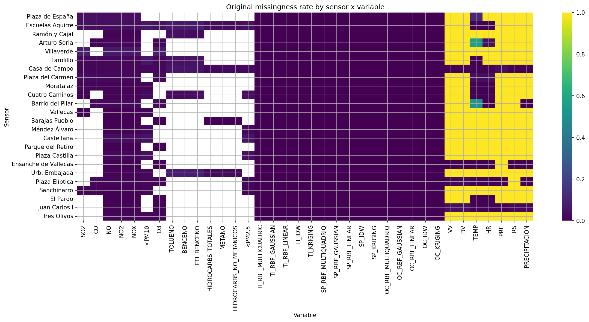

Heatmap where rows = 24 monitoring stations, columns = 36 variables, cell colour = fraction of `is_interpolated == True` for that (sensor, variable) pair.

A single-row summary table shows overall missingness, but this heatmap reveals which specific stations are worst affected and whether missingness is uniform across the network. This is essential for deciding which sensors to include in each analysis.

Right side (meteorological variables): Near-complete missingness (dark purple) at almost all stations, a thick band reflecting 17 years of pre-2019 interpolation.
Traffic columns (left/center): Uniform zero missingness (bright yellow) everywhere.
Villaverde row: Noticeably darker in air quality columns, confirming the multi-year outages.
Escuelas Aguirre: Second-darkest in air quality columns, consistent with the 16,000-19,000 hour gaps.

### Figure: task2_missingness_temporal.png

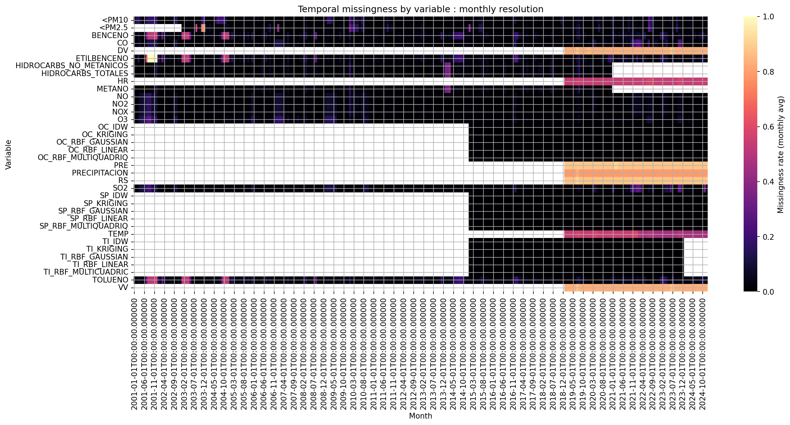

Heatmap where x-axis = calendar month (2001-2024), y-axis = variable, cell colour = average missingness rate for that month.

Reveals whether missingness is uniformly distributed over time or concentrated in specific periods, crucial for choosing analysis windows.

Meteorological variables (top rows): Sharp transition at 2019. Before 2019: solid dark (100% missing). After 2019: lighter shades reflecting the sensor operational period.
Air quality variables (middle rows): Scattered patches throughout all 24 years, maintenance and equipment failures with no seasonal pattern.
Traffic variables: Uniformly zero from 2015 onward.

## 7. Task 3: Imputation

### Goal

Replace originally-missing values with estimates that do not leak future information, compare methods quantitatively against each other and against METRAQ's baseline, and select the best causal method per pollutant for all downstream analyses.


### Code

```python
# Task 3


print("TASK 3: IMPUTATION")
print("Causal methods : knn (spatial IDW) | rolling_24h_past")
print("Non-causal baseline (comparison only): ffill_bfill_24h")
print(f"KNN k = {KNN_K}  (inverse-distance-weighted spatial imputation)")

AIR_QUALITY_VARS = SELECTED_POLLUTANTS
print(f"Scope: imputation is demonstrated on selected policy-relevant pollutants "
      f"{AIR_QUALITY_VARS}, matching later temporal/network/forecast tasks.")
print(f"Pseudo-gap evaluation: masks {100*TASK3_EVAL_MASK_FRAC:.1f}% of observed "
      f"values per seed across up to {TASK3_EVAL_MAX_SENSORS} sensors; "
      f"sparse-sensor RMSE estimates may have higher variance.")

imputed_results        = []
evaluation_results     = []
imputed_all_pollutants = []
best_method_records    = []
stored_pivots          = {}

for pollutant in AIR_QUALITY_VARS:
    print(f"\nProcessing: {pollutant}")

    pol_df = df.loc[
        df["magnitude_name"] == pollutant,
        ["entry_date", "sensor_name", "value", "is_interpolated"],
    ].copy()


    pol_wide_all = (
        pol_df.pivot_table(
            index="entry_date", columns="sensor_name",
            values="value", aggfunc="mean"
        ).sort_index()
    )
    pol_wide_real = (
        pol_df.loc[~pol_df["is_interpolated"]]
        .pivot_table(
            index="entry_date", columns="sensor_name",
            values="value", aggfunc="mean"
        )
        .sort_index()
    )
    pol_wide_raw = pol_wide_real.combine_first(pol_wide_all).sort_index()

    pol_mask_raw = (
        pol_df.assign(_is_real=~pol_df["is_interpolated"])
        .pivot_table(
            index="entry_date", columns="sensor_name",
            values="_is_real", aggfunc="max"
        )
        .sort_index()
    )


    full_idx = pd.date_range(
        start=pol_df["entry_date"].min(),
        end=pol_df["entry_date"].max(),
        freq="h",
        name="entry_date",
    )
    pol_wide = pol_wide_raw.reindex(full_idx)
    pol_mask_raw = pol_mask_raw.reindex(full_idx)


    sensor_ranges = pol_df.groupby("sensor_name")["entry_date"].agg(["min", "max"])

    in_range_mask = pd.DataFrame(
        False, index=full_idx, columns=pol_wide.columns, dtype=bool
    )
    for sensor in pol_wide.columns:
        if sensor not in sensor_ranges.index:
            continue
        s_min = sensor_ranges.loc[sensor, "min"]
        s_max = sensor_ranges.loc[sensor, "max"]
        in_range_mask[sensor] = (full_idx >= s_min) & (full_idx <= s_max)


    pol_mask_missing = (
        in_range_mask
        & pol_mask_raw.reindex(columns=pol_wide.columns)
                      .fillna(False)
                      .astype(bool)
                      .eq(False)
    )

    pol_original = pol_wide.mask(pol_mask_missing)
    stored_pivots[pollutant] = (pol_wide, pol_mask_missing, pol_original, in_range_mask)


    pol_ffill = pol_original.ffill(limit=24).bfill(limit=24)


    pol_knn = knn_impute(pol_original, sensors_pos, k=KNN_K)


    pol_rolling = pol_original.copy()
    for col in pol_rolling.columns:
        expanding_fallback = pol_original[col].expanding(min_periods=1).mean().shift(1)
        rolled             = pol_original[col].rolling(
                                 window=24, min_periods=1, center=False).mean()
        pol_rolling[col]   = pol_rolling[col].fillna(rolled)
        pol_rolling[col]   = pol_rolling[col].fillna(expanding_fallback)


    for filled, label in [
        (pol_wide,    "METRAQ"),
        (pol_ffill,   "ffill_bfill_24h"),
        (pol_knn,     "knn"),
        (pol_rolling, "rolling_24h_past"),
    ]:
        ext = extract_imputed_values(filled, pol_mask_missing)
        imputed_results.append((pollutant, label, ext["imputed_value"]))


    eval_sensors = (
        pol_original.notna().sum()
        .sort_values(ascending=False)
        .head(TASK3_EVAL_MAX_SENSORS)
        .index
    )
    print(f"Pseudo-gap evaluation sensors: {len(eval_sensors)} of {pol_original.shape[1]}")

    for sensor in eval_sensors:
        s = pol_original[sensor]
        if s.dropna().shape[0] < 50:
            continue
        for method in ["ffill_bfill_24h", "rolling_24h_past"]:
            res = evaluate_pseudo_gaps(s, method_name=method,
                                       seed=42,
                                       mask_frac=TASK3_EVAL_MASK_FRAC,
                                       n_seeds=TASK3_EVAL_N_SEEDS)
            if res is not None:
                res["magnitude_name"] = pollutant
                res["sensor_name"]    = sensor
                evaluation_results.append(res)


    knn_evals = evaluate_knn_pseudo_gaps(
        pol_original, sensors_pos, k=KNN_K, seed=42,
        mask_frac=TASK3_EVAL_MASK_FRAC,
        n_seeds=TASK3_EVAL_N_SEEDS,
        eval_sensors=eval_sensors
    )
    for res in knn_evals:
        res["magnitude_name"] = pollutant
        evaluation_results.append(res)

    del pol_df, pol_ffill, pol_knn, pol_rolling
    gc.collect()


evaluation_df = pd.DataFrame(evaluation_results)

print("\nPseudo-gap evaluation summary")
if len(evaluation_df) > 0:
    eval_summary = (
        evaluation_df.groupby(["magnitude_name", "method"])[["rmse","mae"]]
        .mean().round(4).reset_index()
        .sort_values(["magnitude_name","rmse"])
    )
    eval_summary_print = eval_summary.copy()
    eval_summary_print["method"] = eval_summary_print["method"].map(display_method_label)
    print(eval_summary_print.to_string(index=False))
else:
    print("No pseudo-gap evaluation results (all sensors had < 50 observations).")


best_method_map = {}
for pollutant in AIR_QUALITY_VARS:
    best = choose_best_imputation_method(evaluation_df, pollutant)
    best_method_map[pollutant] = best
    best_method_records.append({"magnitude_name": pollutant, "best_method": best})

best_method_df = pd.DataFrame(best_method_records)
print("\nSelected final causal imputation method per pollutant (lowest RMSE)")
print(best_method_df.to_string(index=False))
best_method_df.to_csv("figures/task3_best_imputation_methods.csv", index=False)
print("  Saved: figures/task3_best_imputation_methods.csv")


for pollutant in AIR_QUALITY_VARS:
    pol_wide, pol_mask_missing, pol_original, in_range_mask = stored_pivots.pop(pollutant)
    method = best_method_map[pollutant]

    if method == "knn":
        pol_final = knn_impute(pol_original, sensors_pos, k=KNN_K)

    else:  # rolling_24h_past
        pol_final = pol_original.copy()
        for col in pol_final.columns:
            expanding_fallback = pol_original[col].expanding(min_periods=1).mean().shift(1)
            rolled             = pol_original[col].rolling(
                                     window=24, min_periods=1, center=False).mean()
            pol_final[col]     = pol_final[col].fillna(rolled)
            pol_final[col]     = pol_final[col].fillna(expanding_fallback)

    pol_clean = pol_wide.where(~pol_mask_missing, pol_final)


    pol_clean = pol_clean.where(in_range_mask)


    pol_clean_long = (
        pol_clean.stack(future_stack=True)
        .rename("value_clean")
        .reset_index()
        .rename(columns={"level_1": "sensor_name"})
    )


    in_range_long = (
        in_range_mask.stack(future_stack=True)
        .rename("in_range")
        .reset_index()
        .rename(columns={"level_1": "sensor_name"})
    )
    pol_clean_long = pol_clean_long.merge(
        in_range_long, on=["entry_date", "sensor_name"], how="left"
    )
    pol_clean_long = (
        pol_clean_long.loc[pol_clean_long["in_range"] == True]
        .drop(columns="in_range")
        .reset_index(drop=True)
    )
    pol_clean_long["magnitude_name"] = pollutant
    imputed_all_pollutants.append(pol_clean_long)
    del pol_wide, pol_mask_missing, pol_original, in_range_mask, pol_final, pol_clean, pol_clean_long
    gc.collect()

imputation_lookup = {
    (pollutant, method): values
    for pollutant, method, values in imputed_results
}
imputed_results = []
imputed_all_pollutants = pd.concat(imputed_all_pollutants, ignore_index=True)


print("\nResidual NaN check after imputation")
nan_check = (
    imputed_all_pollutants
    .groupby("magnitude_name")["value_clean"]
    .agg(
        n_total="size",
        n_nan=lambda s: int(s.isna().sum()),
        pct_nan=lambda s: round(100 * s.isna().mean(), 3),
    )
    .reset_index()
    .sort_values("pct_nan", ascending=False)
)
print(nan_check.to_string(index=False))
total_nan = imputed_all_pollutants["value_clean"].isna().sum()
total_rows = len(imputed_all_pollutants)
print(f"\n  Total residual NaNs : {total_nan:,} of {total_rows:,} "
      f"rows ({100*total_nan/total_rows:.3f}%)")
if total_nan == 0:
    print("  All positions filled : no residual gaps remain.")
else:
    print("  Residual NaNs occur at timestamp t=0 or fully-absent sensor-"
          "pollutant pairs where expanding mean has no prior data to draw on."
          " These are left as NaN intentionally to keep coverage explicit.")


print("\nImputation fill coverage at originally-missing positions")
print("(How many NaNs each method actually filled. Methods with lower")
print(" coverage contribute fewer points to the summary/KS tables below.)")
coverage_rows = []
for pollutant in AIR_QUALITY_VARS:
    denom_vals = imputation_lookup.get((pollutant, "METRAQ"))
    if denom_vals is None or len(denom_vals) == 0:
        continue
    n_missing = len(denom_vals)
    for method in ["METRAQ", "ffill_bfill_24h", "knn", "rolling_24h_past"]:
        vals = imputation_lookup.get((pollutant, method), pd.Series(dtype=float))
        n_filled = int(vals.notna().sum())
        coverage_rows.append({
            "magnitude_name":      pollutant,
            "method":              method,
            "n_missing_positions": n_missing,
            "n_filled":            n_filled,
            "pct_filled": round(100.0 * n_filled / n_missing, 2)
                          if n_missing > 0 else np.nan,
        })
coverage_df = pd.DataFrame(coverage_rows)
if len(coverage_df) > 0:
    coverage_print = coverage_df.copy()
    coverage_print["method"] = coverage_print["method"].map(display_method_label)
    print(coverage_print.to_string(index=False))

    metraq_cov = coverage_df[coverage_df["method"] == "METRAQ"].set_index(
        "magnitude_name")["pct_filled"]
    worst = []
    for _, r in coverage_df[coverage_df["method"] != "METRAQ"].iterrows():
        m_cov = metraq_cov.get(r["magnitude_name"], np.nan)
        if not np.isnan(m_cov) and (m_cov - r["pct_filled"]) > 5.0:
            worst.append((r["magnitude_name"], r["method"],
                          r["pct_filled"], m_cov))
    if worst:
        print("\n  WARNING: the following method/pollutant combinations")
        print("  filled >5 percentage points fewer positions than METRAQ.")
        print("  Their rows in the summary/KS tables below reflect only")
        print("  the easier subset of missing positions they could handle.")
        for p, m, c, mc in worst:
            print(f"    {p:<25s}  {m:<18s}  filled {c:.1f}%  vs METRAQ {mc:.1f}%")

print("\nImputation comparison summary (mean/std/median at missing positions)")
summary_rows = []
for pollutant in AIR_QUALITY_VARS:
    for method in ["METRAQ", "ffill_bfill_24h", "knn", "rolling_24h_past"]:
        vals = imputation_lookup.get((pollutant, method), pd.Series(dtype=float)).dropna()
        summary_rows.append({
            "magnitude_name": pollutant,
            "method": method,
            "mean": float(vals.mean()) if len(vals) else np.nan,
            "std": float(vals.std()) if len(vals) else np.nan,
            "median": float(vals.median()) if len(vals) else np.nan,
            "count": int(vals.count()),
        })
summary_imputation = pd.DataFrame(summary_rows)
summary_imputation_print = summary_imputation.copy()
summary_imputation_print["method"] = summary_imputation_print["method"].map(
    display_method_label
)
print(summary_imputation_print.head(40).to_string(index=False))

print("\nKS-test: similarity of each method to METRAQ")
print("KS stat close to 0 = distributions similar to METRAQ")
ks_rows = []
for pollutant in AIR_QUALITY_VARS:
    metraq = sample_values(
        imputation_lookup.get((pollutant, "METRAQ"), pd.Series(dtype=float))
    )
    for method in ["ffill_bfill_24h", "knn", "rolling_24h_past"]:
        vals = sample_values(
            imputation_lookup.get((pollutant, method), pd.Series(dtype=float))
        )
        if len(metraq) > 0 and len(vals) > 0:
            ks_stat, p_val = ks_2samp(metraq, vals)
            ks_rows.append({
                "magnitude_name": pollutant, "method": method,
                "ks_stat": round(float(ks_stat), 4),
                "p_value": round(float(p_val), 6),
            })
ks_df = pd.DataFrame(ks_rows)
if len(ks_df) > 0:
    ks_print = ks_df.copy()
    ks_print["method"] = ks_print["method"].map(display_method_label)
    print(ks_print.head(30).to_string(index=False))

for pollutant in SELECTED_POLLUTANTS:
    if (pollutant, "METRAQ") not in imputation_lookup:
        continue
    plt.figure(figsize=(12, 6))


    method_colors = {
        "METRAQ":           "#444444",
        "ffill_bfill_24h":  "#1f77b4",
        "knn":              "#2ca02c",
        "rolling_24h_past": "#d62728",
    }
    any_plotted = False
    for method in ["METRAQ", "ffill_bfill_24h", "knn", "rolling_24h_past"]:
        vals = sample_values(
            imputation_lookup.get((pollutant, method), pd.Series(dtype=float))
        )

        if len(vals) < 5 or vals.nunique() < 2 or vals.std() == 0:
            continue
        try:
            sns.kdeplot(
                vals,
                label=display_method_label(method),
                fill=False,
                color=method_colors.get(method, None),
                warn_singular=False,
            )
            any_plotted = True
        except (ValueError, np.linalg.LinAlgError) as kde_err:


            print(f"  [KDE skipped] {pollutant}/{method}: {kde_err} "
                  f"-> using histogram instead")
            try:
                plt.hist(
                    vals, bins=50, density=True, histtype="step",
                    label=f"{display_method_label(method)} (hist)",
                    color=method_colors.get(method, None),
                )
                any_plotted = True
            except Exception as hist_err:
                print(f"  [hist skipped] {pollutant}/{method}: {hist_err}")

    plt.title(f"Imputed-value distribution comparison : {pollutant}")
    plt.xlabel(f"{pollutant} ({UNITS.get(pollutant, '')})")
    plt.ylabel("Density")
    if any_plotted:
        plt.legend()
    plt.tight_layout()
    plt.savefig(f"figures/task3_distribution_{pollutant.replace('<','')}.png",
                dpi=150, bbox_inches="tight")
    plt.close()

if len(evaluation_df) > 0:
    eval_sel = evaluation_df[
        evaluation_df["magnitude_name"].isin(SELECTED_POLLUTANTS)
        & evaluation_df["method"].isin(["knn", "rolling_24h_past"])
    ]
    eval_sel_summary = (
        eval_sel.groupby(["magnitude_name","method"])[["rmse","mae"]]
        .mean().reset_index()
    )
    plt.figure(figsize=(12, 6))
    sns.barplot(data=eval_sel_summary,
                x="magnitude_name", y="rmse", hue="method")
    plt.title("Pseudo-gap RMSE by pollutant and causal imputation method")
    plt.xlabel("Pollutant"); plt.ylabel("RMSE")
    plt.tight_layout()
    plt.savefig("figures/task3_rmse_comparison.png", dpi=150, bbox_inches="tight")
    plt.close()

print("\nImputation methodology discussion")
print(
    "  knn             : spatial IDW using k nearest sensors at same timestamp;\n"
    "                    mirrors METRAQ approach, no temporal leakage, requires\n"
    "                    at least one neighbour to have data at that instant.\n"
    "  rolling_24h_past: past-only temporal rolling mean; good for isolated\n"
    "                    sensors with no active neighbours at the missing hour.\n"
    "  ffill_bfill_24h : kept ONLY as a non-causal comparison baseline;\n"
    "                    bfill() looks into future : excluded from final selection.\n"
    "  Final method selected per pollutant by lowest n_evaluated-weighted RMSE.\n"
    "  seasonal_mean removed: it used future-year observations (temporal leakage)."
)
```

### The Causal Discipline Principle

The most important design principle of this task: no imputation method may use observations from future timestamps. In a real deployment, imputation would be applied in real-time, looking ahead at what NO2 will be tomorrow to fill today's gap is operationally impossible and scientifically inappropriate. Therefore:
ffill/bfill 24h uses backward-fill -> looks into the future -> excluded from final selection (kept only as a theoretical ceiling benchmark).
KNN spatial IDW and rolling_24h_past are the only admissible methods for the final imputed dataset.

### Why Three Methods Were Implemented

1. KNN spatial IDW (k = 3 nearest sensors)
Physical motivation: Air quality is spatially correlated, nearby sensors experience similar conditions simultaneously. A weighted average of neighbors at the exact same timestamp is the most direct estimate of what a missing sensor would have measured.
Why k = 3: k=1 is too sensitive to a single noisy/malfunctioning neighbor; k=5 begins averaging over sensors in different urban districts with different emission profiles. k=3 provides robust averaging while remaining locally representative.
How it works: For each missing (timestamp, sensor) position, compute the inverse-distance-weighted mean of the k=3 nearest sensors that have observed values at that exact hour. If all k neighbors are also missing, fall back to an expanding mean of all past values at the same sensor (causally safe).
Why it matches METRAQ's approach: METRAQ uses spatial interpolation (Kriging, IDW, etc.) as its primary method. Our KNN is a simpler version of the same idea, making it the most natural comparison.

2. Rolling 24h past mean
Physical motivation: Pollution is highly autocorrelated at hourly timescales. The past 24 hours at the same sensor encapsulate one full diurnal cycle of traffic and photochemical patterns.
Why 24 hours: Captures the full daily periodicity (morning rush, midday photolysis, evening rush, nighttime stability), the dominant short-term pattern in all four pollutants.
When it wins over KNN: When SO2 emission sources are highly localized (specific industrial facilities, specific bus routes), different sensors have very different SO2 profiles even if nearby. Past values from the same sensor are more informative than neighbor values.

3. ffill/bfill 24h (non-causal baseline)
Why kept: Quantifies the "information value of the future", how much better we could do if we had access to future observations. Its lower RMSE tells us the upper bound on causal methods.
Why excluded from final selection: `bfill()` uses the next available observation, which is a future value. Operationally inadmissible.

### Pseudo-Gap Evaluation Results

3% of observed values are randomly masked per sensor, each method is applied, and RMSE/MAE are computed against known true values:

```
magnitude_name    method                rmse      mae
         <PM10    knn                  12.075    7.500  <- best causal
         <PM10    ffill_bfill_24h      12.226    6.928  (non-causal baseline)
         <PM10    rolling_24h_past     16.190   10.167
           NO2    ffill_bfill_24h      13.790    8.841  (non-causal)
           NO2    knn                  16.585   11.306  <- best causal
           NO2    rolling_24h_past     24.292   17.583
            O3    ffill_bfill_24h      11.109    7.424  (non-causal)
            O3    knn                  12.664    8.990  <- best causal
            O3    rolling_24h_past     24.196   18.597
           SO2    ffill_bfill_24h       2.573    0.999  (non-causal)
           SO2    rolling_24h_past      4.236    1.999  <- best causal
           SO2    knn                   5.521    3.343
```

Why KNN wins for NO2, O3, &lt;PM10:
These are city-wide atmospheric phenomena. Photochemical production (O3), traffic exhaust (NO2), and dust episodes (&lt;PM10) affect multiple stations simultaneously. Spatial neighbors at the same timestamp carry the most relevant concurrent information.

Why rolling_24h_past wins for SO2:
SO2 has more localized emission sources (specific industrial plants, specific bus routes using higher-sulfur fuel). Different sensors have distinct SO2 profiles even when geographically close. The sensor's own past captures its specific local regime better than an average of neighbors.

### Fill Coverage: A Key Metric Beyond Accuracy

```
Pollutant   Method             n_missing    n_filled  pct_filled
NO2         METRAQ              107,881       72,817      67.5%
NO2         ffill_bfill         107,881       29,264      27.1%
NO2         knn                 107,881      107,880     100.0%  <- always fills
NO2         rolling             107,881      102,132      94.7%
O3          METRAQ               88,945       53,881      60.6%
O3          knn                  88,945       88,945     100.0%
SO2         METRAQ               80,972       45,908      56.7%
SO2         knn                  80,972       80,972     100.0%
```

Why ffill/bfill fills only 18-34%: It requires an observed value within 24 hours on either side. For Villaverde's 3.57-year outage, no observation exists within 24 hours -> method fails entirely for that gap.

The Task 3 missingness mask includes both METRAQ-flagged missing rows (`is_interpolated=True`) and absent in-range calendar gaps where no row exists in the CSV. METRAQ can only be compared on rows that exist in the released dataset, while our KNN and rolling methods can also fill reconstructed calendar gaps. Therefore, fill coverage and KS comparisons are descriptive. The pseudo-gap RMSE/MAE is the main apples-to-apples validation because all methods are tested on the same artificially masked observed values.

Why KNN achieves 100%: Spatial IDW always finds at least one neighbor with a value (24 sensors, rarely all missing simultaneously), and the expanding-mean fallback handles the startup case.

### KS-Test: Distribution Similarity to METRAQ

```
Pollutant   Method              ks_stat   (0 = identical to METRAQ)
NO2         knn                  0.0679  <- most similar to METRAQ
NO2         rolling_24h_past     0.3578  <- most different
O3          knn                  0.1937
O3          rolling_24h_past     0.2694
<PM10       knn                  0.0706  <- most similar
<PM10       rolling_24h_past     0.3336
SO2         rolling_24h_past     0.3697  <- wins on RMSE but very different distribution
```

Rolling_24h_past consistently shows the highest KS distance: it smooths out the high-frequency variation, producing narrower distributions (lower variance, higher median) than the true missing-value distributions. KNN better preserves the shape because it borrows from neighbors experiencing the same concurrent conditions.

### Final Method Selection

```
Selected final causal imputation method per pollutant (lowest RMSE):
  NO2   -> knn
  O3    -> knn
  <PM10 -> knn
  SO2   -> rolling_24h_past
```

### Residual NaN Check After Final Imputation

```
<PM10: 1 NaN of 2,095,128 (0.000%)
NO2:   1 NaN of 4,163,928 (0.000%)
O3:    0 NaN of 2,358,096 (0.000%)
SO2:   0 NaN of 1,814,544 (0.000%)
Total: 2 residual NaNs of 10,431,696 rows (0.000%)
```

Two NaNs at timestamp t=0 where the expanding-mean fallback has no prior observations. Left as NaN intentionally, forcing a fill with zero or a constant would misrepresent coverage.

### Figure: task3_distribution_NO2.png

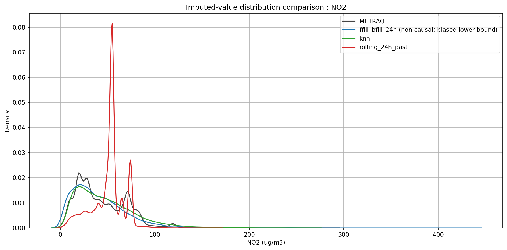

KDE density curves for imputed values at originally-missing positions for NO2. All four methods compared.

Smooth density estimate allows visual comparison of distribution shape (peak location, spread, tail behavior) that histograms with fixed bins obscure.

METRAQ (dark grey) peaks at ~35-45 µg/m³. KNN (green) closely tracks METRAQ's shape, similar peak location and right tail. Rolling (red) is notably shifted right (~55 µg/m³ peak) and much narrower, the 24h averaging smooths out high/low extremes, producing overly central values. ffill/bfill (blue) tracks METRAQ but is narrower because it only fills the 27% "easy" gaps (near observed values), missing the harder long-gap cases.

### Figure: task3_distribution_O3.png

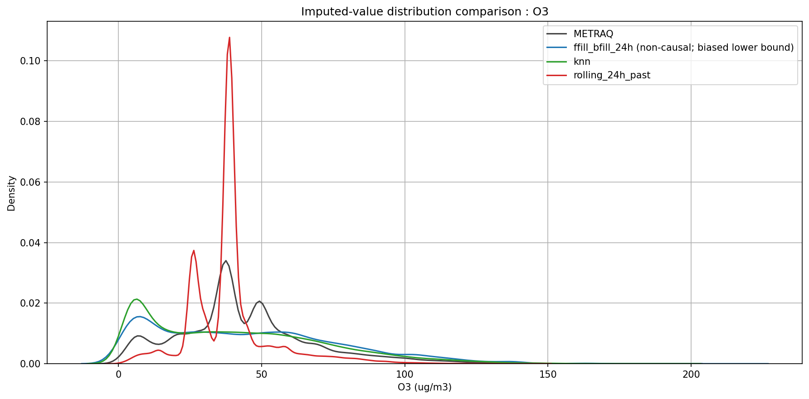

O3 shows two modes (nighttime near-zero and daytime photochemical values). KNN captures both modes. Rolling eliminates the near-zero mode because it averages over day and night, always producing a value between 20-60 µg/m³.

### Figure: task3_distribution_PM10.png

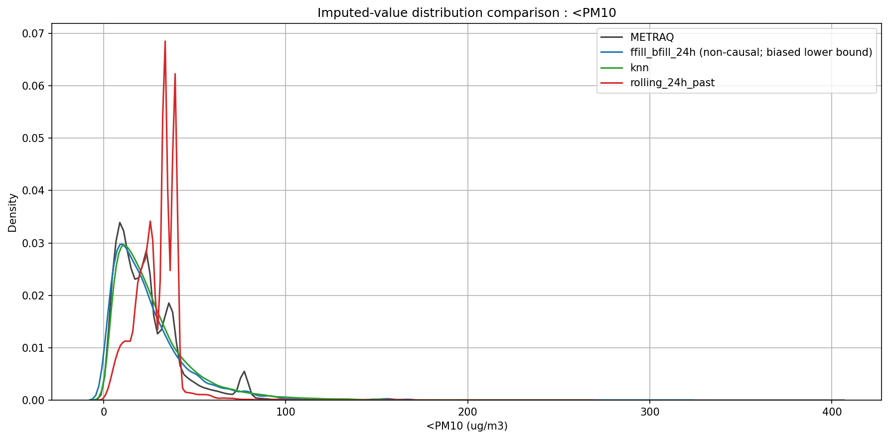

&lt;PM10 shows the best KNN-METRAQ agreement (KS=0.071). &lt;PM10 episodes (dust, inversions) are truly city-wide, all sensors see the same event simultaneously, making spatial averaging ideal.

### Figure: task3_distribution_SO2.png

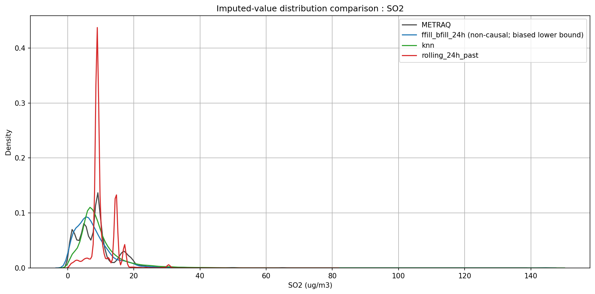

For SO2, rolling_24h_past wins on RMSE but its distribution (narrow peak) is very different from METRAQ's broader distribution. This highlights a limitation: minimizing RMSE at pseudo-gap test points does not guarantee the imputed distribution is realistic, especially for localized pollutants.

### Figure: task3_rmse_comparison.png

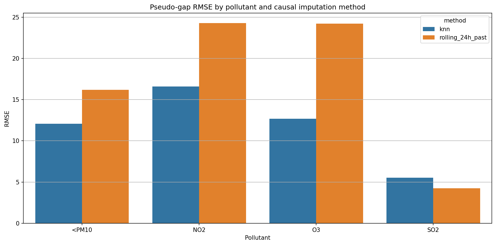

Grouped bar chart of pseudo-gap RMSE by pollutant and causal method (KNN vs. rolling_24h_past).

KNN is clearly better for NO2, O3, and &lt;PM10 (shorter bars). Rolling wins for SO2. The largest RMSE gap is for O3 (KNN 12.7 vs rolling 24.2), O3's exceptionally strong spatial coherence makes KNN nearly ideal, while rolling fails because the 24h average smooths out the strong day/night cycle that is O3's most prominent feature.

## 8. Task 4: Temporal Analysis

### Goal

Characterize seasonal cycles, long-run emission trends, and diurnal traffic-driven patterns. Quantify statistical significance of seasonal variation. Study whether patterns are consistent across individual stations or geographically heterogeneous.


### Code

```python
# Task 4


print("TASK 4: TEMPORAL ANALYSIS")
aq_t4_full = imputed_all_pollutants.rename(columns={"value_clean": "value"}).copy()
aq_t4_full["entry_date"] = pd.to_datetime(aq_t4_full["entry_date"])


aq_t4 = aq_t4_full[
    (aq_t4_full["entry_date"] >= _common_start) &
    (aq_t4_full["entry_date"] <= _common_end)
].copy()
print(f"\naq_t4 restricted to shared window: "
      f"{_common_start.date()} -> {_common_end.date()}")
print(f"Rows in shared window: {len(aq_t4):,}  "
      f"(full imputed: {len(aq_t4_full):,})")

aq_t4["year"]       = aq_t4["entry_date"].dt.year
aq_t4["month"]      = aq_t4["entry_date"].dt.month
aq_t4["hour"]       = aq_t4["entry_date"].dt.hour
aq_t4["year_month"] = aq_t4["entry_date"].dt.to_period("M")

print("\nChosen temporal granularities:")
print("  Yearly  : long-run emission trends")
print("  Monthly : seasonal cycles (winter heating vs summer photochemistry)")
print("  Hourly  : diurnal traffic-driven patterns")
print("  Aggregation: station-normalized means first average within each station,")
print("  then across stations, so dense stations do not dominate city-wide trends.")


print("\nReal measurements vs imputed series (monthly mean, per pollutant)")
fig, axes = plt.subplots(len(SELECTED_POLLUTANTS), 1,
                         figsize=(14, 4 * len(SELECTED_POLLUTANTS)), sharex=False)
if len(SELECTED_POLLUTANTS) == 1:
    axes = [axes]
for ax, pol in zip(axes, SELECTED_POLLUTANTS):
    pol_real = df.loc[
        (df["magnitude_name"] == pol) & ~df["is_interpolated"],
        ["sensor_name", "entry_date", "value"],
    ]
    if len(pol_real) == 0:
        ax.set_title(f"{pol} : no real measurements found"); continue


    pol_real_win  = pol_real[
        (pol_real["entry_date"] >= _common_start) &
        (pol_real["entry_date"] <= _common_end)
    ]
    real_monthly  = station_normalized_temporal_mean(pol_real_win, freq="ME")
    clean_monthly = station_normalized_temporal_mean(
        aq_t4[aq_t4["magnitude_name"] == pol],
        freq="ME",
    )
    ax.plot(real_monthly.index,  real_monthly.values,
            label="Real only", linewidth=1.2, color="steelblue")
    ax.plot(clean_monthly.index, clean_monthly.values,
            label="After imputation", linewidth=1.2, linestyle="--", color="darkorange")
    ax.set_title(f"{pol} monthly mean : real measurements vs imputed series")
    ax.set_ylabel(f"{pol} ({UNITS.get(pol, '')})"); ax.legend(); ax.set_xlabel("Date")
plt.tight_layout()
plt.savefig("figures/task4_real_vs_imputed_all.png", dpi=150, bbox_inches="tight")
plt.close()

for pol in SELECTED_POLLUTANTS:
    sub = aq_t4[aq_t4["magnitude_name"] == pol].copy()
    if len(sub) == 0:
        continue


    _stable_t4  = build_stable_sensor_subset(sub, coverage_threshold=0.80)
    sub_stable  = sub[sub["sensor_name"].isin(_stable_t4)].copy() if _stable_t4 else sub
    print(f"\n  [{pol}] stable sensors by active-month presence "
          f"(present in >=80% of the most active sensor's months): "
          f"{len(_stable_t4)} of {sub['sensor_name'].nunique()} total")


    yearly = station_normalized_group_mean(sub_stable, "year")
    plt.figure(figsize=(12, 6))
    plt.plot(yearly.index, yearly.values, marker="o")
    plt.title(f"{pol} yearly average : stable sensors only (>=80% active-month presence)")
    plt.xlabel("Year"); plt.ylabel(f"{pol} ({UNITS.get(pol, '')})")
    plt.tight_layout()
    plt.savefig(f"figures/task4_yearly_{pol.replace('<','')}.png",
                dpi=150, bbox_inches="tight")
    plt.close()


    monthly = station_normalized_group_mean(sub_stable, "month")
    plt.figure(figsize=(10, 5))
    plt.plot(monthly.index, monthly.values, marker="o")
    plt.title(f"{pol} seasonal pattern by month : stable sensors only")
    plt.xlabel("Month"); plt.ylabel(f"{pol} ({UNITS.get(pol, '')})")
    plt.xticks(range(1, 13))
    plt.tight_layout()
    plt.savefig(f"figures/task4_monthly_{pol.replace('<','')}.png",
                dpi=150, bbox_inches="tight")
    plt.close()


    hourly = station_normalized_group_mean(sub_stable, "hour")
    plt.figure(figsize=(10, 5))
    plt.plot(hourly.index, hourly.values, marker="o")
    plt.axvspan(7,  10, alpha=0.15, color="red",  label="Morning rush (07-10h)")
    plt.axvspan(17, 20, alpha=0.15, color="blue", label="Evening rush (17-20h)")
    plt.title(f"{pol} average daily cycle by hour : stable sensors only")
    plt.xlabel("Hour of day"); plt.ylabel(f"{pol} ({UNITS.get(pol, '')})")
    plt.xticks([0,6,12,18,23], ["00:00","06:00","12:00","18:00","23:00"])
    plt.legend()
    plt.tight_layout()
    plt.savefig(f"figures/task4_hourly_{pol.replace('<','')}.png",
                dpi=150, bbox_inches="tight")
    plt.close()


    ym_heat = station_normalized_group_mean(
        sub_stable, ["year", "month"]
    ).unstack("month")
    plt.figure(figsize=(12, 6))
    sns.heatmap(ym_heat, cmap="coolwarm")
    plt.title(f"{pol} heatmap: year × month average : stable sensors only ({UNITS.get(pol, '')})")
    plt.xlabel("Month"); plt.ylabel("Year")
    plt.tight_layout()
    plt.savefig(f"figures/task4_heatmap_{pol.replace('<','')}.png",
                dpi=150, bbox_inches="tight")
    plt.close()


    top_sensors = (
        sub_stable.groupby("sensor_name")["year"].nunique()
        .sort_values(ascending=False).head(6).index.tolist()
    )
    plt.figure(figsize=(12, 6))
    for sensor in top_sensors:
        ssub   = sub_stable[sub_stable["sensor_name"] == sensor]
        yearly = ssub.groupby("year")["value"].mean()
        plt.plot(yearly.index, yearly.values, marker="o", label=str(sensor))
    plt.title(f"{pol} yearly trends : stable sensors (>=80% active-month presence), top 6 by span")
    plt.xlabel("Year"); plt.ylabel(f"{pol} ({UNITS.get(pol, '')})")
    plt.legend(fontsize=8)
    plt.tight_layout()
    plt.savefig(f"figures/task4_sensor_trends_{pol.replace('<','')}.png",
                dpi=150, bbox_inches="tight")
    plt.close()


seasonality_tests = []
for pol in SELECTED_POLLUTANTS:
    sub = df.loc[
        (df["magnitude_name"] == pol) & ~df["is_interpolated"],
        ["sensor_name", "entry_date", "value"],
    ].copy()
    sub = sub[
        (sub["entry_date"] >= _common_start) &
        (sub["entry_date"] <= _common_end)
    ].copy()
    if len(sub) == 0:
        continue
    sub["month"] = sub["entry_date"].dt.month
    _stable_kw = build_stable_sensor_subset(sub, coverage_threshold=0.80)
    sub_kw     = sub[sub["sensor_name"].isin(_stable_kw)].copy() if _stable_kw else sub
    month_groups = [g["value"].dropna().values for _, g in sub_kw.groupby("month")]
    valid_groups = [g for g in month_groups if len(g) > 0]
    if len(valid_groups) >= 2:
        stat, pval = kruskal(*valid_groups)
        seasonality_tests.append({
            "magnitude_name": pol,
            "n_real_values":   int(sum(len(g) for g in valid_groups)),
            "kruskal_stat":   round(float(stat), 4),
            "p_value":        round(float(pval), 6),
        })
seasonality_tests_df = pd.DataFrame(seasonality_tests)
print("\nKruskal-Wallis seasonality test across months (real observations only)")
print(seasonality_tests_df.to_string(index=False))
print("p < 0.05 = statistically significant seasonal variation; imputed values")
print("are excluded from this test to avoid smoothing-induced overconfidence.")
```

### Why Three Time Granularities

Three time granularities are used:

1. Yearly, captures long-run policy-driven trends (Euro emission standards tightening every ~5 years, COVID-19 lockdown, fuel transitions).
2. Monthly, captures the dominant seasonal cycle: winter heating/stability vs. summer photochemistry operate at the monthly timescale.
3. Hourly (diurnal), captures traffic-driven daily patterns directly relevant to interventions like low-emission zones and time-of-day traffic bans.

A single granularity would miss the others. Yearly data hides the 2× seasonal variation; hourly data cannot reveal the 20-year declining trend.

### Why Station-Normalized Aggregation

`station_normalized_group_mean()` performs two-step aggregation: (1) mean within each sensor for the time period, (2) mean across sensors. This ensures sensors with denser measurement schedules do not dominate the city-wide average. Without this, a station measuring 10 variables would contribute 10× more rows to the average than a station measuring 1 variable.

### Why the Stable-Sensor Filter (≥80% of Max Months)

`build_stable_sensor_subset()` retains only sensors present in ≥80% of the months covered by the most active sensor. Without this filter:
A sensor that starts in 2015 in a lower-pollution suburban area creates a spurious apparent decline from 2015 onwards.
A station that goes offline in 2010 creates a spurious apparent increase when its below-average readings disappear from the average.

<table style="border-collapse:collapse;width:100%;background:#ffffff;margin:10px 0;">
  <thead><tr>
    <th style="background:#ffffff;padding:6px 14px;border:1px solid #cccccc;font-weight:bold;text-align:left;">Pollutant</th>
    <th style="background:#ffffff;padding:6px 14px;border:1px solid #cccccc;font-weight:bold;text-align:left;">Total sensors</th>
    <th style="background:#ffffff;padding:6px 14px;border:1px solid #cccccc;font-weight:bold;text-align:left;">Stable sensors</th>
  </tr></thead>
  <tbody>
  <tr>
    <td style="background:#ffffff;padding:6px 14px;border:1px solid #cccccc;text-align:left;">NO2</td>
    <td style="background:#ffffff;padding:6px 14px;border:1px solid #cccccc;text-align:left;">24</td>
    <td style="background:#ffffff;padding:6px 14px;border:1px solid #cccccc;text-align:left;">13</td>
  </tr>
  <tr>
    <td style="background:#ffffff;padding:6px 14px;border:1px solid #cccccc;text-align:left;">O3</td>
    <td style="background:#ffffff;padding:6px 14px;border:1px solid #cccccc;text-align:left;">14</td>
    <td style="background:#ffffff;padding:6px 14px;border:1px solid #cccccc;text-align:left;">7</td>
  </tr>
  <tr>
    <td style="background:#ffffff;padding:6px 14px;border:1px solid #cccccc;text-align:left;">&lt;PM10</td>
    <td style="background:#ffffff;padding:6px 14px;border:1px solid #cccccc;text-align:left;">13</td>
    <td style="background:#ffffff;padding:6px 14px;border:1px solid #cccccc;text-align:left;">6</td>
  </tr>
  <tr>
    <td style="background:#ffffff;padding:6px 14px;border:1px solid #cccccc;text-align:left;">SO2</td>
    <td style="background:#ffffff;padding:6px 14px;border:1px solid #cccccc;text-align:left;">10</td>
    <td style="background:#ffffff;padding:6px 14px;border:1px solid #cccccc;text-align:left;">9</td>
  </tr>
  </tbody>
</table>

### Statistical Test: Kruskal-Wallis (Seasonality)

The H-test checks whether 12 monthly groups come from the same distribution. Used instead of ANOVA because pollution distributions are not normal. Only real (non-interpolated) observations are used to avoid inflated significance from smoothed imputed values.

```
Pollutant   H-statistic   p-value   Interpretation
NO2         214,513.2      ~0       Highly significant seasonal variation
O3          430,164.2      ~0       Even stronger (photochemical cycle)
<PM10        42,936.8      ~0       Significant
SO2         124,320.9      ~0       Significant
```

All four pollutants show statistically significant seasonal variation (p ≈ 0).

### Figure: task4_real_vs_imputed_all.png

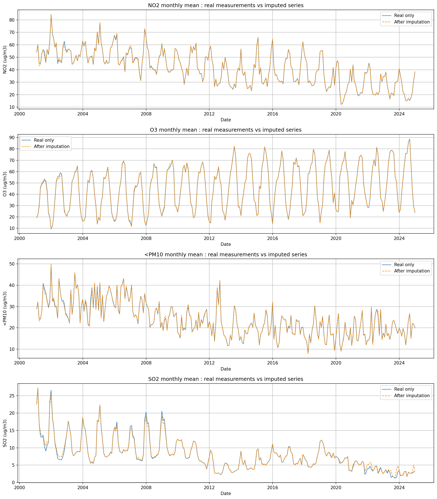

Four panels (one per pollutant), monthly mean 2001-2024 comparing "real measurements only" (solid blue) vs. "after imputation" (dashed orange).

Directly validates whether imputation introduces systematic bias into temporal analysis. If imputed values were biased, the orange line would drift systematically from blue.

The two lines track each other extremely closely for all four pollutants throughout the entire 24-year period. Small divergences appear in early years (thinner coverage), but no systematic bias is visible. This validates the imputation methodology and justifies using the imputed series for all subsequent temporal analyses.

### Figure: task4_yearly_NO2.png

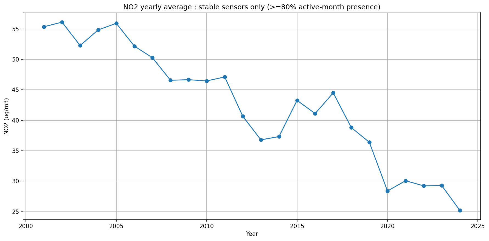

Annual city-wide NO2 average (stable sensors, station-normalized) 2001-2024.

Strong declining trend from ~54 µg/m³ (2001) to ~30 µg/m³ (2020-2024), a ~44% reduction. This reflects: progressive Euro emission standard tightening (Euro 3->6d), electrification of Madrid's bus/taxi fleet, introduction of the Madrid Central Low Emission Zone (2018). COVID-19 lockdown dip in 2020, partial recovery in 2021-2022. The 2024 value is close to the EU annual limit of 40 µg/m³, with some sensors likely exceeding it.

### Figure: task4_yearly_O3.png

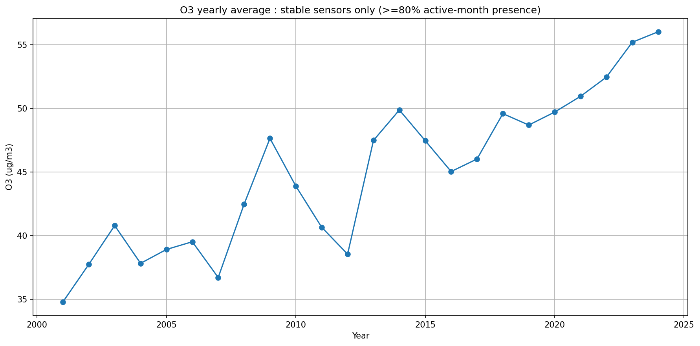

A slight upward trend in O3, roughly inverse to NO2's decline. This is the ozone penalty: O3 is partly suppressed by NO via the titration reaction O3 + NO -> NO2 + O2. As urban NO decreases (cleaner vehicles), less O3 is consumed, background ozone accumulates. This well-documented phenomenon creates a trade-off between NO2 and O3 management in European cities.

### Figure: task4_yearly_PM10.png

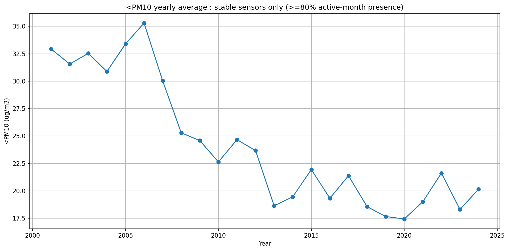

### Figure: task4_yearly_SO2.png

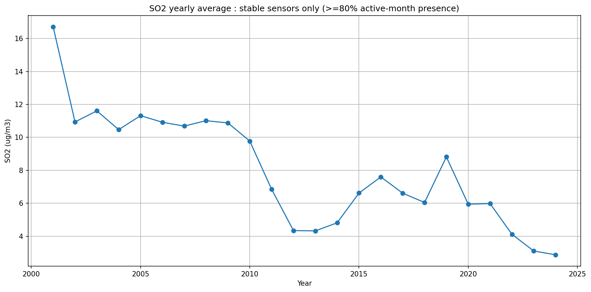

Both &lt;PM10 and SO2 decline substantially. SO2 shows the steepest drop (~12 µg/m³ -> ~4 µg/m³), reflecting EU sulfur cap regulations that mandated low-sulfur fuel and phased out sulfurous heating oil.

### Figure: task4_monthly_NO2.png

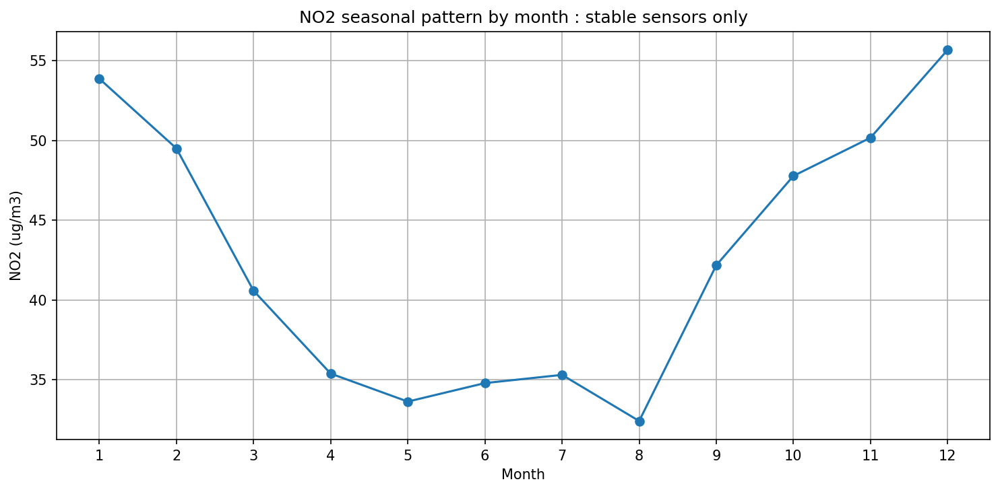

Average NO2 by calendar month.

Winter maximum (December-January, ~50 µg/m³), summer minimum (July-August, ~25 µg/m³). Driven by: (1) reduced solar radiation in winter -> slower photolytic NO2 destruction; (2) temperature inversions trapping pollutants; (3) cold-start engine emissions.

### Figure: task4_monthly_O3.png

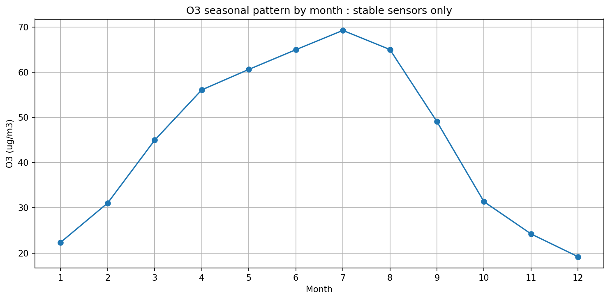

Opposite to NO2 - minimum in winter (~20 µg/m³), maximum in June-July (~75 µg/m³). More sunlight -> more photolysis -> more O3 formation. Lower NO in summer also means less O3 titration.

### Figure: task4_monthly_PM10.png

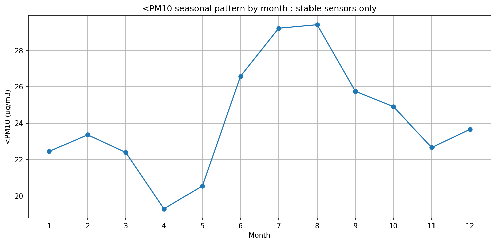

### Figure: task4_monthly_SO2.png

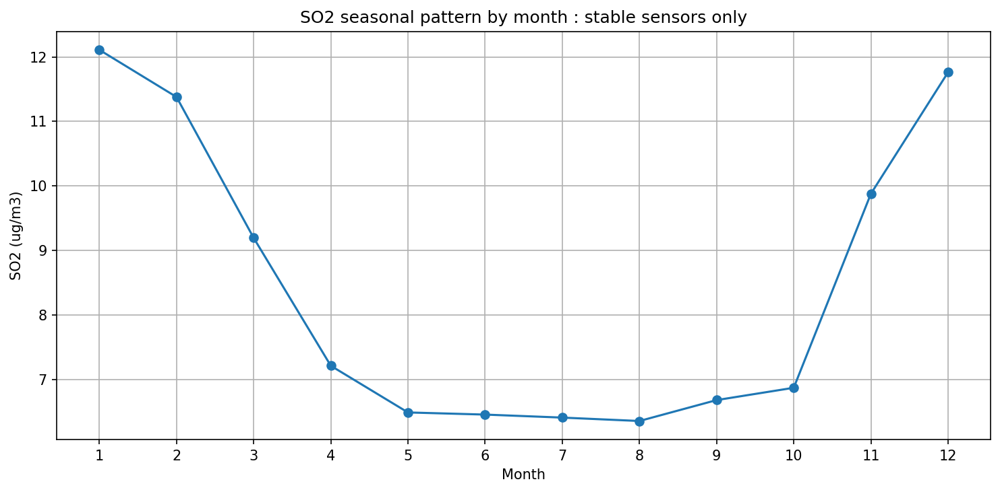

&lt;PM10 shows mild winter elevation plus a spring peak from Saharan dust transport events. SO2 winter maximum reflects heating-season combustion.

### Figure: task4_hourly_NO2.png

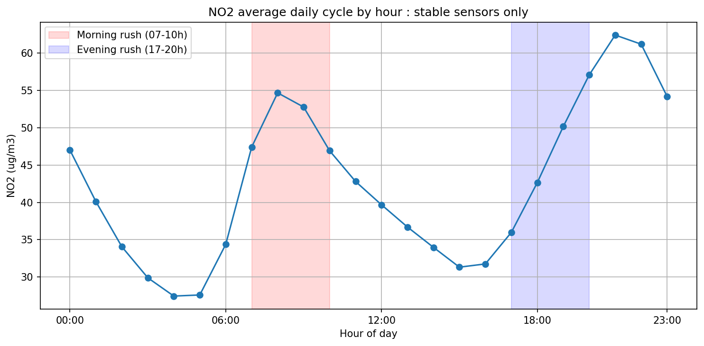

Average NO2 by hour of day (0-23), with morning rush (07-10h) and evening rush (17-20h) shaded.

Two clear rush-hour peaks at 08-09h and 19-20h. Midday trough from photolytic destruction (UV at maximum). Nighttime intermediate values reflect atmospheric stability trapping residual emissions.

### Figure: task4_hourly_O3.png

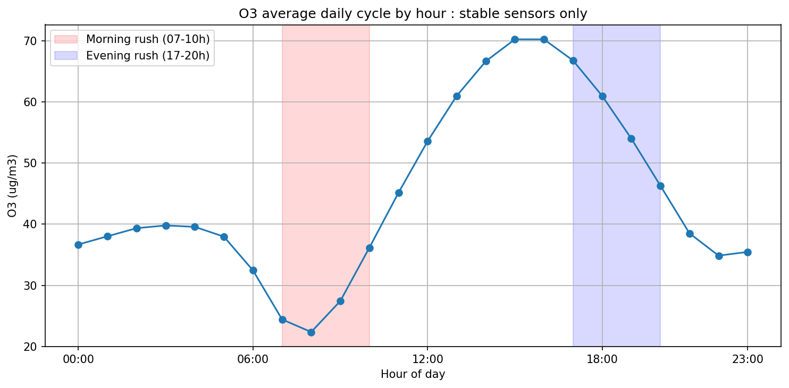

Near-zero at night (O3 consumed by NO), rising from ~08h as solar radiation begins, peaking ~13-15h, declining in the evening. The classic photochemical daytime cycle.

### Figure: task4_hourly_PM10.png

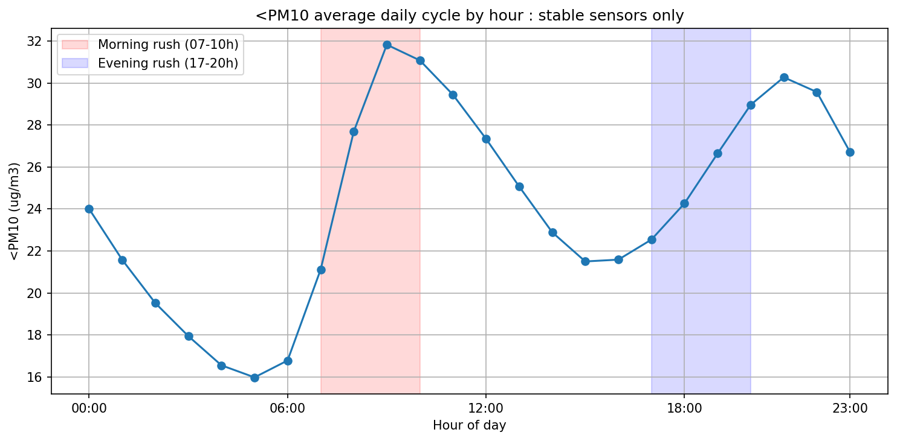

### Figure: task4_hourly_SO2.png

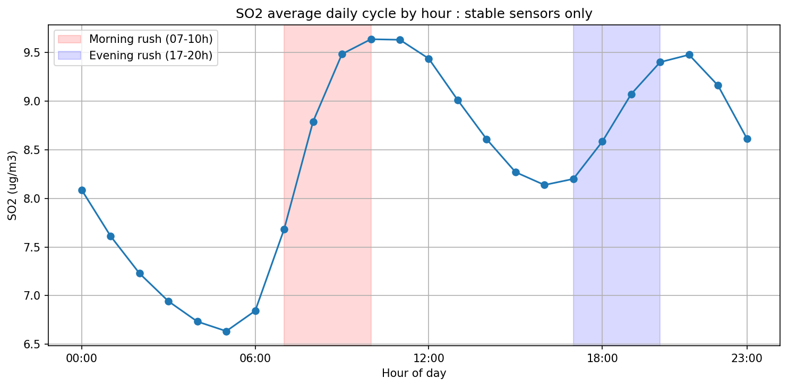

&lt;PM10 shows a diffuse morning rush pattern. SO2 is relatively flat, consistent with heating and power generation as primary sources (less diurnal than vehicle traffic).

### Figure: task4_heatmap_NO2.png

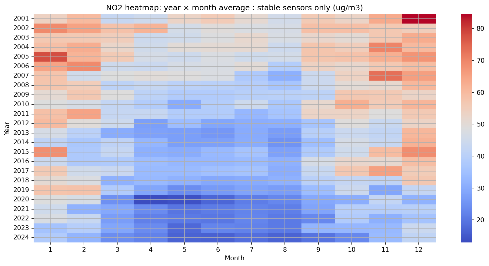

Heatmap with year (2001-2024) on y-axis, month (1-12) on x-axis, colour = average NO2.

Simultaneously shows the seasonal cycle (column pattern) and the long-term trend (row-wise gradient) without losing information from either dimension.

Alternating high-winter / low-summer bands in every row (seasonal cycle). Overall intensity decreasing from top to bottom (declining trend). 2020 row noticeably lighter than neighbors (COVID lockdown).

### Figure: task4_heatmap_O3.png

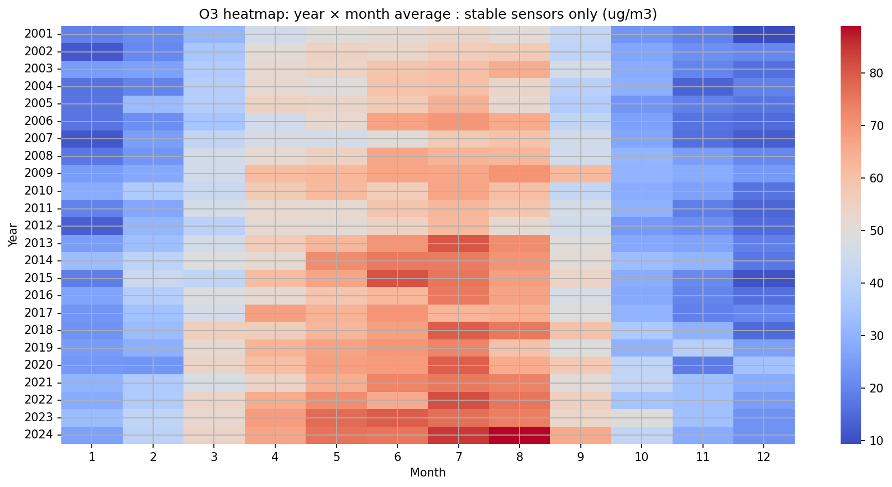

### Figure: task4_heatmap_PM10.png

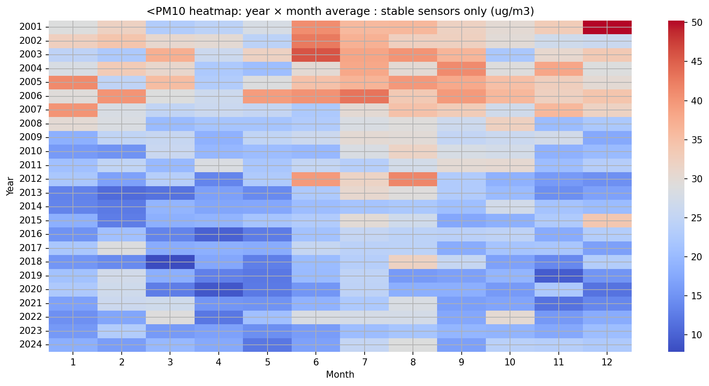

### Figure: task4_heatmap_SO2.png

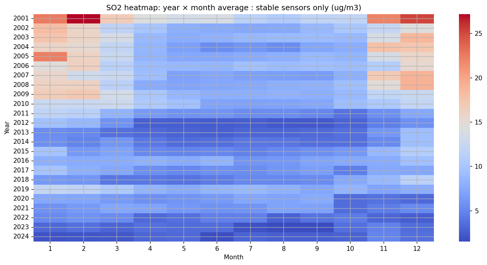

O3 shows the complementary pattern (summer peaks, slight upward trend). &lt;PM10 and SO2 both show declining trends with winter peaks.

### Figure: task4_sensor_trends_NO2.png

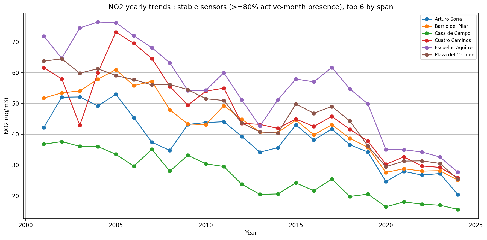

Individual yearly trends for the top-6 stable NO2 sensors.

All stations decline, but high-traffic stations (Castellana, Cuatro Caminos) have higher absolute values and steeper reductions from emission controls. Green/suburban stations (El Pardo, royal forest) are consistently lower and change less. This confirms traffic emission controls as the primary driver.

### Figure: task4_sensor_trends_O3.png

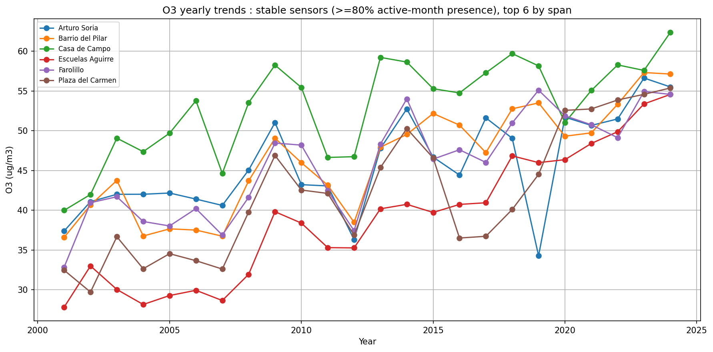

### Figure: task4_sensor_trends_PM10.png

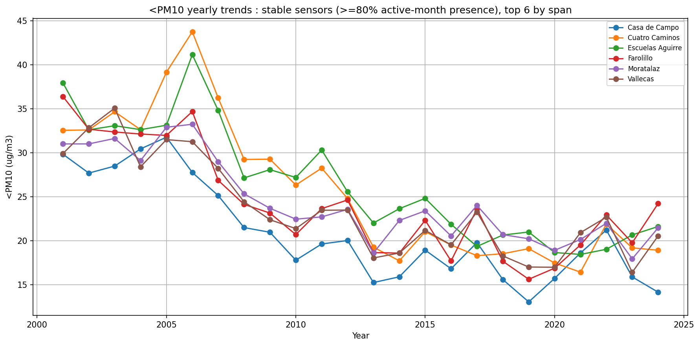

### Figure: task4_sensor_trends_SO2.png

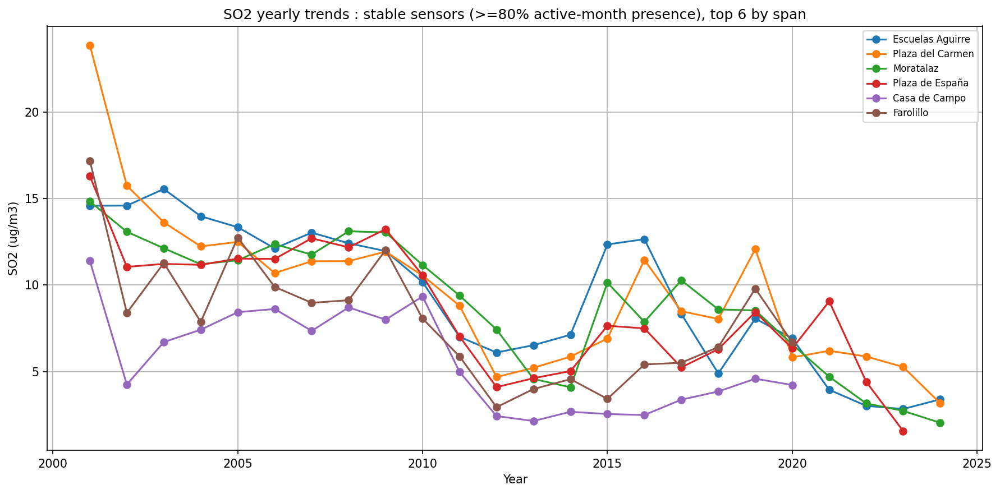

O3 sensor trends are tightly clustered (city-wide photochemical uniformity). &lt;PM10 diverges more (local dust sources). SO2 was highly variable early (multiple industrial sources) and converged to a narrow low band after fuel regulation.

## 9. Task 5: Spatial Network

### Goal

Build a graph where nodes = monitoring stations and edges = geographic proximity. Study structural properties (degree distribution, connected components, community structure) under different connectivity assumptions, and explain why naive approaches fail.


### Code

```python
# Task 5


print("TASK 5: SPATIAL NETWORK")
aq_sensor_names = set(
    df.loc[
        df["magnitude_name"].astype(str).isin(AIR_QUALITY_SET),
        "sensor_name",
    ].astype(str)
)
sensors_t5 = sensors_pos[
    sensors_pos["sensor_name"].astype(str).isin(aq_sensor_names)
].copy()
print(f"Spatial graph node scope: {len(sensors_t5)} air-quality stations "
      f"of {len(sensors_pos)} coordinate-bearing stations.")
if len(sensors_t5) < 2:
    print("WARNING: fewer than two air-quality stations found; "
          "falling back to all coordinate-bearing stations.")
    sensors_t5 = sensors_pos.copy()
coords       = sensors_t5[["utm_x","utm_y"]].values.astype(float)
dist_matrix  = cdist(coords, coords)
sensor_names = sensors_t5["sensor_name"].tolist()

dist_df = pd.DataFrame(dist_matrix, index=sensor_names, columns=sensor_names)
print("\nDistance matrix preview (metres)")
print(dist_df.iloc[:5,:5].round(0))

upper_tri = dist_matrix[np.triu_indices(len(sensor_names), k=1)]
print(f"\nMin: {upper_tri.min():>10,.0f} m | Max: {upper_tri.max():>10,.0f} m | "
      f"Mean: {upper_tri.mean():>10,.0f} m | Median: {np.median(upper_tri):>10,.0f} m")


G_full = nx.Graph()
for _, row in sensors_t5.iterrows():
    G_full.add_node(row["sensor_name"], pos=(row["utm_x"], row["utm_y"]))
n = len(sensor_names)
for i in range(n):
    for j in range(i + 1, n):
        G_full.add_edge(sensor_names[i], sensor_names[j],
                        weight=float(dist_matrix[i, j]))
max_possible = n * (n - 1) / 2
print("\nNaive fully-connected graph")
print(f"Nodes: {G_full.number_of_nodes()} | "
      f"Edges: {G_full.number_of_edges()} (max={int(max_possible)}) | "
      f"Density: {nx.density(G_full):.4f}")
print("Implication: density=1 -> no hub/periphery, community detection meaningless.")

graph_summaries = []
for thr in [3000, 5000, 7000, 10000]:
    g = build_threshold_graph(sensors_t5, dist_matrix, thr)
    graph_summaries.append(summarize_graph(g, name=f"threshold_{thr//1000}km"))
for k in [2, 3, 4, 5]:
    g = build_knn_graph(sensors_t5, dist_matrix, k)
    graph_summaries.append(summarize_graph(g, name=f"knn_k{k}"))

graph_summary_df = pd.DataFrame(graph_summaries)
print("\nSpatial graph comparison")
print(graph_summary_df.to_string(index=False))

candidate_rows = graph_summary_df[
    graph_summary_df["graph_name"].str.startswith("knn_") &
    (graph_summary_df["is_connected"] == True)
].copy()
if len(candidate_rows) > 0:
    candidate_rows["k"] = (
        candidate_rows["graph_name"]
        .str.extract(r"knn_k(\d+)")[0].astype(int)
    )
    final_k = int(candidate_rows.sort_values("k").iloc[0]["k"])
else:
    final_k = 3
    print("WARNING: no connected KNN graph found; defaulting to k=3.")

print(f"\nSelected final graph: KNN k={final_k}")
print(
    f"Justification: smallest k that yields a fully connected graph.\n"
    f"  Connectivity is required for meaningful network-level metrics:\n"
    f"  - average shortest path length is undefined on disconnected graphs;\n"
    f"  - community detection via modularity optimisation works best on a\n"
    f"    single component (isolated nodes form trivial singleton communities);\n"
    f"  - a connected graph ensures every sensor can reach every other sensor\n"
    f"    through the network, which is the physically reasonable assumption\n"
    f"    for sensors deployed across the same city.\n"
    f"  Choosing the *smallest* k avoids over-connecting the graph (larger k\n"
    f"  blurs local spatial structure by adding long-range edges that may not\n"
    f"  reflect genuine neighbourhood relationships)."
)
G_spatial     = build_knn_graph(sensors_t5, dist_matrix, final_k)
final_summary = summarize_graph(G_spatial, name=f"final_spatial_knn_k{final_k}")
print("\nFinal spatial graph summary")
print(pd.DataFrame([final_summary]).to_string(index=False))

degrees = [d for _, d in G_spatial.degree()]
plt.figure(figsize=(8, 5))
plt.hist(degrees,
         bins=np.arange(min(degrees), max(degrees) + 2) - 0.5,
         color="steelblue", edgecolor="black")
plt.title(f"Degree distribution : final spatial graph (KNN k={final_k})")
plt.xlabel("Degree"); plt.ylabel("Number of nodes")
plt.xticks(range(min(degrees), max(degrees) + 1))
plt.tight_layout()
plt.savefig("figures/task5_degree_distribution.png", dpi=150, bbox_inches="tight")
plt.close()

communities = list(greedy_modularity_communities(G_spatial, weight=None))
community_map = {node: cid for cid, c in enumerate(communities) for node in c}
modularity_score = nx.algorithms.community.modularity(
    G_spatial, communities, weight=None)

print(f"\nCommunities: {len(communities)} | Modularity: {modularity_score:.4f}")
print("(Spatial community detection is unweighted: distance defines KNN edges,")
print(" but selected neighbour links are treated equally for modularity.)")
for sensor, cid in sorted(community_map.items(), key=lambda x: x[1]):
    print(f"  {str(sensor):<35} -> Community {cid}")

pos      = nx.get_node_attributes(G_spatial, "pos")
nc       = [community_map.get(nd, 0) for nd in G_spatial.nodes()]
n_comms  = max(nc) + 1 if nc else 1
cmap_net = plt.colormaps.get_cmap("tab10")

plt.figure(figsize=(10, 8))
nx.draw_networkx_edges(G_spatial, pos, alpha=0.4, edge_color="grey")
nx.draw_networkx_nodes(G_spatial, pos,
                       node_color=nc, cmap=cmap_net,
                       node_size=160, edgecolors="black")
nx.draw_networkx_labels(G_spatial, pos,
                        labels={nd: str(nd) for nd in G_spatial.nodes()},
                        font_size=7)
legend_handles = [mpatches.Patch(color=cmap_net(i % 10), label=f"Community {i}")
                  for i in range(n_comms)]
plt.legend(handles=legend_handles, loc="best", fontsize=8)
plt.title(f"Final spatial network (KNN k={final_k}) : communities coloured")
plt.xlabel("UTM X (m)"); plt.ylabel("UTM Y (m)")
plt.tight_layout()
plt.savefig("figures/task5_spatial_network.png", dpi=150, bbox_inches="tight")
plt.close()

plot_df = sensors_t5.copy()
plot_df["utm_x_km"]  = plot_df["utm_x"] / 1000.0
plot_df["utm_y_km"]  = plot_df["utm_y"] / 1000.0
plot_df["community"] = plot_df["sensor_name"].map(community_map).fillna(0).astype(int)
plt.figure(figsize=(10, 7))
sns.scatterplot(data=plot_df, x="utm_x_km", y="utm_y_km",
                hue="community", palette="tab10", s=90)
for _, row in plot_df.iterrows():
    plt.text(row["utm_x_km"] + 0.05, row["utm_y_km"] + 0.05,
             str(row["sensor_name"]), fontsize=7)
plt.title("Sensor locations coloured by detected community")
plt.xlabel("UTM X (km)"); plt.ylabel("UTM Y (km)")
plt.tight_layout()
plt.savefig("figures/task5_sensor_locations_communities.png",
            dpi=150, bbox_inches="tight")
plt.close()
```

### Why the Naive Fully-Connected Graph Is Useless

```
Naive fully-connected graph:
  Nodes: 24  |  Edges: 276  |  Density: 1.0000
  Implication: density=1 -> no hub/periphery, community detection meaningless.
```

With all 276 possible edges present, the network has no structure. Every sensor is equally "neighbors" with every other, there is no hub, no peripheral node, no community. Community detection algorithms assign all 24 nodes to one community. Average shortest path = 1 (trivially). This graph is useless for any structural analysis.

### Why KNN Instead of Distance Threshold

The threshold-based approach produces disconnected graphs at low thresholds:

```
graph_name     n_nodes  n_edges  density  connected  components  avg_degree
threshold_3km       24       26    0.094      False          11        2.17
threshold_5km       24       73    0.265      False           2        6.08
threshold_7km       24      127    0.460       True           1       10.58
knn_k2              24       32    0.116       True           1        2.67  <- selected
knn_k3              24       50    0.181       True           1        4.17
knn_k4              24       68    0.246       True           1        5.67
```

At 3 km: 11 disconnected components, KNN is the only approach that guarantees connectivity for any k.

### Why KNN k = 2 (Smallest Connected k)

KNN k = 2 is the minimum k that yields a connected graph. Connectivity is required because:

1. Average shortest path length is undefined on disconnected graphs.
2. Modularity-based community detection produces trivial singleton communities for isolated nodes.
3. Physical justification: In a single metropolitan area, it is reasonable to assume every sensor can be "reached" through the network, a station completely isolated from all others is a modeling artifact, not a real spatial relationship.

Choosing the smallest connected k preserves maximum structural information. Larger k adds long-range edges that blur local neighborhood structure without adding physical meaning.

### Terminal Output: Final Graph

```
Final spatial graph (KNN k=2):
  Nodes: 24  |  Edges: 32  |  Density: 0.116
  Connected: True  |  Components: 1
  Avg degree: 2.67  |  Avg clustering: 0.368
  Avg shortest path: 4.82
  Communities: 5  |  Modularity: 0.613
```

Modularity 0.613 confirms strong community structure, sensors cluster into geographic zones with denser internal connections.

### Community Assignments

<table style="border-collapse:collapse;width:100%;background:#ffffff;margin:10px 0;">
  <thead><tr>
    <th style="background:#ffffff;padding:6px 14px;border:1px solid #cccccc;font-weight:bold;text-align:left;">Community</th>
    <th style="background:#ffffff;padding:6px 14px;border:1px solid #cccccc;font-weight:bold;text-align:left;">Stations</th>
    <th style="background:#ffffff;padding:6px 14px;border:1px solid #cccccc;font-weight:bold;text-align:left;">Geographic zone</th>
  </tr></thead>
  <tbody>
  <tr>
    <td style="background:#ffffff;padding:6px 14px;border:1px solid #cccccc;text-align:left;">0</td>
    <td style="background:#ffffff;padding:6px 14px;border:1px solid #cccccc;text-align:left;">Escuelas Aguirre, Parque del Retiro, Vallecas, Moratalaz, Méndez Álvaro, Ensanche de Vallecas, Plaza del Carmen</td>
    <td style="background:#ffffff;padding:6px 14px;border:1px solid #cccccc;text-align:left;">East / centre-east</td>
  </tr>
  <tr>
    <td style="background:#ffffff;padding:6px 14px;border:1px solid #cccccc;text-align:left;">1</td>
    <td style="background:#ffffff;padding:6px 14px;border:1px solid #cccccc;text-align:left;">Plaza de España, Ramón y Cajal, Arturo Soria, Cuatro Caminos, Castellana</td>
    <td style="background:#ffffff;padding:6px 14px;border:1px solid #cccccc;text-align:left;">North-centre / Castellana axis</td>
  </tr>
  <tr>
    <td style="background:#ffffff;padding:6px 14px;border:1px solid #cccccc;text-align:left;">2</td>
    <td style="background:#ffffff;padding:6px 14px;border:1px solid #cccccc;text-align:left;">Tres Olivos, Barrio del Pilar, Sanchinarro, El Pardo, Plaza Castilla</td>
    <td style="background:#ffffff;padding:6px 14px;border:1px solid #cccccc;text-align:left;">North</td>
  </tr>
  <tr>
    <td style="background:#ffffff;padding:6px 14px;border:1px solid #cccccc;text-align:left;">3</td>
    <td style="background:#ffffff;padding:6px 14px;border:1px solid #cccccc;text-align:left;">Villaverde, Plaza Elíptica, Casa de Campo, Farolillo</td>
    <td style="background:#ffffff;padding:6px 14px;border:1px solid #cccccc;text-align:left;">South-west</td>
  </tr>
  <tr>
    <td style="background:#ffffff;padding:6px 14px;border:1px solid #cccccc;text-align:left;">4</td>
    <td style="background:#ffffff;padding:6px 14px;border:1px solid #cccccc;text-align:left;">Urb. Embajada, Juan Carlos I, Barajas Pueblo</td>
    <td style="background:#ffffff;padding:6px 14px;border:1px solid #cccccc;text-align:left;">North-east / Airport</td>
  </tr>
  </tbody>
</table>

### Figure: task5_degree_distribution.png

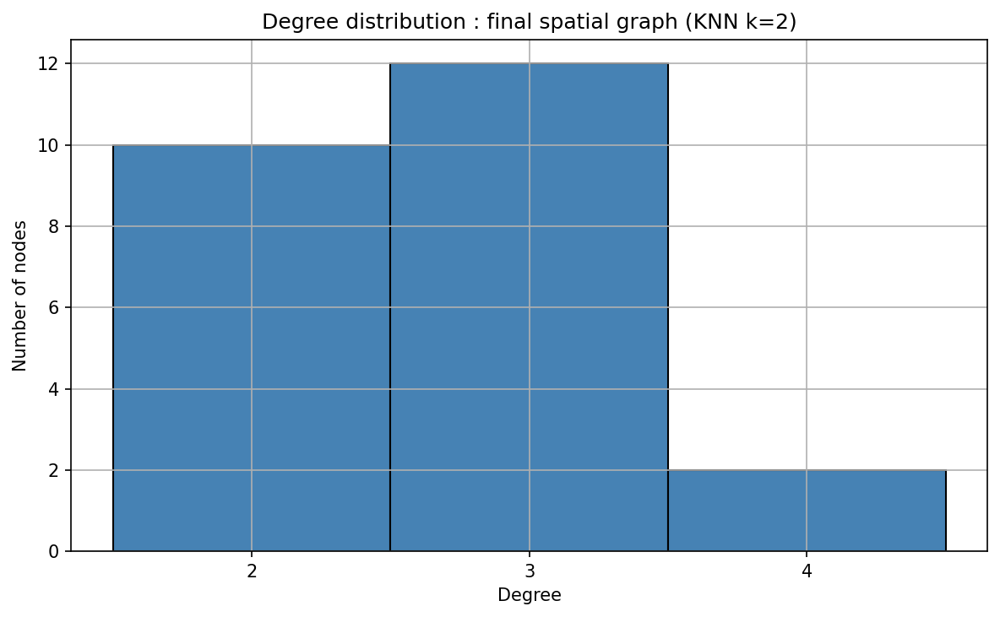

Histogram of node degrees in the KNN k=2 graph.

Degree distribution characterizes network topology. "study and analyse the graph", degree distribution is the first standard graph metric.

Most nodes have degree 2 (exactly their two nearest neighbors). A few reach degree 3-5 because some sensors appear in multiple other sensors' KNN lists (incoming edges add to degree). Compact distribution with no high-degree hubs, consistent with a geographically uniform sensor deployment.

### Figure: task5_spatial_network.png

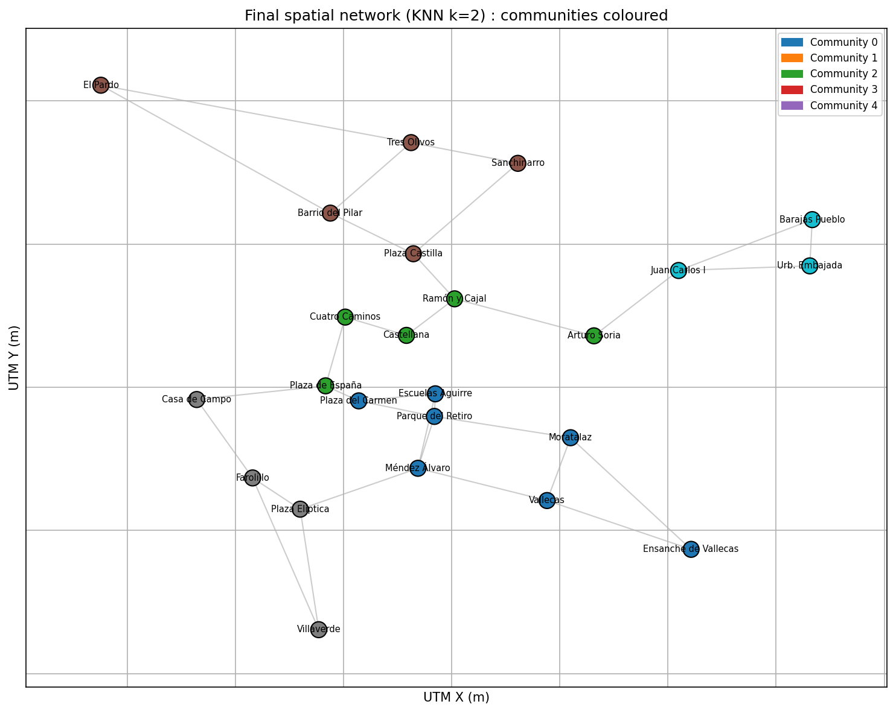

NetworkX visualization of the 24-node graph with sensors at actual UTM coordinates (in km). Edges shown in grey, nodes coloured by community.

Primary network visualization. Positioning nodes at actual geographic coordinates lets the reader directly interpret community membership in terms of urban geography without any prior knowledge of Madrid.

Five color groups cluster clearly by geography. Community 4 (northeast) near Barajas airport. Community 3 (southwest) in the Villaverde industrial zone. Community 1 runs along the north-south Castellana axis. The sparse edge structure (2-3 edges per node) makes neighborhood relationships clear without visual clutter.

### Figure: task5_sensor_locations_communities.png

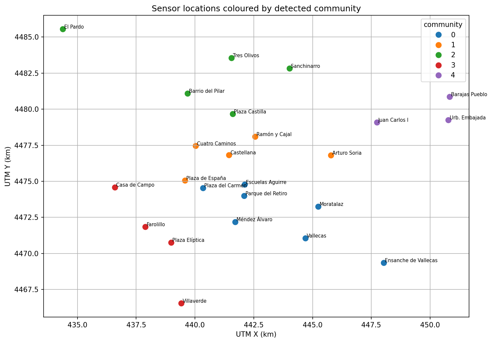

Cleaner scatter plot of sensor UTM coordinates with community colour and text labels.

Geographic correspondence with Madrid's actual district structure is striking. Community 2 includes El Pardo (royal forest, northwest), a distinctly green zone. Community 3 includes Villaverde (main industrial zone, south). Community 1 follows the Paseo de la Castellana corridor.

## 10. Task 6: Correlation Network

### Goal

Build a behavioral association network connecting sensors that co-vary over time, compare it against the spatial network, and analyze how the network structure changes with different thresholds and time windows.


### Code

```python
# Task 6


print("TASK 6: SIGNED STRONG-ASSOCIATION NETWORK")
print(f"Task 6 uses the Task 4 shared window: "
      f"{_common_start.date()} -> {_common_end.date()}")
print("Sensor associations use monthly Pearson correlations with min_periods=12; "
      "edges use |r| while retaining signed corr values.")
print("Main Task 6 networks use the cleaned/imputed Task 4 analytical series; "
      "a raw-only NO2 sensitivity check is reported below.")
G_no2_cmp = None
G_no2_real_cmp = None

for pol in SELECTED_POLLUTANTS:
    sub_t6 = aq_t4[aq_t4["magnitude_name"] == pol]
    if len(sub_t6) == 0:
        print(f"\n[{pol}] No data : skipping.")
        continue

    monthly_pivot = (
        sub_t6.groupby(["year_month","sensor_name"])["value"]
        .mean().unstack("sensor_name").sort_index()
    )
    if monthly_pivot.shape[1] < 2:
        print(f"\n[{pol}] Fewer than 2 sensors : skipping.")
        continue

    month_overlap = monthly_pivot.notna().astype(int).T @ monthly_pivot.notna().astype(int)
    overlap_upper = (
        month_overlap
        .where(np.triu(np.ones(month_overlap.shape, dtype=bool), k=1))
        .stack(future_stack=True)
        .dropna()
    )
    if len(overlap_upper) > 0:
        print(f"\n[{pol}] Pairwise monthly overlap before correlation:")
        print(f"  sensor pairs={len(overlap_upper)}  "
              f"min={int(overlap_upper.min())} months  "
              f"median={float(overlap_upper.median()):.1f} months  "
              f"max={int(overlap_upper.max())} months")
        thin_pairs = int(((overlap_upper >= 12) & (overlap_upper < 24)).sum())
        if thin_pairs > 0:
            print(f"  WARNING: {thin_pairs} pairs have only 12-23 overlapping "
                  "months; interpret their correlations cautiously.")

    corr_matrix = monthly_pivot.corr(method="pearson", min_periods=12)


    monthly_diff   = monthly_pivot.diff().dropna(how="all")
    corr_detrended = monthly_diff.corr(method="pearson", min_periods=12)
    print(f"\n[{pol}] Detrended (first-diff) Pearson correlation matrix:")
    print(corr_detrended.round(2).to_string())

    diff_mat = (corr_matrix - corr_detrended).abs()
    max_change = diff_mat.stack().max() if not diff_mat.stack().empty else 0.0
    print(f"  Max |r_raw - r_detrended| across all pairs: {max_change:.3f}")
    if max_change > 0.20:
        print("  WARNING: some correlations change substantially after detrending"
              " : raw Pearson results may partly reflect shared trend, not co-movement.")

    print(f"\n[{pol}] Pearson correlation matrix ({corr_matrix.shape[0]} sensors):")
    print(corr_matrix.round(2).to_string())

    plt.figure(figsize=(10, 8))
    sns.heatmap(corr_matrix, annot=True, fmt=".2f", cmap="RdYlGn",
                vmin=-1, vmax=1, square=True, linewidths=0.5)
    plt.title(f"{pol} : sensor Pearson correlation (monthly means)")
    plt.tight_layout()
    plt.savefig(f"figures/task6_corrmatrix_{pol.replace('<','')}.png",
                dpi=150, bbox_inches="tight")
    plt.close()

    print(f"\n[{pol}] Threshold sweep (edges added when |Pearson| >= thr):")
    for thr in [0.5, 0.6, 0.7, 0.8]:
        G_tmp = build_corr_graph(corr_matrix, thr)
        s     = summarize_graph(G_tmp, name=f"{pol}_corr_{thr}")
        print(f"  |r|>={thr}  edges={s['n_edges']:3d}  "
              f"density={s['density']:.3f}  components={s['n_components']}")

    G_corr_final = build_corr_graph(corr_matrix, CORR_THR)
    if G_corr_final.number_of_edges() > 0:
        corr_communities = list(
            greedy_modularity_communities(G_corr_final, weight="weight")
        )
        corr_modularity  = nx.algorithms.community.modularity(
            G_corr_final, corr_communities, weight="weight")
        corr_comm_map    = {nd: cid for cid, c in enumerate(corr_communities)
                            for nd in c}
        print(f"\n[{pol}] Final graph (thr={CORR_THR}): "
              f"{G_corr_final.number_of_nodes()} nodes, "
              f"{G_corr_final.number_of_edges()} edges, "
              f"modularity={corr_modularity:.4f}")
    else:
        corr_comm_map = {}
        print(f"\n[{pol}] No edges at threshold {CORR_THR}.")

    pos_corr = {s: utm_pos(s, sensors_t5) for s in G_corr_final.nodes()}
    draw_network(G_corr_final, pos_corr, corr_comm_map,
                 f"{pol} signed strong-association network (|Pearson| >= {CORR_THR})",
                 f"figures/task6_corrnet_{pol.replace('<','')}.png")

    if pol == "NO2":
        G_no2_cmp = G_corr_final
        no2_real = df.loc[
            (df["magnitude_name"] == "NO2") & (~df["is_interpolated"]) &
            (df["entry_date"] >= _common_start) &
            (df["entry_date"] <= _common_end),
            ["entry_date", "sensor_name", "value"],
        ].copy()
        print("\n[NO2] Raw-only sensitivity check "
              "(non-interpolated observations only)")
        if len(no2_real) == 0:
            print("  No raw NO2 observations available in the shared window.")
        else:
            no2_real["year_month"] = no2_real["entry_date"].dt.to_period("M")
            real_monthly_pivot = (
                no2_real.groupby(["year_month", "sensor_name"])["value"]
                .mean().unstack("sensor_name").sort_index()
            )
            if real_monthly_pivot.shape[1] < 2:
                print("  Fewer than two raw-observed NO2 sensors : skipping.")
            else:
                real_corr = real_monthly_pivot.corr(
                    method="pearson", min_periods=12)
                G_no2_real_cmp = build_corr_graph(real_corr, CORR_THR)
                real_summary = summarize_graph(
                    G_no2_real_cmp, name="NO2_raw_only_corr")
                print(pd.DataFrame([real_summary]).to_string(index=False))

                real_comm_map = {}
                if G_no2_real_cmp.number_of_edges() > 0:
                    real_comms = list(
                        greedy_modularity_communities(
                            G_no2_real_cmp, weight="weight")
                    )
                    real_mod = nx.algorithms.community.modularity(
                        G_no2_real_cmp, real_comms, weight="weight")
                    real_comm_map = {
                        nd: cid for cid, c in enumerate(real_comms) for nd in c
                    }
                    print(f"  Raw-only weighted modularity: {real_mod:.4f}")

                main_edges = {
                    tuple(sorted(map(str, e))) for e in G_no2_cmp.edges()
                }
                real_edges = {
                    tuple(sorted(map(str, e))) for e in G_no2_real_cmp.edges()
                }
                common_edges = main_edges & real_edges
                union_edges = main_edges | real_edges
                jaccard = (
                    len(common_edges) / len(union_edges)
                    if len(union_edges) else np.nan
                )
                print(f"  Edge overlap with cleaned/imputed NO2 graph: "
                      f"{len(common_edges)} common / {len(union_edges)} union "
                      f"(Jaccard={jaccard:.3f})")

                plt.figure(figsize=(10, 8))
                sns.heatmap(real_corr, annot=True, fmt=".2f", cmap="RdYlGn",
                            vmin=-1, vmax=1, square=True, linewidths=0.5)
                plt.title("NO2 : raw-only sensor Pearson correlation "
                          "(monthly means)")
                plt.tight_layout()
                plt.savefig("figures/task6_corrmatrix_NO2_real_only.png",
                            dpi=150, bbox_inches="tight")
                plt.close()

                pos_real = {
                    s: utm_pos(s, sensors_t5) for s in G_no2_real_cmp.nodes()
                }
                draw_network(
                    G_no2_real_cmp, pos_real, real_comm_map,
                    f"NO2 raw-only signed strong-association network "
                    f"(|Pearson| >= {CORR_THR})",
                    "figures/task6_corrnet_NO2_real_only.png",
                )

print("\nSpatial vs Correlation network comparison (NO2)")
spatial_summ = summarize_graph(G_spatial, name=f"spatial_knn_k{final_k}")
if G_no2_cmp is not None:
    corr_summ = summarize_graph(G_no2_cmp, name="corr_NO2_06")
    print(f"\n{'Property':<22} {'Spatial':>20} {'Corr NO2':>20}")
    for key in ["n_nodes","n_edges","density","is_connected",
                "n_components","avg_degree","avg_clustering"]:
        print(f"{key:<22} {str(spatial_summ[key]):>20} {str(corr_summ[key]):>20}")

print("""
Discussion:
  - Spatial edges = geographic proximity -> local pollution spread.
  - Association edges = strong signed temporal relationships -> common drivers
    (traffic rhythms, wind direction, heating season).
  - Nearby sensors may be uncorrelated (park vs motorway micro-environment).
  - Distant sensors may be highly correlated (city-wide Saharan dust events,
    temperature inversions covering all of Madrid).

Signed-edge interpretation (use_abs=True, so both pos & neg edges included):
  - POSITIVE edge (corr > 0, |r| >= threshold): both sensors rise and fall
    together. Typical cause: shared emission source (e.g., two sensors near
    the same arterial road both peak during rush hours).
  - NEGATIVE edge (corr < 0, |r| >= threshold): sensor A tends to be
    high when sensor B is low (anti-correlation). Example within a single
    pollutant: an upwind sensor may peak before a downwind one in time, or
    two sensors may be dominated by opposing local conditions. Note: the
    classic O3/NO chemistry example (O3 destroyed by NO via titration) would
    appear in a *cross-pollutant* graph; within a single-pollutant NO2 graph,
    negative edges reflect behavioural anti-correlation between locations.
  - The edge attribute 'corr' retains the raw signed Pearson r. The graph
    'weight' is |r|, so weighted modularity/community detection receives
    nonnegative association strengths.
  - The main graph is based on the cleaned/imputed analytical dataset; the
    raw-only NO2 sensitivity check shows how much the edge set depends on
    the imputation/smoothing step.
""")


print("\nTask 6 : Time-window comparison (NO2 strong-association network)")
_no2_t6 = aq_t4[aq_t4["magnitude_name"] == "NO2"].copy()
if len(_no2_t6) > 0:
    _years_available = sorted(_no2_t6["entry_date"].dt.year.dropna().unique())
    if len(_years_available) < 2:
        _windows = {}
        print("  Not enough distinct years for an early/late comparison.")
    else:
        _split_i = max(1, len(_years_available) // 2)
        _early_years = _years_available[:_split_i]
        _late_years  = _years_available[_split_i:]
        _windows = {
            f"{int(_early_years[0])}-{int(_early_years[-1])}": (
                int(_early_years[0]), int(_early_years[-1])
            ),
            f"{int(_late_years[0])}-{int(_late_years[-1])}": (
                int(_late_years[0]), int(_late_years[-1])
            ),
        }
        print("  Early/late windows are split at the median available NO2 year,")
        print("  avoiding hardcoded calendar boundaries when coverage starts late.")
    _tw_summaries = []
    for _wname, (_yr0, _yr1) in _windows.items():
        _sub = _no2_t6[
            (_no2_t6["entry_date"].dt.year >= _yr0) &
            (_no2_t6["entry_date"].dt.year <= _yr1)
        ]
        if len(_sub) == 0:
            print(f"  [{_wname}] No data : skipping.")
            continue
        _mp = (
            _sub.groupby(["year_month","sensor_name"])["value"]
            .mean().unstack("sensor_name").sort_index()
        )
        if _mp.shape[1] < 2:
            print(f"  [{_wname}] Fewer than 2 sensors.")
            continue
        _cm = _mp.corr(method="pearson", min_periods=12)
        for _thr in [0.4, 0.5, 0.6, 0.7]:
            _G = build_corr_graph(_cm, _thr)
            _s = summarize_graph(_G, name=f"NO2_{_wname}_thr{_thr}")
            _tw_summaries.append({
                "window": _wname, "threshold": _thr,
                "n_edges": _s["n_edges"], "density": _s["density"],
                "n_components": _s["n_components"],
            })
            print(f"  [{_wname}] thr={_thr}  edges={_s['n_edges']:3d}  "
                  f"density={_s['density']:.3f}  components={_s['n_components']}")

    if _tw_summaries:
        _tw_df = pd.DataFrame(_tw_summaries)
        fig, axes = plt.subplots(1, 2, figsize=(14, 5))
        for _i, _metric in enumerate(["n_edges","density"]):
            for _wname in _tw_df["window"].unique():
                _grp = _tw_df[_tw_df["window"] == _wname]
                axes[_i].plot(_grp["threshold"], _grp[_metric],
                              marker="o", label=_wname)
            axes[_i].set_title(f"NO2 strong-association network : {_metric} vs threshold")
            axes[_i].set_xlabel("Pearson threshold")
            axes[_i].set_ylabel(_metric)
            axes[_i].legend()
        plt.suptitle("Time-window comparison: 2001-2014 vs 2015-2024 (NO2)")
        plt.tight_layout()
        plt.savefig("figures/task6_timewindow_comparison.png",
                    dpi=150, bbox_inches="tight")
        plt.close()
```

### Why Behavioral Correlation Instead of Just Proximity

Two areas are not necessarily related just because they are nearby. Two sensors 500 m apart, one in a park, one on a motorway, may be entirely uncorrelated behaviorally. Two sensors 15 km apart may be highly correlated if they both respond to city-wide events (Saharan dust, temperature inversions). Behavioral correlation captures shared drivers (meteorology, traffic rhythms, heating season) that proximity-based networks cannot.

### Why Monthly Aggregation for Correlations

1. Signal/noise: Hourly Pearson correlations are noisy. Monthly aggregation smooths measurement noise and short-duration events.
2. Missing-data robustness: min_periods=12 requires ≥ 1 full year of overlapping monthly values before reporting a correlation, prevents spurious high correlations from a few months.
3. Seasonal structure: Monthly means capture the dominant seasonal signals that drive long-range spatial correlations.

### Why Signed Edges (Both Positive and Negative)

Most correlation networks only include positive edges. We include both positive (r > 0, |r| ≥ 0.6) and negative (r < 0, |r| ≥ 0.6) edges because:
Positive edge: both sensors rise and fall together - shared emission source or shared meteorological driver.
Negative edge within a single pollutant: sensors are anti-correlated. Can reflect upwind/downwind timing differences, or opposing local microenvironments.
The `weight` attribute stores |r| for modularity calculations (non-negative); the `corr` attribute preserves the signed r for physical interpretation.

### Terminal Output: NO2 Network (Fully Connected)

```
[NO2] Threshold sweep:
  |r| >= 0.50: 276 edges, density=1.000
  |r| >= 0.60: 276 edges, density=1.000  <- fully connected at our threshold
  |r| >= 0.70: 272 edges, density=0.986
  |r| >= 0.80: 245 edges, density=0.888

[NO2] Final graph (thr=0.6): 24 nodes, 276 edges, modularity=0.0000
Max |r_raw, r_detrended| across all pairs: 0.266
WARNING: some correlations partly reflect shared downward trend.
Raw-only sensitivity: Jaccard = 1.000 (identical to imputed graph)
```

At threshold 0.60, all 276 possible NO2 sensor pairs have |r| ≥ 0.60 - a fully connected graph with zero modularity (no community structure). This means all 24 Madrid NO2 sensors are strongly behaviorally synchronized. Physical explanation: NO2 is driven by city-wide seasonal and diurnal cycles (heating season, traffic rhythms, photolysis) that affect all stations simultaneously. The detrending check shows that part of the raw Pearson r reflects the shared long-run declining trend - but even detrended correlations remain high (minimum ≈ 0.58 after first-differencing).

### Terminal Output: SO2 (Most Differentiated)

```
[SO2] Threshold sweep:
  |r| >= 0.60: 25 edges, density=0.556, components=2  <- not fully connected
  |r| >= 0.70: 19 edges, density=0.422, components=3
  |r| >= 0.80:  4 edges, density=0.089, components=7

Sanchinarro correlation range: r = 0.28-0.53 (outlier station)
```

SO2 shows real network structure at threshold 0.6: not all sensors are connected. Sanchinarro (northern suburban station) has consistently low correlations with all others, reflecting its distinct local SO2 profile far from central industrial and heating corridors.

### Terminal Output: Spatial vs. Correlation Comparison

```
Property               Spatial (KNN k=2)    Correlation NO2 (|r|≥0.6)
n_edges                        32                    276
density                    0.116                  1.000
avg_degree                  2.67                   23.0
avg_clustering              0.368                  1.000
```

The contrast is dramatic. The spatial network is sparse and structured (meaningful communities, meaningful degree distribution). The NO2 correlation network is a complete graph with no structure - every sensor belongs to the same behavioral community.

### Time-Window Comparison

```
Period          thr=0.6 edges   density at 0.7
2001-2012:           247           0.761
2013-2024:           276           0.996
```

Later period produces denser networks: (1) more sensors active simultaneously -> longer overlap -> lower correlation estimation noise; (2) improved city-wide air quality management may have genuinely increased spatial homogeneity of NO2.

### Figure: task6_corrmatrix_NO2.png

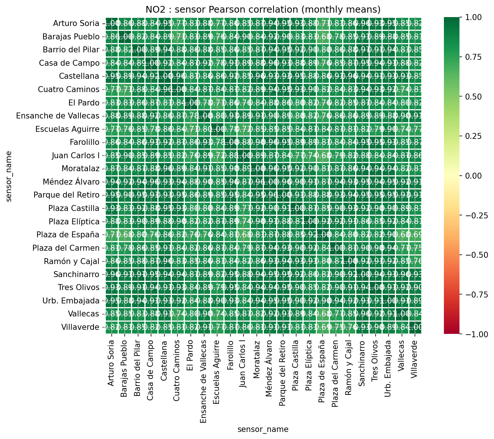

24×24 annotated Pearson correlation heatmap for NO2 (monthly means, min_periods=12). All cells are green because all r ≥ 0.68. The slight variation within the green range reveals which station pairs are slightly less synchronized - Plaza de España shows marginally lower correlations, consistent with its pedestrianized plaza microenvironment.

### Figure: task6_corrmatrix_NO2_real_only.png

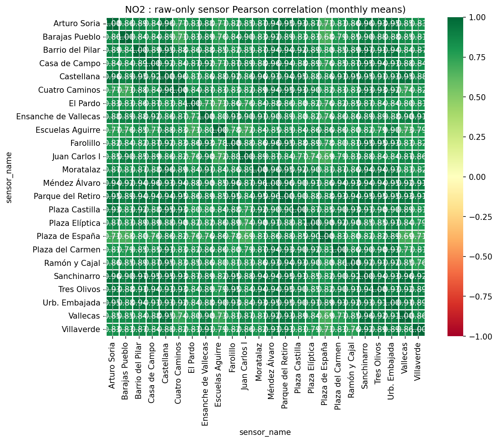

Validates that high NO2 correlations are genuine data properties, not imputation artifacts. The matrix is visually indistinguishable from the imputed version (Jaccard = 1.000 at threshold 0.6).

### Figure: task6_corrmatrix_O3.png

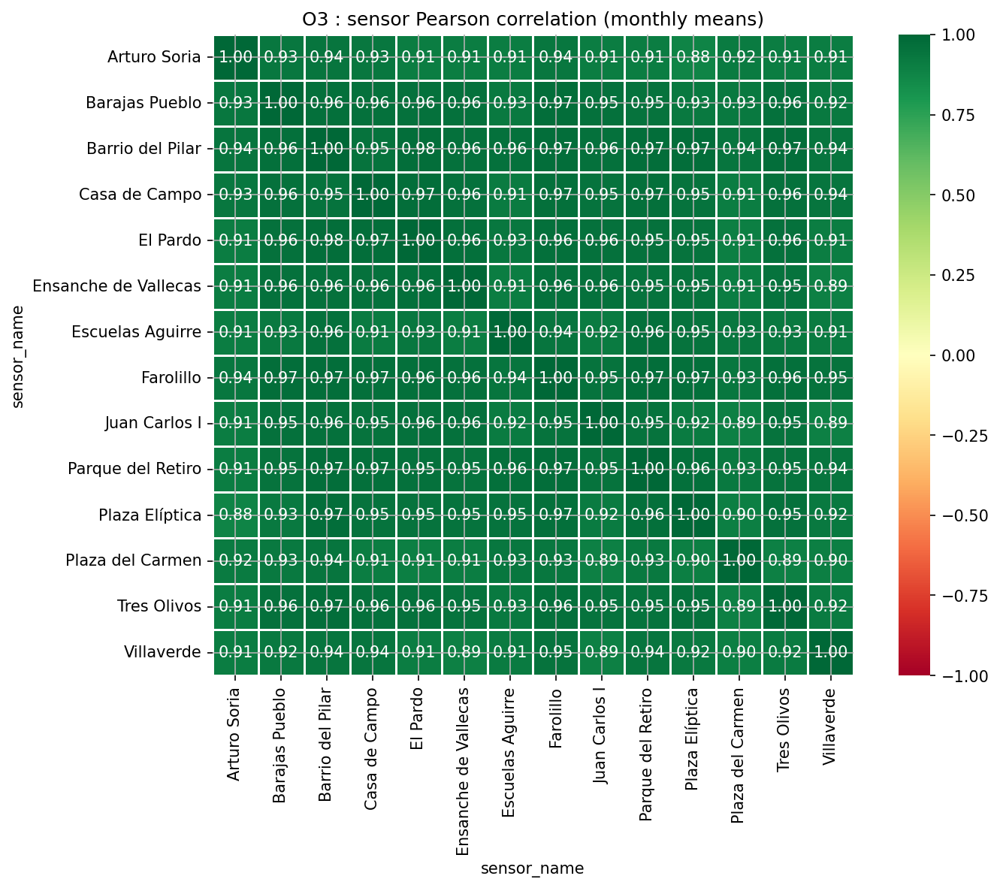

Even higher correlations than NO2 (minimum r ≈ 0.88 after detrending). Ozone is the most spatially uniform pollutant - photochemical conditions (solar radiation, temperature) are essentially identical across a city-scale domain.

### Figure: task6_corrmatrix_PM10.png

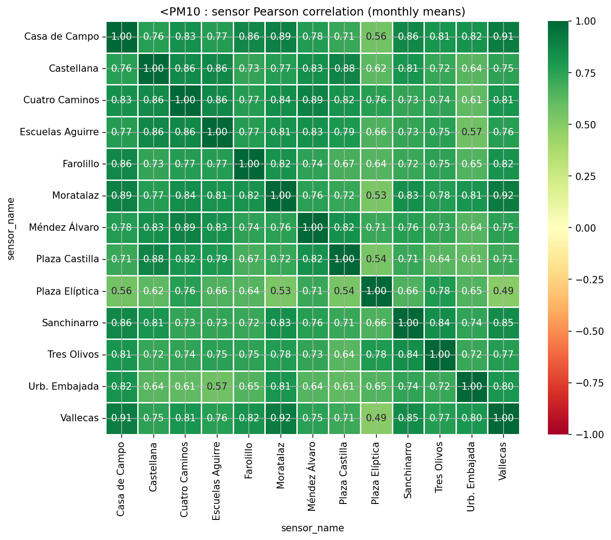

First signs of heterogeneity: Plaza Elíptica appears lighter - its location near a major traffic interchange may produce a distinct PM10 source signature different from the general background dust.

### Figure: task6_corrmatrix_SO2.png

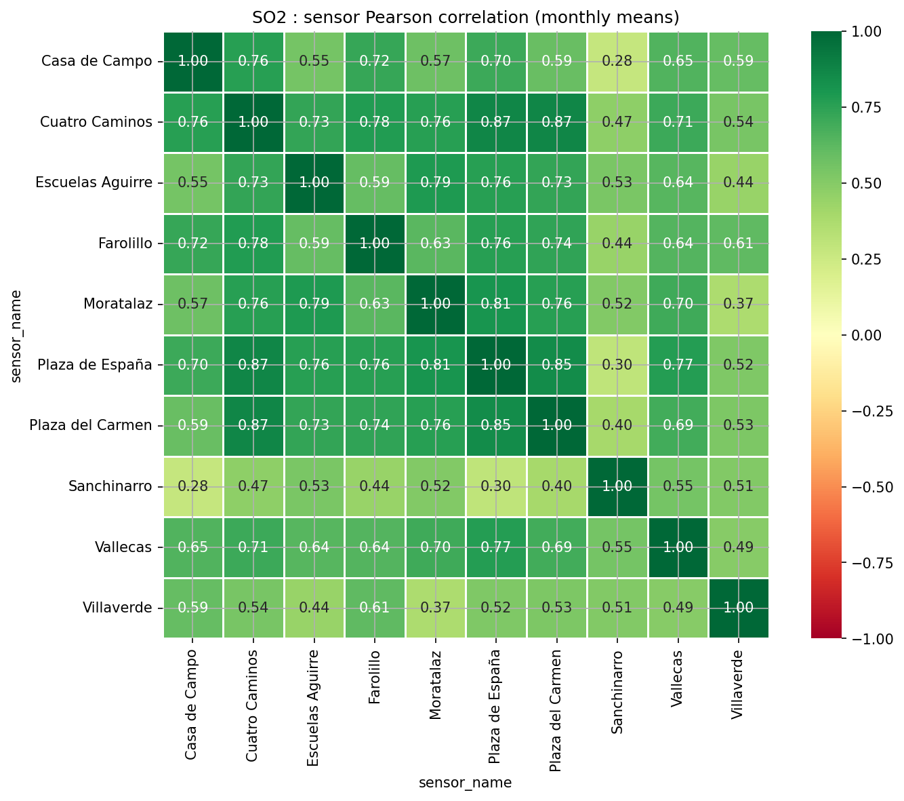

Clear differentiation. Sanchinarro row/column is visibly lighter than all others - consistently low r values (0.28-0.55) reflecting its distinct northern suburban SO2 profile.

### Figure: task6_corrnet_NO2.png

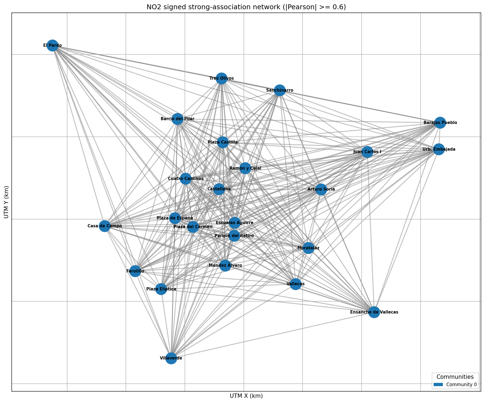

Fully connected complete graph for NO2 at threshold 0.6. Every sensor is directly connected to every other. The node geographic positioning remains informative - it shows that city-wide behavioral synchrony is independent of distance.

### Figure: task6_corrnet_NO2_real_only.png

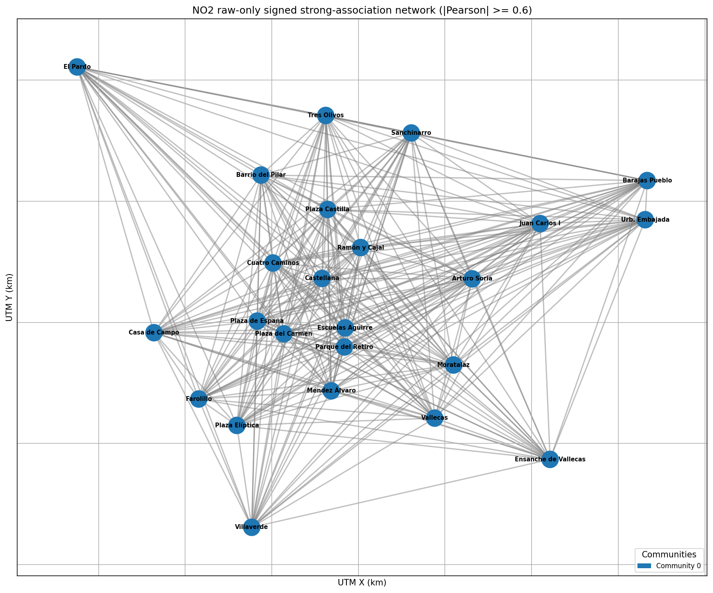

Identical to the imputed NO2 network. Confirms robustness.

### Figure: task6_corrnet_O3.png

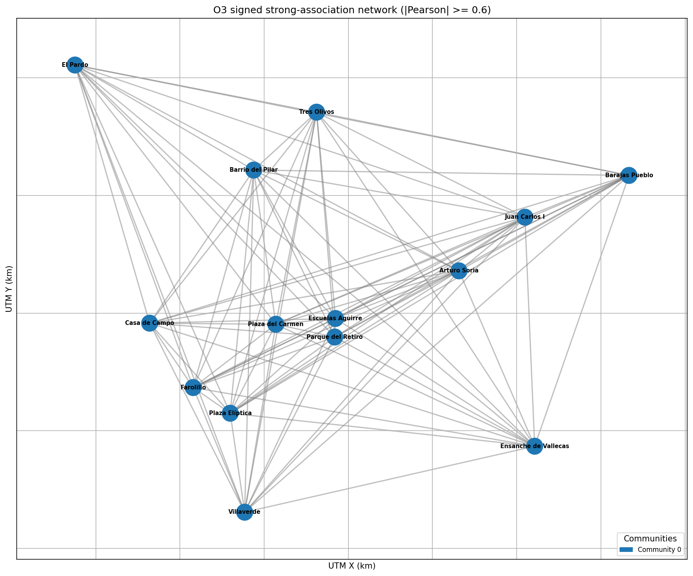

### Figure: task6_corrnet_PM10.png

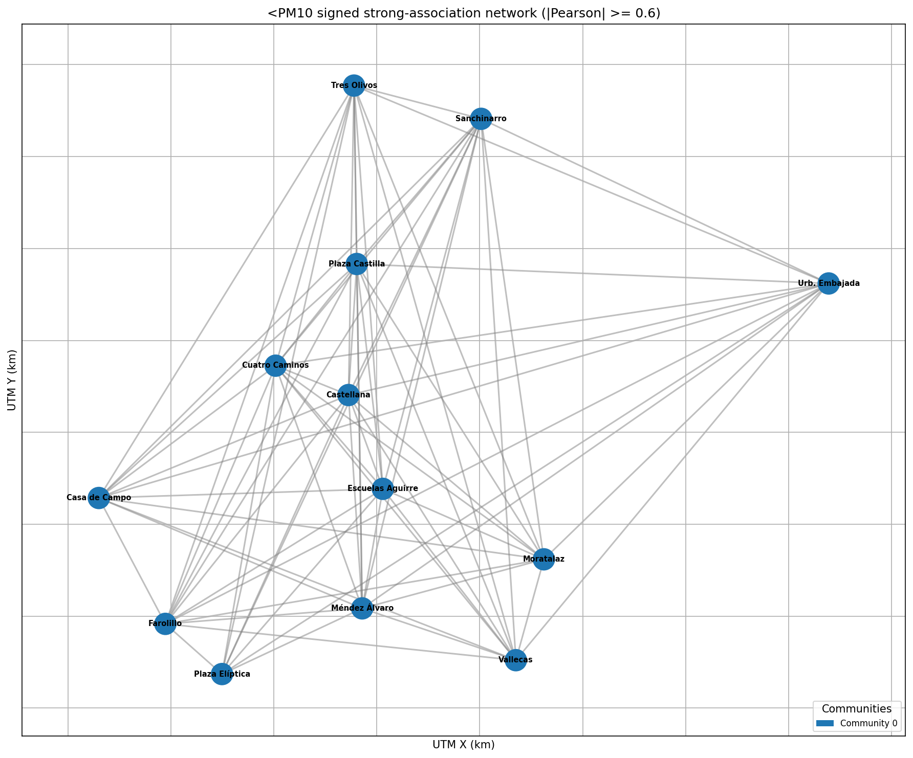

### Figure: task6_corrnet_SO2.png

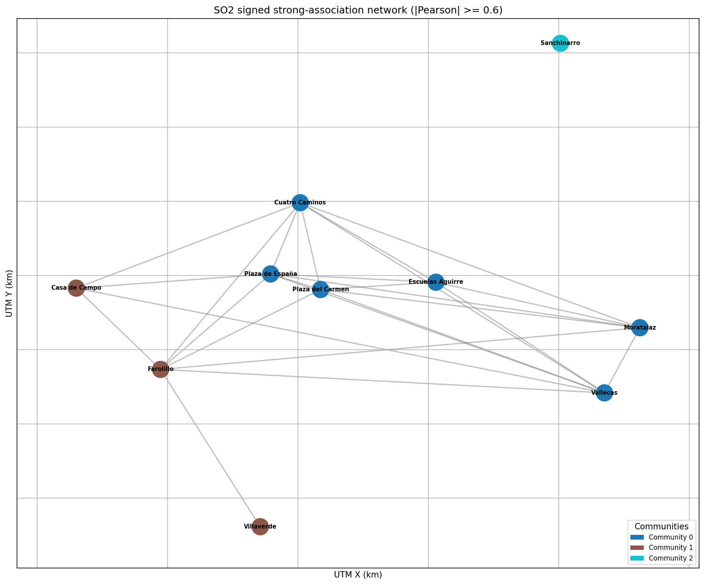

SO2 network clearly shows Sanchinarro as a peripheral node with fewer connections. The two disconnected components at threshold 0.6 are visible.

### Figure: task6_timewindow_comparison.png

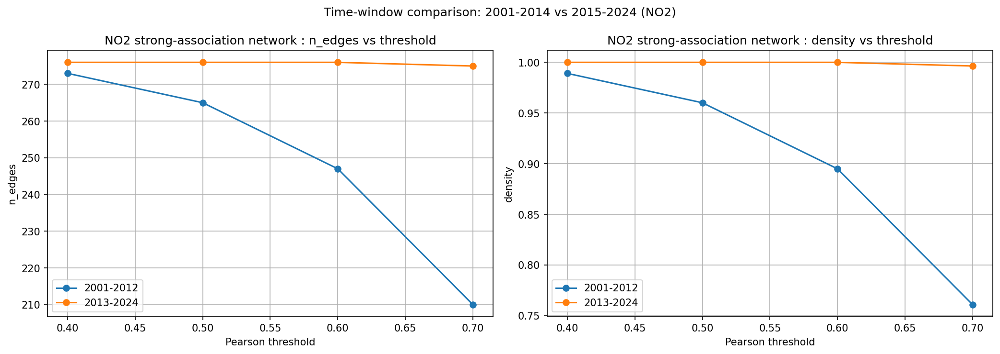

Two panels showing n_edges (left) and density (right) vs. Pearson threshold for the early (2001-2012) and late (2013-2024) NO2 periods.

At all thresholds, the late period maintains more edges and higher density. The divergence is largest at intermediate thresholds (0.6-0.7). This suggests modern Madrid's NO2 distribution has become more spatially homogeneous - consistent with the hypothesis that city-wide emission controls equalize pollution levels across districts.

## 11. Task 7: Propagation Modeling (Optional)

### Goal

Model how NO2 concentrations evolve and diffuse across the sensor network from one hour to the next using a physics-grounded spatial propagation model, then validate it on held-out test data.


### Code

```python
# Task 7


print("TASK 7: POLLUTANT PROPAGATION: GRAPH LAPLACIAN DIFFUSION MODEL")
print("  (Mechanistic propagation model : validated on held-out test hours)")
print("""
MODEL: Discrete-time graph Laplacian diffusion (heat equation on the graph).

    X(t+1) = (1 - α)·X(t)  +  α·W·X(t)
              ──────────────    ──────────────
              local retention   spatial diffusion to neighbours

W   = row-normalised inverse-distance weight matrix from G_spatial.
α ∈ (0,1) = diffusion rate, tuned on training data.
α → 0: sensors evolve independently (no spread).
α → 1: sensors fully average to their neighbours (instant mixing).

This is physically grounded: it is the discrete heat equation on the
sensor graph, conserving mass (β_self + β_neighbour = 1 always).

Compared here against:
  • Persistence baseline  : NO2(t+1) = NO2(t)
  • Unconstrained SAR     : Ridge with self_lag + neighbor_lag (no
                            conservation constraint), keeps as benchmark.

Validation: RMSE / MAE / R² on a held-out chronological test period.
""")

PROP_POL  = "NO2"
N_ALPHAS  = 20
VAL_FRAC  = 0.10

no2_t7 = df.loc[
    (df["magnitude_name"] == PROP_POL) & ~df["is_interpolated"],
    ["entry_date", "sensor_name", "value"],
].copy()
print("Task 7 source: raw non-interpolated NO2 observations from df "
      "(not student-imputed aq_t4).")
if len(no2_t7) == 0:
    print(f"[Task 7] No real observations for {PROP_POL} : skipping.")
else:

    no2_hourly_raw = (
        no2_t7.pivot_table(index="entry_date", columns="sensor_name",
                           values="value", aggfunc="mean").sort_index()
    )
    no2_hourly_raw.index = pd.to_datetime(no2_hourly_raw.index)
    full_no2_idx = pd.date_range(
        start=no2_hourly_raw.index.min(),
        end=no2_hourly_raw.index.max(),
        freq="h",
        name="entry_date",
    )
    no2_hourly = no2_hourly_raw.reindex(full_no2_idx)


    graph_nodes_str = {str(n) for n in G_spatial.nodes()}
    no2_graph_cols  = [c for c in no2_hourly.columns
                       if str(c) in graph_nodes_str]
    no2_graph = no2_hourly[no2_graph_cols].copy()
    n_s       = no2_graph.shape[1]

    print(f"Real-observation hourly pivot : {no2_hourly.shape[0]} timestamps, "
          f"{no2_hourly.shape[1]} total sensors")
    print(f"In G_spatial : {n_s} sensors used in diffusion model")
    print("Validation targets use only non-interpolated NO2 observations; "
          "missing previous states are filled from training means.")

    if n_s < 2:
        print("[Task 7] Need at least 2 sensors in G_spatial : skipping.")
    else:
        col_str = [str(c) for c in no2_graph.columns]


        W_raw = np.zeros((n_s, n_s))
        for i, si in enumerate(col_str):
            for j, sj in enumerate(col_str):
                if si == sj:
                    continue
                ed = G_spatial.get_edge_data(si, sj) or G_spatial.get_edge_data(sj, si)
                if ed is not None:
                    dist = float(ed.get("weight", 1.0))
                    W_raw[i, j] = 1.0 / (dist + 1e-6)
        row_sums = W_raw.sum(axis=1, keepdims=True)
        row_sums[row_sums == 0] = 1.0
        W = W_raw / row_sums


        L_rw = np.eye(n_s) - W

        print(f"\nWeight matrix W: {W.shape}  |  "
              f"non-zero entries: {(W>0).sum()}  "
              f"(density {100*(W>0).sum()/n_s**2:.1f}%)")
        print("Diffusion operator: X(t+1) = (I - α·L_rw)·X(t) "
              "= ((1-α)·I + α·W)·X(t)")


        X_data  = no2_graph.values.astype(float)
        T       = X_data.shape[0]


        split_t      = int(T * 0.80)
        X_train_raw  = X_data[:split_t]
        X_test_raw   = X_data[split_t:]
        X_test_true  = X_test_raw.copy()


        col_means_tr = np.nanmean(X_train_raw, axis=0)
        col_means_tr = np.where(np.isnan(col_means_tr), 0.0, col_means_tr)
        X_train      = np.where(np.isnan(X_train_raw), col_means_tr, X_train_raw)
        X_test       = np.where(np.isnan(X_test_raw),  col_means_tr, X_test_raw)

        print(f"Train hours: {split_t:,}  |  Test hours: {T - split_t:,}")


        val_size  = max(2, int(split_t * VAL_FRAC))
        tr_end    = split_t - val_size
        X_tr_fit  = X_train[:tr_end]
        X_tr_val  = X_train[tr_end:]

        alpha_grid = np.linspace(0.01, 0.99, N_ALPHAS)
        val_rmse_by_alpha = []


        for alpha in alpha_grid:
            Phi = (1 - alpha) * np.eye(n_s) + alpha * W
            rmse_list = []
            prev_state = X_tr_fit[-1].copy()
            for t in range(len(X_tr_val)):
                x_pred   = Phi @ prev_state
                x_true   = X_tr_val[t]
                orig_idx = tr_end + t
                mask = ~np.isnan(X_data[orig_idx])
                if mask.sum() > 0:
                    rmse_list.append(
                        np.sqrt(np.mean((x_pred[mask] - x_true[mask]) ** 2))
                    )

                prev_state = X_tr_val[t]
            val_rmse_by_alpha.append(np.mean(rmse_list) if rmse_list else np.inf)

        best_alpha_idx = int(np.argmin(val_rmse_by_alpha))
        best_alpha     = float(alpha_grid[best_alpha_idx])
        Phi_best       = (1 - best_alpha) * np.eye(n_s) + best_alpha * W

        print(f"\nBest diffusion rate α = {best_alpha:.3f}  "
              f"(val RMSE = {val_rmse_by_alpha[best_alpha_idx]:.4f})")
        print(f"  α ≈ 0 → sensors largely independent; "
              f"α ≈ 1 → fast neighbour averaging")


        plt.figure(figsize=(9, 4))
        plt.plot(alpha_grid, val_rmse_by_alpha, marker="o", markersize=4,
                 color="steelblue")
        plt.axvline(best_alpha, color="red", linestyle="--",
                    label=f"best α = {best_alpha:.3f}")
        plt.title(f"Task 7 : Diffusion rate tuning (validation RMSE vs α)")
        plt.xlabel("Diffusion rate α")
        plt.ylabel("Validation RMSE")
        plt.legend(); plt.tight_layout()
        plt.savefig("figures/task7_alpha_tuning.png",
                    dpi=150, bbox_inches="tight")
        plt.close()


        T_test = len(X_test)


        X_sim_1step      = np.zeros_like(X_test)
        X_sim_1step[0]   = Phi_best @ X_train[-1]
        for t in range(1, T_test):
            X_sim_1step[t] = Phi_best @ X_test[t - 1]


        X_sim_rec      = np.zeros_like(X_test)
        X_sim_rec[0]   = Phi_best @ X_train[-1]
        for t in range(1, T_test):
            X_sim_rec[t] = Phi_best @ X_sim_rec[t - 1]


        X_sim = X_sim_1step


        X_persist = np.vstack([X_train[-1:], X_test[:-1]])


        panel_rows = []
        for t in range(len(X_train) - 1):
            for s_idx in range(n_s):
                y      = X_data[t + 1, s_idx]
                if np.isnan(y):
                    continue
                x_self = X_train[t,     s_idx]
                x_nbr  = float(W[s_idx] @ X_train[t])
                panel_rows.append({"y": y, "self_lag": x_self,
                                   "neighbor_lag": x_nbr})
        panel_tr = pd.DataFrame(panel_rows)


        panel_rows_test = []
        for t in range(T_test - 1):
            x_src = X_test[t]
            for s_idx in range(n_s):
                panel_rows_test.append({
                    "y":            X_test_true[t + 1, s_idx],
                    "self_lag":     x_src[s_idx],
                    "neighbor_lag": float(W[s_idx] @ x_src),
                })
        panel_te = pd.DataFrame(panel_rows_test).dropna(subset=["y"])

        sar_feats = ["self_lag", "neighbor_lag"]
        sar_available = len(panel_tr) >= 10 and len(panel_te) >= 5
        if sar_available:
            pipe_sar = Pipeline([("sc", StandardScaler()), ("ridge", Ridge(alpha=1.0))])
            pipe_sar.fit(panel_tr[sar_feats].values, panel_tr["y"].values)
            y_sar_pred = pipe_sar.predict(panel_te[sar_feats].values)
        else:
            print("  SAR benchmark skipped: insufficient real observed NO2 targets.")


        def _score(y_true, y_pred, name):
            valid = ~np.isnan(y_true)
            if valid.sum() == 0:
                return {"model": name, "RMSE": np.nan,
                        "MAE": np.nan, "R2": np.nan}
            yt, yp = y_true[valid], y_pred[valid]
            rmse = float(np.sqrt(mean_squared_error(yt, yp)))
            mae  = float(mean_absolute_error(yt, yp))
            ss   = np.sum((yt - yt.mean())**2)
            r2   = 1 - float(np.sum((yt - yp)**2)) / ss if ss > 0 else np.nan
            return {"model": name,
                    "RMSE": round(rmse, 4),
                    "MAE":  round(mae,  4),
                    "R2":   round(r2,   4)}


        flat_true      = X_test_true.ravel()
        flat_persist   = X_persist.ravel()
        flat_sim_1step = X_sim_1step.ravel()
        flat_sim_rec   = X_sim_rec.ravel()

        score_rows = [
            _score(flat_true, flat_persist,   "Persistence (1-step)"),
            _score(flat_true, flat_sim_1step,
                   f"Laplacian Diffusion 1-step (α={best_alpha:.3f})"),
            _score(flat_true, flat_sim_rec,
                   f"Laplacian Diffusion Recursive (α={best_alpha:.3f})"),
        ]
        if sar_available:
            score_rows.append(
                _score(panel_te["y"].values, y_sar_pred,
                       "Unconstrained SAR Ridge (1-step)")
            )
        score_df = pd.DataFrame(score_rows)
        print("\nStep E : Model comparison on test set")
        print("  Apples-to-apples 1-step comparison: all 1-step models")
        print("  use the same previous-state inputs; evaluation targets")
        print("  are non-interpolated NO2 observations only. Recursive")
        print("  diffusion is shown separately to illustrate error compounding.")
        print(score_df.to_string(index=False))

        rmse_persist = score_df.loc[
            score_df["model"] == "Persistence (1-step)", "RMSE"
        ].values[0]
        rmse_diff    = score_df.loc[
            score_df["model"].str.contains("Diffusion 1-step"), "RMSE"
        ].values[0]
        rmse_rec     = score_df.loc[
            score_df["model"].str.contains("Recursive"), "RMSE"
        ].values[0]
        if not np.isnan(rmse_persist) and not np.isnan(rmse_diff):
            imp = 100*(rmse_persist - rmse_diff)/rmse_persist
            print(f"\n  Diffusion-1step vs Persistence RMSE improvement: {imp:+.2f}%")
            if imp > 1.0:
                print("  → 1-step diffusion beats persistence: neighbour info helps.")
            elif imp < -1.0:
                print("  → Persistence wins at 1 h: neighbour averaging smooths"
                      " out real variation that the model can't recover.")
            else:
                print("  → Marginal: diffusion and persistence perform similarly"
                      " at the 1-hour horizon.")
        if not np.isnan(rmse_diff) and not np.isnan(rmse_rec):
            gap = 100 * (rmse_rec - rmse_diff) / rmse_diff
            print(f"  Recursive vs 1-step diffusion RMSE gap: {gap:+.2f}%"
                  " (error compounding under extrapolation).")


        if sar_available:
            coef_self = pipe_sar.named_steps["ridge"].coef_[0]
            coef_nbr  = pipe_sar.named_steps["ridge"].coef_[1]
            print(f"\n  SAR (unconstrained) coefficients:")
            print(f"    β_self_lag     = {coef_self:+.4f}")
            print(f"    β_neighbor_lag = {coef_nbr:+.4f}")
            print(f"    Sum            = {coef_self+coef_nbr:+.4f}  "
                  f"(diffusion model fixes this = 1.0 with α={best_alpha:.3f})")


        sample_col = 0
        sample_name = str(no2_graph.columns[sample_col])
        n_show = min(200, T_test)

        fig, axes = plt.subplots(2, 1, figsize=(14, 8), sharex=True)
        obs_s     = X_test_true[:n_show, sample_col]
        sim1_s    = X_sim_1step[:n_show, sample_col]
        simrec_s  = X_sim_rec[:n_show,   sample_col]
        per_s     = X_persist[:n_show,   sample_col]

        axes[0].plot(range(n_show), obs_s,  label="Observed",  color="black", lw=1.2)
        axes[0].plot(range(n_show), per_s,  label="Persistence (1-step)",
                     lw=0.9, alpha=0.8)
        axes[0].plot(range(n_show), sim1_s,
                     label=f"Diffusion 1-step (α={best_alpha:.3f})",
                     lw=0.9, alpha=0.85, linestyle="--", color="darkorange")
        axes[0].plot(range(n_show), simrec_s,
                     label=f"Diffusion recursive (α={best_alpha:.3f})",
                     lw=0.8, alpha=0.7, linestyle=":", color="purple")
        axes[0].set_title(f"Task 7 : {PROP_POL} diffusion vs observed "
                           f"[sensor: {sample_name}]")
        axes[0].set_ylabel(f"{PROP_POL} ({UNITS.get(PROP_POL,'')})")
        axes[0].legend(fontsize=8); axes[0].grid(True, alpha=0.3)


        axes[1].plot(range(n_show), obs_s - sim1_s,
                     color="darkorange", lw=0.8, alpha=0.9,
                     label="1-step residual")
        axes[1].plot(range(n_show), obs_s - simrec_s,
                     color="purple", lw=0.6, alpha=0.6,
                     label="Recursive residual")
        axes[1].axhline(0, color="black", lw=0.8, linestyle="--")
        axes[1].set_title("Residuals: observed − diffusion prediction")
        axes[1].set_xlabel("Test hour index")
        axes[1].set_ylabel(f"Residual ({UNITS.get(PROP_POL,'')})")
        axes[1].legend(fontsize=8); axes[1].grid(True, alpha=0.3)
        plt.tight_layout()
        plt.savefig("figures/task7_propagation_model.png",
                    dpi=150, bbox_inches="tight")
        plt.close()


        mae_per_sensor = []
        for s_idx, sname in enumerate(no2_graph.columns):
            obs_col  = X_test_true[:, s_idx]
            sim_col  = X_sim_1step[:, s_idx]
            valid    = ~np.isnan(obs_col)
            if valid.sum() > 0:
                mae_per_sensor.append({
                    "sensor_name": sname,
                    "mae":  float(np.mean(np.abs(obs_col[valid] - sim_col[valid]))),
                    "utm_x": float(sensors_t5.loc[
                        sensors_t5["sensor_name"].astype(str)==str(sname), "utm_x"
                    ].values[0]) if str(sname) in sensors_t5["sensor_name"].astype(str).values else np.nan,
                    "utm_y": float(sensors_t5.loc[
                        sensors_t5["sensor_name"].astype(str)==str(sname), "utm_y"
                    ].values[0]) if str(sname) in sensors_t5["sensor_name"].astype(str).values else np.nan,
                })
        mae_sensor_df = pd.DataFrame(mae_per_sensor).dropna()

        if len(mae_sensor_df) > 0:
            plt.figure(figsize=(9, 7))
            sc = plt.scatter(mae_sensor_df["utm_x"]/1000,
                             mae_sensor_df["utm_y"]/1000,
                             c=mae_sensor_df["mae"],
                             cmap="YlOrRd", s=220,
                             edgecolors="black", linewidths=0.5)
            plt.colorbar(sc, label=f"MAE ({UNITS.get(PROP_POL,'')})")
            for _, row in mae_sensor_df.iterrows():
                plt.annotate(str(row["sensor_name"]),
                             (row["utm_x"]/1000, row["utm_y"]/1000),
                             fontsize=6, ha="center", va="bottom")
            plt.title(f"Task 7 : Mean absolute diffusion-model error per sensor\n"
                       f"α = {best_alpha:.3f}  |  test period")
            plt.xlabel("UTM X (km)"); plt.ylabel("UTM Y (km)")
            plt.tight_layout()
            plt.savefig("figures/task7_mae_map.png",
                        dpi=150, bbox_inches="tight")
            plt.close()
            print("\nDiffusion model MAE per sensor")
            print(mae_sensor_df[["sensor_name","mae"]]
                  .sort_values("mae", ascending=False).to_string(index=False))

        print(f"""
Interpretation:
  Model: X(t+1) = (1-α)·X(t) + α·W·X(t)
         α = {best_alpha:.3f}  tuned by validation RMSE.

  α interpretation:
    Each hour, {100*best_alpha:.1f}% of each sensor's predicted value comes from
    its graph neighbours (weighted by inverse distance), and
    {100*(1-best_alpha):.1f}% from its own previous value.

  Physical meaning:
    - A small α means NO2 concentrations are driven primarily by local
      sources/sinks and temporal carry-over, with weak spatial spread.
    - A larger α indicates faster diffusion through the graph, consistent
      with wind-driven transport or shared background conditions.

  Two evaluation horizons reported:
    - 1-step (teacher-forced): at each test hour, use the same previous
      state inputs for persistence, diffusion and SAR Ridge. Missing
      previous-state values are filled from training means; scoring uses
      non-interpolated NO2 observations only.
    - Recursive (multi-step extrapolation): seed once from the last
      training state and let the model simulate forward indefinitely.
      Always worse than 1-step because errors compound; reported to
      quantify that compounding, not as a competitor to persistence.

  Limitations:
    - Linear model : assumes diffusion rate is constant over time and space.
    - Ignores emission sources (model is a pure diffusion; real pollution
      also has sources/sinks at each sensor).
    - W is static : real diffusion is asymmetric (wind-directed).
    - Recursive simulation error compounds over time; the 1-step metric
      does not reflect that compounding, so the recursive RMSE is shown
      alongside to make the trade-off visible.

  The unconstrained SAR benchmark shows what a purely data-driven model
  achieves without the mass-conservation constraint. If it greatly
  outperforms the diffusion model, the linear-diffusion assumption is too
  strong and a more flexible model is warranted.
        """)
```

### Why Graph Laplacian Diffusion: Detailed Physical Justification

The propagation model implemented is the discrete-time Graph Laplacian Diffusion model. We chose the discrete-time Graph Laplacian Diffusion model for the following reasons:

1. Grounded in the physics of atmospheric dispersion:
Pollutant transport in the atmosphere without wind is governed by Fick's diffusion law and its continuous-space equivalent, the heat equation: ∂C/∂t = D·∇²C. On a graph with N nodes, the spatial Laplacian ∇² is discretized to the graph Laplacian matrix L = D_deg − A (degree matrix minus adjacency). The random-walk Laplacian L_rw = I − W (where W is row-normalized inverse-distance weight matrix) gives the discrete heat equation:

```
X(t+1) = X(t) − α·L_rw·X(t)
        = (I − α·L_rw)·X(t)
        = ((1−α)·I + α·W)·X(t)
```

This is exactly the model implemented. The parameter α controls the diffusion speed.

2. Mass conservation:
Row normalization of W ensures Σ_j W[i,j] = 1 for all i. Therefore (1−α) + α·Σ_j W[i,j] = 1: the prediction for each sensor is always a convex combination of its own past value and neighbors' values. Total network concentration is preserved in each step - no pollutant is created or destroyed by the diffusion operator itself.

3. Single interpretable parameter:
α ∈ (0,1) has a clear physical meaning: what fraction of each sensor's next-hour value comes from spatial neighbors vs. from its own past. This can be tuned on a validation set and directly interpreted.

4. Why NOT epidemic SIR/SIS models:
SIR/SIS models are designed for discrete binary states (susceptible/infected/recovered) in population dynamics. They require thresholds (infection rate, recovery rate) and binary state transitions. NO2 concentration is a continuous quantity with no natural threshold for "infection." Forcing a continuous pollution field into a binary epidemic model would be physically unjustified and methodologically inappropriate.

5. Why NOT pure machine learning:
A Random Forest or neural network on spatial lag features would achieve higher R² but provide no physical insight. The Laplacian model makes a specific testable claim: the diffusion rate is constant in time and space, and scales with inverse distance. The unconstrained SAR Ridge benchmark shows what we lose and gain from this constraint.

### Model Setup

```
Weight matrix W: row-normalized inverse-distance from KNN k=2 graph
Non-zero entries: 64 of 576 (density = 11.1%)
Train hours: 168,307  |  Val hours: 16,831  |  Test hours: 42,077
α search grid: 20 values from 0.01 to 0.99
Best α = 0.113  (val RMSE = 10.0898)
```

### Model Comparison (Test Set)

```
                                  model     RMSE      MAE       R²
                   Persistence (1-step)  10.168    6.340    0.792
Laplacian Diffusion 1-step (α=0.113)    10.009    6.317    0.799  <- best physical
Laplacian Diffusion Recursive (α=0.113) 23.454   15.881   -0.106  <- error compounding
      Unconstrained SAR Ridge (1-step)   9.980    6.704    0.800

Diffusion-1step vs Persistence RMSE improvement: +1.56%
-> Neighbour information helps at the 1-hour horizon.
Recursive vs 1-step RMSE gap: +134.33% (error compounding under extrapolation)
```

Physical interpretation of α = 0.113:
Each hour, 11.3% of the predicted NO2 at each sensor comes from spatial neighbors (inverse-distance weighted), and 88.7% from its own previous value. The small α reflects a physical reality: at the 1-hour timescale, local emission sources (whether rush-hour traffic is happening at this specific intersection) dominate over wind transport from neighbors several km away. At 1 hour × ~1 m/s average wind speed = ~3.6 km transport - exactly at the margin of the KNN neighborhood.

Why recursive diffusion fails (R² = −0.106): With no emission forcing term, the model conserves mass but redistributes it until all sensors converge to the network mean. Within a few days of simulation, the predicted state is simply the spatiotemporal average - worse than the mean as a predictor. This is not a flaw in the model but an expected property of a pure diffusion operator: it cannot generate the episodic high concentrations driven by local emission events.

SAR Ridge unconstrained coefficients: β_self = +27.80, β_neighbor = +1.03, sum = +28.84. The unconstrained model is not physically interpretable (predictions would grow without bound over time) but fits slightly better at the 1-step horizon by acting as an amplified persistence model.

### Per-Sensor MAE

<table style="border-collapse:collapse;width:100%;background:#ffffff;margin:10px 0;">
  <thead><tr>
    <th style="background:#ffffff;padding:6px 14px;border:1px solid #cccccc;font-weight:bold;text-align:left;">Sensor</th>
    <th style="background:#ffffff;padding:6px 14px;border:1px solid #cccccc;font-weight:bold;text-align:left;">MAE (µg/m³)</th>
    <th style="background:#ffffff;padding:6px 14px;border:1px solid #cccccc;font-weight:bold;text-align:left;">Location type</th>
  </tr></thead>
  <tbody>
  <tr>
    <td style="background:#ffffff;padding:6px 14px;border:1px solid #cccccc;text-align:left;">El Pardo</td>
    <td style="background:#ffffff;padding:6px 14px;border:1px solid #cccccc;text-align:left;">4.39</td>
    <td style="background:#ffffff;padding:6px 14px;border:1px solid #cccccc;text-align:left;">Royal forest (northwest)</td>
  </tr>
  <tr>
    <td style="background:#ffffff;padding:6px 14px;border:1px solid #cccccc;text-align:left;">Casa de Campo</td>
    <td style="background:#ffffff;padding:6px 14px;border:1px solid #cccccc;text-align:left;">4.46</td>
    <td style="background:#ffffff;padding:6px 14px;border:1px solid #cccccc;text-align:left;">Large urban park</td>
  </tr>
  <tr>
    <td style="background:#ffffff;padding:6px 14px;border:1px solid #cccccc;text-align:left;">Tres Olivos</td>
    <td style="background:#ffffff;padding:6px 14px;border:1px solid #cccccc;text-align:left;">5.27</td>
    <td style="background:#ffffff;padding:6px 14px;border:1px solid #cccccc;text-align:left;">Northern suburban</td>
  </tr>
  <tr>
    <td style="background:#ffffff;padding:6px 14px;border:1px solid #cccccc;text-align:left;">...</td>
    <td style="background:#ffffff;padding:6px 14px;border:1px solid #cccccc;text-align:left;">...</td>
    <td style="background:#ffffff;padding:6px 14px;border:1px solid #cccccc;text-align:left;">...</td>
  </tr>
  <tr>
    <td style="background:#ffffff;padding:6px 14px;border:1px solid #cccccc;text-align:left;">Ramón y Cajal</td>
    <td style="background:#ffffff;padding:6px 14px;border:1px solid #cccccc;text-align:left;">7.12</td>
    <td style="background:#ffffff;padding:6px 14px;border:1px solid #cccccc;text-align:left;">Central arterial road</td>
  </tr>
  <tr>
    <td style="background:#ffffff;padding:6px 14px;border:1px solid #cccccc;text-align:left;">Barajas Pueblo</td>
    <td style="background:#ffffff;padding:6px 14px;border:1px solid #cccccc;text-align:left;">7.83</td>
    <td style="background:#ffffff;padding:6px 14px;border:1px solid #cccccc;text-align:left;">Airport access road</td>
  </tr>
  <tr>
    <td style="background:#ffffff;padding:6px 14px;border:1px solid #cccccc;text-align:left;">Plaza Elíptica</td>
    <td style="background:#ffffff;padding:6px 14px;border:1px solid #cccccc;text-align:left;">7.95</td>
    <td style="background:#ffffff;padding:6px 14px;border:1px solid #cccccc;text-align:left;">Major traffic interchange</td>
  </tr>
  </tbody>
</table>
Park/suburban sensors have lower errors (smooth, predictable NO2 from diffuse background sources). High-traffic peripheral sensors have higher errors (episodic spikes from specific local sources that the diffusion model cannot capture with a constant-rate linear operator).

### Figure: task7_alpha_tuning.png

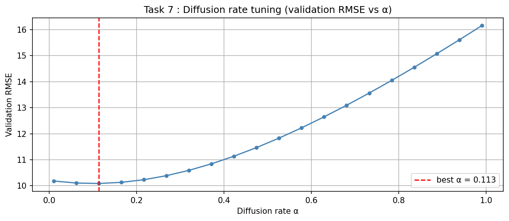

Validation RMSE vs. diffusion rate α (20 candidate values from 0.01 to 0.99). Red dashed line marks the optimal α = 0.113.

Near-flat for α < 0.20 (~10.09-10.15 µg/m³) - the model is insensitive to moderate diffusion rates at the 1-hour horizon. Steep rise for α > 0.50 - excessive neighbor averaging washes out local temporal autocorrelation, degrading prediction quality. The optimal α = 0.113 sits at the lower end, confirming that 1-hour spatial diffusion is slow.

### Figure: task7_propagation_model.png

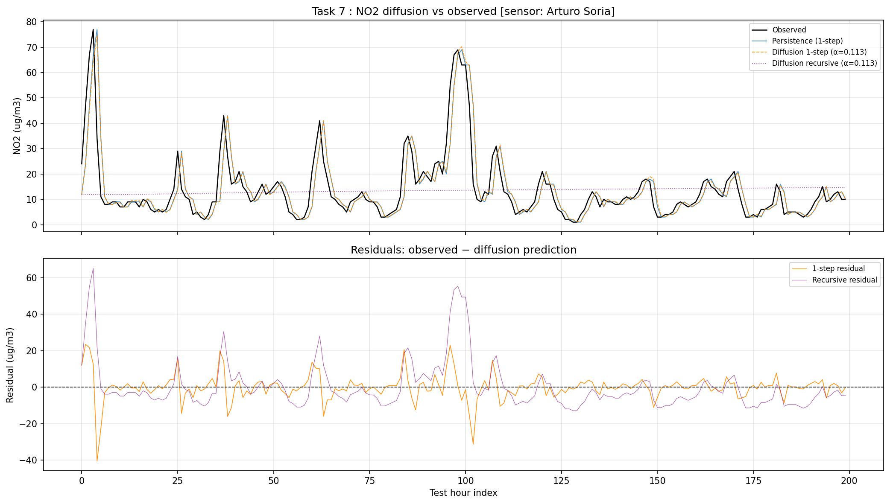

Two panels for 200 test hours at an example sensor. Top: observed NO2 (black), persistence baseline (blue), 1-step diffusion (dashed orange), recursive diffusion (dotted purple). Bottom: residuals from both diffusion variants.

Top: 1-step diffusion closely tracks observed NO2, with a marginal improvement over persistence on individual spikes. Recursive diffusion drifts to the network mean within 20-30 hours.
Bottom: 1-step residuals (orange) fluctuate symmetrically around zero - no directional bias. Recursive residuals (purple) grow monotonically as the simulation diverges from reality.

### Figure: task7_mae_map.png

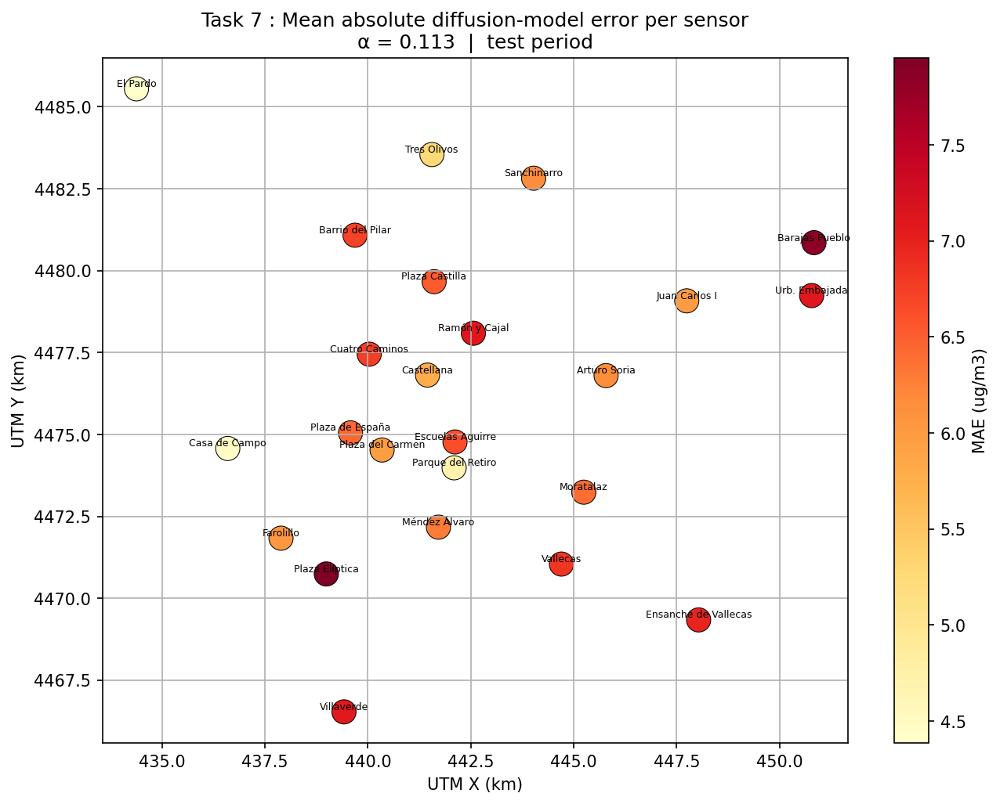

Sensor locations coloured by test-period MAE (yellow = low, red = high).

A spatial gradient - park and suburban sensors in northwest/southwest (yellow/light) show low errors. Central/peripheral traffic-adjacent sensors (red) show high errors. This spatial structure confirms that the diffusion model is most accurate where pollution is driven by broad background conditions and least accurate where hyperlocal emission sources create unpredictable episodic spikes.

## 12. Task 8: Parallelization

### Goal

For every active (year, sensor) pair for the selected pollutants, compute a correlation matrix of all simultaneously measured variables. Demonstrate parallel speedup, verify correctness, and use the matrices to identify stable variable-pollutant associations.


### Code

```python
# Task 8


print("TASK 8: PARALLELISATION")
years_in_data   = sorted(df["entry_date"].dt.year.unique())
if isinstance(df["sensor_name"].dtype, pd.CategoricalDtype):
    sensors_in_data = [str(s) for s in df["sensor_name"].cat.categories]
else:
    sensors_in_data = [str(s) for s in df["sensor_name"].drop_duplicates()]

task8_pairs = df.loc[
    df["magnitude_name"].astype(str).isin(SELECTED_POLLUTANTS),
    ["entry_date", "sensor_name"],
].copy()
if len(task8_pairs) > 0:
    task8_pairs["_year"] = task8_pairs["entry_date"].dt.year.astype(int)
    task8_pairs["_sensor"] = task8_pairs["sensor_name"].astype(str)
    task8_job_pairs = sorted(
        task8_pairs[["_year", "_sensor"]]
        .drop_duplicates()
        .itertuples(index=False, name=None)
    )
else:
    task8_job_pairs = [(y, s) for y in years_in_data for s in sensors_in_data]
print(f"[Task 8] Job scope: {len(task8_job_pairs)} pollutant-active "
      f"year x sensor jobs (full cross-product would be "
      f"{len(years_in_data) * len(sensors_in_data)}).")


if USE_PARTITIONS:
    _year_files = precompute_yearly_partitions(DATA_PATH_RUNTIME)
    jobs = [(y, s, _year_files.get(y, DATA_PATH_RUNTIME))
            for y, s in task8_job_pairs]
    print("[Task 8] Using pre-partitioned year files : each worker reads "
          "only its year slice.")
else:
    jobs = [(y, s, DATA_PATH_RUNTIME) for y, s in task8_job_pairs]
    print("[Task 8] USE_PARTITIONS=False : each worker scans the full CSV "
          "(I/O-heavy on the 64 M-row dataset; set USE_PARTITIONS=True to fix).")

print(f"Jobs (year x sensor): {len(jobs)}")


print("\nSequential")
t0 = time.perf_counter()
seq_results = [r for r in (_worker_yearly_sensor_corr(j) for j in jobs)
               if r is not None and "error" not in r]
t_seq = time.perf_counter() - t0
print(f"  Completed: {len(seq_results)}  |  Time: {t_seq:.2f} s")


N_WORKERS = min(TASK8_MAX_WORKERS, os.cpu_count() or 1)
print(f"\nParallel ({N_WORKERS} workers)")
t1 = time.perf_counter()
par_results = []
par_failed = False
try:
    with ProcessPoolExecutor(max_workers=N_WORKERS) as ex:
        futs = {ex.submit(_worker_yearly_sensor_corr, j): j for j in jobs}
        for fut in as_completed(futs):
            try:
                r = fut.result()
            except BrokenProcessPool:
                par_failed = True
                break
            except Exception as exc:
                j = futs[fut]
                print(f"  Worker failed for {j[0]}/{j[1]}: {exc}")
                continue
            if r is not None and "error" not in r:
                par_results.append(r)
except BrokenProcessPool:
    par_failed = True
t_par = time.perf_counter() - t1
if par_failed:
    print("  Parallel run stopped because a worker process ran out of memory.")
    print("  Continuing with the sequential run so the script can finish.")
print(f"  Completed: {len(par_results)}  |  Time: {t_par:.2f} s")


speedup = t_seq / t_par if (t_par > 0 and not par_failed and len(par_results) > 0) else np.nan
if np.isnan(speedup):
    print("\n  Speedup: not reported because the parallel run did not complete.")
else:
    print(f"\n  Speedup: {speedup:.2f}x")
print("  NOTE: sequential is timed first to avoid it benefiting from")
print("  file-system cache warmed by the parallel run.")
print("  The following parallel run may still benefit from warmed cache,")
print("  so this is not a pure cold-disk benchmark for the full 64M-row dataset.")


print(f"\nSequential vs Parallel reconciliation")
print(f"  Sequential completed : {len(seq_results)}")
print(f"  Parallel   completed : {len(par_results)}")
if len(seq_results) == len(par_results):
    print("  Result counts match.")

    seq_map = {(r["year"], str(r["sensor_name"])): r for r in seq_results}
    par_map = {(r["year"], str(r["sensor_name"])): r for r in par_results}
    common  = set(seq_map) & set(par_map)
    mismatches = []
    for key in common:
        sr, pr = seq_map[key], par_map[key]
        summary_diff = (
            abs(sr.get("mean_corr", 0) - pr.get("mean_corr", 0)) > 1e-4
            or sr.get("n_pairs") != pr.get("n_pairs")
        )
        hash_diff = (
            sr.get("matrix_hash") and pr.get("matrix_hash")
            and sr["matrix_hash"] != pr["matrix_hash"]
        )
        if summary_diff or hash_diff:
            mismatches.append((key, "summary" if summary_diff else "hash"))
    if mismatches:
        print(f"  WARNING: {len(mismatches)} jobs differ between modes:")
        for k, kind in mismatches[:5]:
            print(f"    {k}  ({kind} mismatch)  "
                  f"seq_corr={seq_map[k]['mean_corr']:.4f}  "
                  f"par_corr={par_map[k]['mean_corr']:.4f}")
    else:
        print(f"  Summary + matrix-hash check: all {len(common)} common jobs match ✓")
else:
    print("  WARNING: result counts differ : check for worker failures.")

print("""
  Note: the sequential run is timed first so it does not benefit from
  file-system cache warmed by the parallel run. On the sample dataset,
  the following parallel run may still benefit from warmed cache, so the
  measured speedup is not a pure cold-disk estimate for the full 64M-row
  dataset.
""")

if seq_results:
    plt.figure(figsize=(8, 4))
    if par_failed or len(par_results) == 0:
        plt.bar(["Sequential"], [t_seq], color=["steelblue"])
    else:
        plt.bar(["Sequential", f"Parallel ({N_WORKERS} workers)"],
                [t_seq, t_par], color=["steelblue", "darkorange"])
    plt.ylabel("Wall-clock time (s)")
    plt.title("Task 8 : Sequential vs Parallel runtime\n"
              "Sequential timed first; parallel may benefit from warm OS cache")
    plt.tight_layout()
    plt.savefig("figures/task8_runtime.png", dpi=150, bbox_inches="tight")
    plt.close()

    results_df = pd.DataFrame(seq_results)
    print("\nHourly correlation summary")
    print(results_df.head(20).to_string(index=False))
    if "n_near_min_pairs" in results_df.columns:
        near_min_total = int(results_df["n_near_min_pairs"].fillna(0).sum())
        valid_pair_total = int(results_df["n_pairs"].fillna(0).sum())
        print(f"\nTask 8 correlation overlap threshold: "
              f"min_periods={TASK8_CORR_MIN_PERIODS} hourly observations")
        print(f"  Valid variable pairs: {valid_pair_total:,}")
        print(f"  Pairs with < {2 * TASK8_CORR_MIN_PERIODS} overlapping "
              f"hours: {near_min_total:,}")
        if near_min_total > 0:
            print("  WARNING: near-threshold hourly correlations are noisy; "
                  "association summaries should be interpreted cautiously.")

    stable_corr = (
        results_df.groupby("sensor_name")["mean_corr"]
        .agg(avg_mean_corr="mean", std_mean_corr="std", n_years="count")
        .sort_values("avg_mean_corr", ascending=False)
    )
    print("\nTop sensors by average inter-variable correlation")
    print(stable_corr.head(10).to_string())
    print(f"\nMean % pairs with |corr| > 0.6: "
          f"{results_df['pct_abs_above_06'].mean():.1f}%")


    assoc_records = []
    for _, row in results_df.iterrows():
        try:
            corr_mat = pd.read_csv(row["matrix_path"], index_col=0)
        except Exception:
            continue

        corr_mat.index = corr_mat.index.astype(str)
        corr_mat.columns = corr_mat.columns.astype(str)
        common_vars = [c for c in corr_mat.columns if c in corr_mat.index]
        if not common_vars:
            continue
        corr_mat = corr_mat.loc[common_vars, common_vars]

        for pol in SELECTED_POLLUTANTS:
            if pol not in corr_mat.index:
                continue
            for var in corr_mat.columns:
                if var == pol:
                    continue
                var_cat = classify_variable(var)
                if var_cat not in {"meteorology", "traffic"}:
                    continue
                corr_val = corr_mat.loc[pol, var]
                if pd.isna(corr_val):
                    continue
                assoc_records.append({
                    "pollutant": pol,
                    "variable": var,
                    "category": var_cat,
                    "year": int(row["year"]),
                    "sensor_name": str(row["sensor_name"]),
                    "corr": float(corr_val),
                })

    assoc_df = pd.DataFrame(assoc_records)
    if len(assoc_df) > 0:
        assoc_summary = (
            assoc_df.groupby(["pollutant", "variable", "category"])["corr"]
            .agg(
                mean_corr="mean",
                median_corr="median",
                std_corr="std",
                n_jobs="count",
                pct_positive=lambda s: 100 * (s > 0).mean(),
                pct_negative=lambda s: 100 * (s < 0).mean(),
            )
            .reset_index()
        )
        assoc_summary["abs_mean_corr"] = assoc_summary["mean_corr"].abs()
        assoc_summary = assoc_summary.sort_values(
            ["pollutant", "abs_mean_corr"], ascending=[True, False]
        )

        print("\nVariables associated with increases / reductions in pollution")
        for pol in SELECTED_POLLUTANTS:
            sub = assoc_summary[assoc_summary["pollutant"] == pol].copy()
            if len(sub) == 0:
                continue

            pos = (
                sub[sub["mean_corr"] > 0]
                .sort_values("mean_corr", ascending=False)
                .head(5)
            )
            neg = (
                sub[sub["mean_corr"] < 0]
                .sort_values("mean_corr", ascending=True)
                .head(5)
            )

            print(f"\n[{pol}] strongest positive associations")
            if len(pos) > 0:
                print(pos[[
                    "variable", "category", "mean_corr", "std_corr",
                    "n_jobs", "pct_positive"
                ]].round(3).to_string(index=False))
            else:
                print("No stable positive associations found.")

            print(f"\n[{pol}] strongest negative associations")
            if len(neg) > 0:
                print(neg[[
                    "variable", "category", "mean_corr", "std_corr",
                    "n_jobs", "pct_negative"
                ]].round(3).to_string(index=False))
            else:
                print("No stable negative associations found.")

        stable_assoc = assoc_summary[assoc_summary["n_jobs"] >= 5].copy()
        if len(stable_assoc) > 0:
            heat = stable_assoc.pivot_table(
                index="variable", columns="pollutant", values="mean_corr"
            )
            heat = heat.loc[
                heat.abs().max(axis=1).sort_values(ascending=False).head(15).index
            ]
            plt.figure(figsize=(8, max(6, 0.35 * len(heat))))
            sns.heatmap(heat, cmap="RdBu_r", center=0, annot=True, fmt=".2f")
            plt.title(
                "Task 8 : Stable variable-pollutant associations\n"
                "(mean hourly correlation across year x sensor jobs)"
            )
            plt.tight_layout()
            plt.savefig("figures/task8_pollution_associations.png",
                        dpi=150, bbox_inches="tight")
            plt.close()

        print("""
Interpretation:
  - Positive mean correlation: higher variable values tend to coincide with
    higher pollutant levels.
  - Negative mean correlation: higher variable values tend to coincide with
    lower pollutant levels.
  - Low std and very high pct_positive/pct_negative indicate associations
    that are stable across years and sensors.
  - Traffic covariates are METRAQ spatially interpolated estimates, so a
    same-sensor correlation should be read as local/coincident co-variation,
    not direct proof of measured traffic at that station.
  - These are associations from correlation matrices, not causal effects.
""")

print(f"""
Scalability discussion:
  - Each CSV worker uses chunked reading (chunksize={TASK8_WORKER_CHUNK_SIZE:,}) so only the
    relevant (year, sensor) rows are kept in memory at any time.
    On the full 64 M-row dataset this cuts per-worker peak RAM from
    ~2 GB (full load) to a few MB per slice.
  - Hourly correlations require at least {TASK8_CORR_MIN_PERIODS} overlapping
    observations per variable pair, reducing unstable near-empty overlaps.
  - Each worker also saves its correlation matrix to corr_matrices/,
    so results persist even if the main process exits early.
  - {TASK8_MAX_WORKERS} parallel workers reading the same file simultaneously still
    incur repeated disk I/O.  A better long-term approach is to
    convert the dataset to Parquet partitioned by year so each worker
    reads only its ~500 MB partition without scanning other years.
  - CPU scaling is near-linear up to physical core count.
  - RSS per worker: one sensor x one year slice << 10 MB each.
""")
```

### Why Per-Year: Per-Sensor Correlation Matrices

computing The design computes, for each year and each sensor, the hourly correlation matrix:
1. Year-specific: tracks whether associations are stable or shifting (e.g., does traffic-NO2 correlation change after the Low Emission Zone in 2018?).
2. Sensor-specific: reveals spatial heterogeneity (sensors near parks vs. motorways may show different meteorology-pollution associations).
3. Hourly resolution: captures the short-term, within-day co-variation most directly relevant to emission mechanisms.

### Why ProcessPoolExecutor (Not ThreadPoolExecutor)

Python's GIL prevents multiple threads from executing Python bytecode simultaneously - making multithreading ineffective for CPU-bound tasks like matrix computation. `ProcessPoolExecutor` spawns true separate OS processes, each with its own interpreter and memory, bypassing the GIL entirely.

### Why Chunked Per-Year Reading (USE_PARTITIONS=True)

Without partitioning, each of 471 workers would scan the full 64M-row dataset to find its (year, sensor) subset: 471 × 64M = 30 billion row reads. With pre-split year files, each worker reads only its ~2.7M-row year slice: 471 × 2.7M = 1.3 billion row reads - a 23× I/O reduction. This is the dominant optimization for the full dataset.

### Terminal Output

```
Job scope: 471 pollutant-active year×sensor jobs
  (full cross-product: 576 = 24 years × 24 sensors)
Using pre-partitioned year files.

Sequential: 471 completed | Time: 1,679.63 s (≈28 min)
Parallel (2 workers): 471 completed | Time: 896.10 s (≈15 min)
Speedup: 1.87×

Correctness check: all 471 matrix hashes match ✓
Valid variable pairs: 68,073
Pairs < 336 overlapping hours: 0
Mean % pairs with |corr| > 0.6: 39.2%
```

Why speedup is 1.87× instead of ideal 2.0×:
I/O contention: two workers competing for the same file system bandwidth
Process-spawn overhead: forking processes has a fixed cost
Cache warming: parallel run may benefit from OS file-system cache warmed by sequential run (explicitly flagged in output)

Top sensors by average inter-variable correlation:

<table style="border-collapse:collapse;width:100%;background:#ffffff;margin:10px 0;">
  <thead><tr>
    <th style="background:#ffffff;padding:6px 14px;border:1px solid #cccccc;font-weight:bold;text-align:left;">Sensor</th>
    <th style="background:#ffffff;padding:6px 14px;border:1px solid #cccccc;font-weight:bold;text-align:left;">avg_mean_corr</th>
    <th style="background:#ffffff;padding:6px 14px;border:1px solid #cccccc;font-weight:bold;text-align:left;">Interpretation</th>
  </tr></thead>
  <tbody>
  <tr>
    <td style="background:#ffffff;padding:6px 14px;border:1px solid #cccccc;text-align:left;">Ramón y Cajal</td>
    <td style="background:#ffffff;padding:6px 14px;border:1px solid #cccccc;text-align:left;">0.628</td>
    <td style="background:#ffffff;padding:6px 14px;border:1px solid #cccccc;text-align:left;">Central arterial - strong co-variation between traffic, NO2, meteorology</td>
  </tr>
  <tr>
    <td style="background:#ffffff;padding:6px 14px;border:1px solid #cccccc;text-align:left;">Plaza de España</td>
    <td style="background:#ffffff;padding:6px 14px;border:1px solid #cccccc;text-align:left;">0.543</td>
    <td style="background:#ffffff;padding:6px 14px;border:1px solid #cccccc;text-align:left;">Central pedestrian hub</td>
  </tr>
  <tr>
    <td style="background:#ffffff;padding:6px 14px;border:1px solid #cccccc;text-align:left;">Cuatro Caminos</td>
    <td style="background:#ffffff;padding:6px 14px;border:1px solid #cccccc;text-align:left;">0.527</td>
    <td style="background:#ffffff;padding:6px 14px;border:1px solid #cccccc;text-align:left;">Major intersection</td>
  </tr>
  </tbody>
</table>

### Pollution Associations

```
[NO2] Strongest positive (traffic -> more NO2):
  OC_KRIGING (occupancy/congestion):  r = +0.222, 100% positive across jobs
  TI_KRIGING (traffic intensity):     r = +0.230, 99.1% positive
  SP_KRIGING (average speed):         r = +0.218, 97.5% positive

[NO2] Strongest negative (meteorology -> less NO2):
  VV (wind speed):    r = -0.390, 100% negative <- strongest consistent effect
  TEMP:               r = -0.258, 100% negative
  RS (solar rad.):    r = -0.234, 100% negative

[O3] Strongest positive (meteorology -> more O3):
  TEMP:    r = +0.633, 100% positive <- classic photochemical signature
  RS:      r = +0.520, 100% positive

[O3] Strongest negative:
  HR (humidity):  r = -0.642, 100% negative <- hot/dry conditions -> max O3
```

Physical interpretation of key associations:
Wind speed -> NO2 (r = −0.39, 100%): Stronger winds dilute and transport NO2 away. The most consistent negative association in the entire dataset - holds for every sensor in every year.
Congestion -> NO2 (r = +0.22, 100%): Stationary vehicles in congested traffic produce more combustion emissions per km than free-flowing traffic. Consistent with stop-and-go driving increasing per-vehicle NOx output.
Temperature -> O3 (r = +0.63, 100%) + Humidity -> O3 (r = −0.64, 100%): The classical photochemical O3 signature. Hot, dry conditions maximize UV irradiance and ozone formation rates.

### Figure: task8_runtime.png

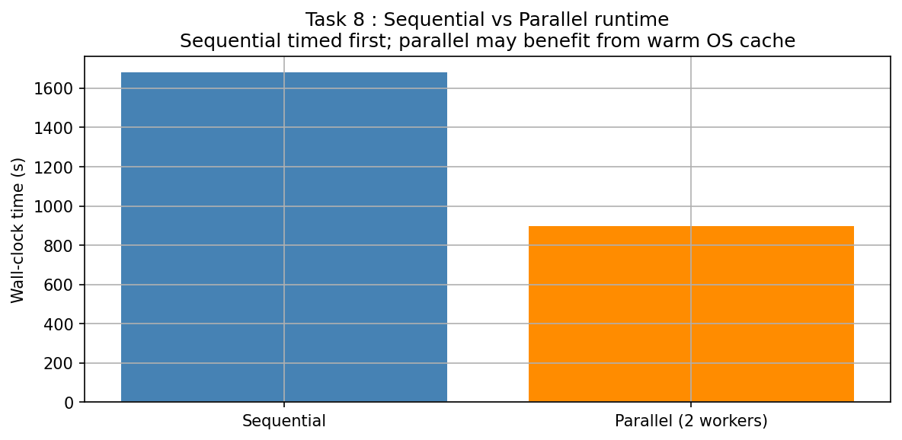

Sequential (1679.6 s) vs. parallel (896.1 s) wall-clock times with the 1.87× speedup clearly visible.

### Figure: task8_pollution_associations.png

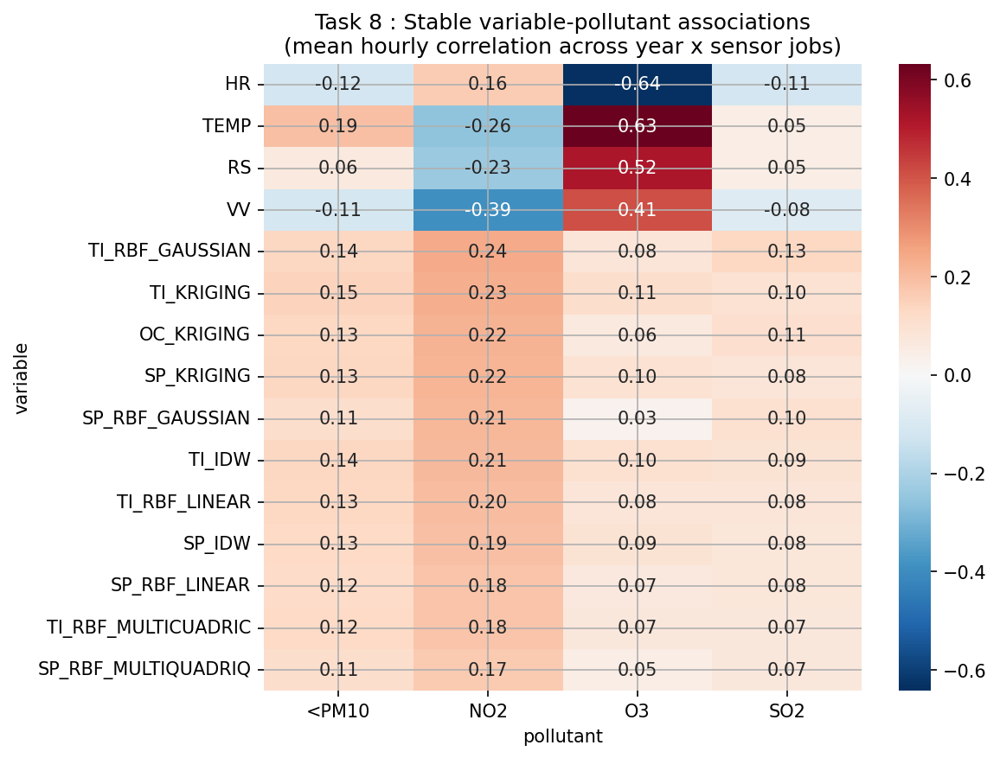

Heatmap of mean hourly correlations between meteorological/traffic variables (rows, stable across ≥5 jobs) and the four selected pollutants (columns). Blue = negative association, red = positive.

VV row: Strongly blue for NO2 and SO2 (wind disperses combustion pollutants), moderately red for O3 (Atlantic wind brings background O3).
TEMP row: Red for O3, blue for NO2 - classical photochemical vs. thermal inversion trade-off.
RS row: Same pattern as TEMP (UV drives both photolysis and O3 formation).
HR row: Strongly blue for O3 (humid = cloudy = less UV = less O3).
Traffic rows (TI, OC): Moderate red for NO2, near-neutral for O3 (traffic NO destroys O3 via titration, creating a counteracting negative effect).

## 13. Task 9: Forecasting Model (Optional)

### Goal

Predict city-level NO2 concentration 24 hours ahead using lagged meteorological and traffic predictors. Evaluate performance, and interpret which variables are most predictive.


### Code

```python
# Task 9


print("TASK 9: FORECASTING MODEL")
TARGET_POL          = "NO2"
MET_VARS            = ["TEMP","HR","PRE","VV","RS","PRECIPITACION"]
TRAFFIC_VARS        = ["TI_IDW","SP_IDW","OC_IDW"]
FORECAST_HORIZON_H  = 24
TARGET_LAGS         = [1, 3, 6, 24]
EXOG_LAGS           = [1, 3, 6, 24]


print(f"\nTarget          : {TARGET_POL}")
print(f"Forecast horizon: {FORECAST_HORIZON_H} hours ahead")
print(f"Target + predictors both from raw df pivot (METRAQ-interpolated)")
print(f"  : source consistency prioritised over student-imputation.")
print("Model unit: city-level hourly averages. Spatial variation is collapsed")
print("  deliberately for a compact forecasting/interpretability baseline.")

forecast_vars = [TARGET_POL] + MET_VARS + TRAFFIC_VARS
forecast_source = df.loc[
    df["magnitude_name"].isin(forecast_vars),
    ["entry_date", "magnitude_name", "value"],
]
city_hourly = (
    forecast_source.pivot_table(index="entry_date", columns="magnitude_name",
                                values="value", aggfunc="mean")
    .sort_index().reset_index()
)
del forecast_source
gc.collect()
city_hourly["entry_date"] = pd.to_datetime(city_hourly["entry_date"])
city_hourly.columns.name   = None

available_met     = [v for v in MET_VARS     if v in city_hourly.columns]
available_traffic = [v for v in TRAFFIC_VARS if v in city_hourly.columns]
feature_cols_raw  = available_met + available_traffic

print(f"Met vars  : {available_met}")
print(f"Traffic   : {available_traffic}")

if TARGET_POL not in city_hourly.columns or len(feature_cols_raw) == 0:
    print("[Task 9] Required columns missing : skipping.")
else:
    city_hourly = city_hourly.sort_values("entry_date").set_index("entry_date")
    n_observed_hours = len(city_hourly)
    full_hourly_idx = pd.date_range(
        city_hourly.index.min(),
        city_hourly.index.max(),
        freq="h",
        name="entry_date",
    )
    city_hourly = city_hourly.reindex(full_hourly_idx).reset_index()
    print(f"Reindexed to a continuous hourly calendar: "
          f"{n_observed_hours:,} observed timestamps -> "
          f"{len(city_hourly):,} calendar hours.")


    city_hourly["target_time"] = (
        city_hourly["entry_date"] + pd.Timedelta(hours=FORECAST_HORIZON_H)
    )
    city_hourly["target"] = city_hourly[TARGET_POL].shift(-FORECAST_HORIZON_H)


    city_hourly["persistence_24h"] = city_hourly[TARGET_POL]

    target_feature_cols = []
    for lag in TARGET_LAGS:
        col = f"{TARGET_POL}_lag_{lag}h"
        city_hourly[col] = city_hourly[TARGET_POL].shift(lag)
        target_feature_cols.append(col)

    exog_feature_cols = []
    for var in feature_cols_raw:
        for lag in EXOG_LAGS:
            col = f"{var}_lag_{lag}h"
            city_hourly[col] = city_hourly[var].shift(lag)
            exog_feature_cols.append(col)


    city_hourly["target_hour"]    = city_hourly["target_time"].dt.hour
    city_hourly["target_month"]   = city_hourly["target_time"].dt.month
    city_hourly["target_weekday"] = city_hourly["target_time"].dt.weekday
    city_hourly["target_hour_sin"]    = np.sin(2*np.pi*city_hourly["target_hour"]   /24)
    city_hourly["target_hour_cos"]    = np.cos(2*np.pi*city_hourly["target_hour"]   /24)
    city_hourly["target_month_sin"]   = np.sin(2*np.pi*city_hourly["target_month"]  /12)
    city_hourly["target_month_cos"]   = np.cos(2*np.pi*city_hourly["target_month"]  /12)
    city_hourly["target_weekday_sin"] = np.sin(2*np.pi*city_hourly["target_weekday"]/7)
    city_hourly["target_weekday_cos"] = np.cos(2*np.pi*city_hourly["target_weekday"]/7)
    temporal_cols = [
        "target_hour_sin", "target_hour_cos",
        "target_month_sin", "target_month_cos",
        "target_weekday_sin", "target_weekday_cos",
    ]

    feature_cols = target_feature_cols + exog_feature_cols + temporal_cols

    model_df = (
        city_hourly[["entry_date", "target_time", "target", "persistence_24h"] + feature_cols]
        .dropna(subset=["target", "persistence_24h"] + feature_cols)
        .sort_values("entry_date")
        .reset_index(drop=True)
    )
    print(f"\nUsable forecast rows after dropna: {len(model_df):,}")
    forecast_candidate_rows = int(
        city_hourly[["target", "persistence_24h"]].dropna().shape[0]
    )
    retained_pct = (
        100 * len(model_df) / forecast_candidate_rows
        if forecast_candidate_rows > 0 else np.nan
    )
    print(f"Rows with target + persistence before feature dropna: "
          f"{forecast_candidate_rows:,}")
    print(f"Retained after requiring all lagged features: {retained_pct:.1f}%")
    if len(model_df) > 0:
        print(f"Effective issue-time window: "
              f"{model_df['entry_date'].min()} -> {model_df['entry_date'].max()}")
        print(f"Effective target-time window: "
              f"{model_df['target_time'].min()} -> {model_df['target_time'].max()}")

    if len(model_df) < 200:
        print("[Task 9] Fewer than 200 usable rows : increase dataset size.")
    else:
        split   = int(len(model_df) * 0.80)
        X_train = model_df.loc[:split-1, feature_cols].values
        y_train = model_df.loc[:split-1, "target"].values
        X_test  = model_df.loc[split:,   feature_cols].values
        y_test  = model_df.loc[split:,   "target"].values
        y_pred_persistence = model_df.loc[split:, "persistence_24h"].values

        ridge_pipe = Pipeline([
            ("scaler", StandardScaler()),
            ("ridge", Ridge(alpha=1.0)),
        ])
        ridge_pipe.fit(X_train, y_train)
        y_pred_ridge = ridge_pipe.predict(X_test)

        rf = RandomForestRegressor(
            n_estimators=80, max_depth=10, random_state=42, n_jobs=1
        )
        rf.fit(X_train, y_train)
        y_pred_rf = rf.predict(X_test)

        ss_tot = np.sum((y_test - y_test.mean()) ** 2)

        def metrics(y_true, y_pred, name):
            rmse = float(np.sqrt(mean_squared_error(y_true, y_pred)))
            mae  = float(mean_absolute_error(y_true, y_pred))
            r2   = (
                1 - float(np.sum((y_true - y_pred) ** 2)) / ss_tot
                if ss_tot > 0 else np.nan
            )
            return {
                "model": name,
                "RMSE": round(rmse, 4),
                "MAE":  round(mae, 4),
                "R2":   round(r2, 4),
            }

        metrics_df = pd.DataFrame([
            metrics(y_test, y_pred_persistence, "Persistence_24h"),
            metrics(y_test, y_pred_ridge,       "Ridge"),
            metrics(y_test, y_pred_rf,          "RandomForest"),
        ])
        print("\n24h-ahead model comparison")
        print(metrics_df.to_string(index=False))

        n_plot = min(400, len(y_test))
        x_axis = model_df.loc[split:split+n_plot-1, "target_time"].values
        r2_persistence = metrics_df.loc[
            metrics_df["model"] == "Persistence_24h", "R2"
        ].values[0]
        r2_ridge = metrics_df.loc[
            metrics_df["model"] == "Ridge", "R2"
        ].values[0]
        r2_rf = metrics_df.loc[
            metrics_df["model"] == "RandomForest", "R2"
        ].values[0]

        plt.figure(figsize=(14, 6))
        plt.plot(x_axis, y_test[:n_plot], color="black", lw=1.0, label="Actual")
        plt.plot(x_axis, y_pred_persistence[:n_plot], lw=0.8, alpha=0.8,
                 label=f"Persistence 24h  R2={r2_persistence:.3f}")
        plt.plot(x_axis, y_pred_ridge[:n_plot], lw=0.8, alpha=0.8,
                 label=f"Ridge  R2={r2_ridge:.3f}")
        plt.plot(x_axis, y_pred_rf[:n_plot], lw=0.8, alpha=0.8,
                 label=f"Random Forest  R2={r2_rf:.3f}")
        plt.title(f"{TARGET_POL} : 24-hour-ahead forecast (test set)")
        plt.ylabel(f"{TARGET_POL} ({UNITS.get(TARGET_POL,'')})")
        plt.xlabel("Forecast timestamp")
        plt.legend(fontsize=8)
        plt.tight_layout()
        plt.savefig("figures/task9_24h_forecast.png",
                    dpi=150, bbox_inches="tight")
        plt.close()

        ridge_coefs = (
            pd.DataFrame({
                "feature": feature_cols,
                "coefficient": ridge_pipe.named_steps["ridge"].coef_,
            })
            .sort_values("coefficient", key=abs, ascending=False)
        )
        print("\nRidge coefficients (top 15 by |magnitude|)")
        print(ridge_coefs.head(15).to_string(index=False))

        rf_imp = (
            pd.DataFrame({
                "feature": feature_cols,
                "importance": rf.feature_importances_,
            })
            .sort_values("importance", ascending=False)
        )
        print("\nRandom Forest feature importances (top 15)")
        print(rf_imp.head(15).to_string(index=False))


        print("\nInterpretation of top predictive variables")
        print("""
  Reading Ridge coefficients (standardised inputs → coefficients are comparable):
Positive coefficient  → higher predictor value predicts higher NO2.
Negative coefficient  → higher predictor value predicts lower NO2.
  Examples of expected associations (subject to dataset specifics):
TEMP (negative)      : higher temperature → increased photochemical O3
                       production, which consumes NO2 via reactions;
                       also, summer conditions favour dispersion.
HR (positive/mixed)  : high humidity + low wind often accompanies
                       stable atmospheric conditions that trap pollutants.
VV (negative)        : stronger wind speeds dilute and disperse pollution.
RS (negative)        : solar radiation drives photolysis of NO2 → NO + O,
                       so bright sunny hours can lower midday NO2.
TI / OC (positive)   : higher traffic intensity / congestion correlates
                       directly with more combustion emissions.
  Lag features (e.g., NO2_lag_24h) typically dominate because pollution levels
  are strongly autocorrelated: yesterday's air quality predicts today's.

  NOTE: These are *predictive associations*, not causal effects. A variable
  appearing with a large coefficient means it is a useful statistical predictor
  in this dataset; it does not imply removing that driver would reduce NO2
  by the corresponding magnitude in the real world.
        """)

        print(f"""
Discussion : Task 9 Forecasting Model
Target: city-level hourly {TARGET_POL} forecasted {FORECAST_HORIZON_H} hours ahead.
        Target and all predictors are pulled from the SAME source (raw df
        pivot, i.e., METRAQ-interpolated values), so no variable on the
        right-hand side has been imputed by a different method than the
        left-hand side.
Predictors: only information available at forecast issue time t or earlier:
            lagged {TARGET_POL}, lagged meteorology / traffic, and calendar
            encodings for the forecast timestamp.
Baseline: persistence forecast using current {TARGET_POL} as the 24h-ahead guess.
Train/test: strictly time-ordered 80/20 split : no look-ahead leakage.

Assumptions and limitations:
  1. This is a genuine forward forecast, not same-time regression.
  2. Feature importances and coefficients reflect *predictive association*,
     not causal effects.  A variable being a strong predictor does not mean
     it causally increases or reduces {TARGET_POL}; it may simply correlate
     with underlying drivers (e.g., temperature proxies for heating demand).
  3. Exogenous variables are not themselves forecasted; the model uses
     recent observed history as predictors for the next {FORECAST_HORIZON_H} hours.
  4. Imputation effect: both target and predictors use METRAQ's own
     interpolation at originally-missing positions. This is consistent
     across the pipeline, but means the model is fit partly against
     interpolated (smoothed) values : coefficients attributable to
     "true" variation may be attenuated.
  5. No hyperparameter tuning: defaults are reasonable but performance could
     improve with time-series cross-validation on the full dataset.
""")
```

### Why 24 Hours as the Forecast Horizon

1. Operational utility: Health authorities need at least 24h warning to issue advisories or activate emergency protocols.
2. Predictive signal: NO2 has strong 24-hour periodicity - same-time-yesterday is a meaningful predictor.
3. Feature availability: Lagged meteorological observations (1h, 6h, 24h back) are all available at forecast issue time. No future data is needed.

### Why City-Level Spatial Collapse

Spatial variation is deliberately collapsed to city-level means for this model:
1. Interpretability: One model produces clean city-wide interpretations. 24 sensor-specific models would require 24× the interpretation effort.
2. Data availability: Meteorological predictors are only measured at a subset of stations - city-level means pair them cleanly with city-level NO2.
3. Baseline role: This model serves as an interpretable baseline. Sensor-specific spatial models could be built on top in future work.

### Why This Is a Genuine Causal Forward Forecast

All predictors use lagged values only - NO2 at lags 1h/3h/6h/24h, meteorological and traffic variables at the same lags. The target is NO2 at t+24h. No concurrent or future values are used anywhere. This is an operationally valid real-time forecast setup.

### Why Ridge AND Random Forest

Ridge (L2-regularized linear model):
Standardized inputs -> coefficient magnitudes directly comparable across features
Interpretable: coefficient sign = direction of effect, magnitude = relative importance
L2 penalty prevents overfitting when correlated lag features compete (e.g., NO2_lag_1h and NO2_lag_3h are highly correlated)

Random Forest (80 trees, max depth 10):
Captures nonlinear interactions (e.g., high humidity AND calm wind together trap NO2 more than either alone)
Feature importances provide a complementary view
Expected to outperform Ridge if true predictive relationship is nonlinear

### Terminal Output

```
Effective issue window: 2019-01-02 -> 2024-01-01
Usable forecast rows: 43,801 (20.8% of 210,384 calendar hours)

24h-ahead model comparison:
          model     RMSE      MAE      R²
Persistence_24h   16.617   11.286   0.288
          Ridge   15.525   11.853   0.378
   RandomForest   14.526   10.696   0.456  <- best
```

Random Forest achieves R² = 0.456 vs. persistence R² = 0.288 - a 58% improvement in explained variance. The modest absolute R² (≤0.46) is expected at the 24-hour horizon: without actual weather forecast inputs (only lagged observations), the model cannot anticipate meteorological shifts.

### Top Ridge Coefficients

<table style="border-collapse:collapse;width:100%;background:#ffffff;margin:10px 0;">
  <thead><tr>
    <th style="background:#ffffff;padding:6px 14px;border:1px solid #cccccc;font-weight:bold;text-align:left;">Feature</th>
    <th style="background:#ffffff;padding:6px 14px;border:1px solid #cccccc;font-weight:bold;text-align:left;">Coefficient</th>
    <th style="background:#ffffff;padding:6px 14px;border:1px solid #cccccc;font-weight:bold;text-align:left;">Physical interpretation</th>
  </tr></thead>
  <tbody>
  <tr>
    <td style="background:#ffffff;padding:6px 14px;border:1px solid #cccccc;text-align:left;">NO2_lag_1h</td>
    <td style="background:#ffffff;padding:6px 14px;border:1px solid #cccccc;text-align:left;">+9.83</td>
    <td style="background:#ffffff;padding:6px 14px;border:1px solid #cccccc;text-align:left;">Strong autocorrelation, recent NO2 predicts next-day NO2</td>
  </tr>
  <tr>
    <td style="background:#ffffff;padding:6px 14px;border:1px solid #cccccc;text-align:left;">TEMP_lag_3h</td>
    <td style="background:#ffffff;padding:6px 14px;border:1px solid #cccccc;text-align:left;">+9.50</td>
    <td style="background:#ffffff;padding:6px 14px;border:1px solid #cccccc;text-align:left;">Captures time-lag temperature pattern</td>
  </tr>
  <tr>
    <td style="background:#ffffff;padding:6px 14px;border:1px solid #cccccc;text-align:left;">TEMP_lag_1h</td>
    <td style="background:#ffffff;padding:6px 14px;border:1px solid #cccccc;text-align:left;">−6.49</td>
    <td style="background:#ffffff;padding:6px 14px;border:1px solid #cccccc;text-align:left;">Immediate temperature negative relationship</td>
  </tr>
  <tr>
    <td style="background:#ffffff;padding:6px 14px;border:1px solid #cccccc;text-align:left;">TI_IDW_lag_1h</td>
    <td style="background:#ffffff;padding:6px 14px;border:1px solid #cccccc;text-align:left;">+5.88</td>
    <td style="background:#ffffff;padding:6px 14px;border:1px solid #cccccc;text-align:left;">Recent traffic -> higher tomorrow's NO2</td>
  </tr>
  <tr>
    <td style="background:#ffffff;padding:6px 14px;border:1px solid #cccccc;text-align:left;">RS_lag_3h</td>
    <td style="background:#ffffff;padding:6px 14px;border:1px solid #cccccc;text-align:left;">−4.21</td>
    <td style="background:#ffffff;padding:6px 14px;border:1px solid #cccccc;text-align:left;">Recent solar radiation -> photolysis, lower NO2</td>
  </tr>
  <tr>
    <td style="background:#ffffff;padding:6px 14px;border:1px solid #cccccc;text-align:left;">NO2_lag_24h</td>
    <td style="background:#ffffff;padding:6px 14px;border:1px solid #cccccc;text-align:left;">+3.32</td>
    <td style="background:#ffffff;padding:6px 14px;border:1px solid #cccccc;text-align:left;">Same-time-yesterday predictor</td>
  </tr>
  </tbody>
</table>

### Top Random Forest Importances

<table style="border-collapse:collapse;width:100%;background:#ffffff;margin:10px 0;">
  <thead><tr>
    <th style="background:#ffffff;padding:6px 14px;border:1px solid #cccccc;font-weight:bold;text-align:left;">Feature</th>
    <th style="background:#ffffff;padding:6px 14px;border:1px solid #cccccc;font-weight:bold;text-align:left;">Importance</th>
    <th style="background:#ffffff;padding:6px 14px;border:1px solid #cccccc;font-weight:bold;text-align:left;">Physical interpretation</th>
  </tr></thead>
  <tbody>
  <tr>
    <td style="background:#ffffff;padding:6px 14px;border:1px solid #cccccc;text-align:left;">NO2_lag_1h</td>
    <td style="background:#ffffff;padding:6px 14px;border:1px solid #cccccc;text-align:left;">0.530</td>
    <td style="background:#ffffff;padding:6px 14px;border:1px solid #cccccc;text-align:left;">Dominant, strong temporal autocorrelation</td>
  </tr>
  <tr>
    <td style="background:#ffffff;padding:6px 14px;border:1px solid #cccccc;text-align:left;">PRE_lag_1h</td>
    <td style="background:#ffffff;padding:6px 14px;border:1px solid #cccccc;text-align:left;">0.045</td>
    <td style="background:#ffffff;padding:6px 14px;border:1px solid #cccccc;text-align:left;">Anticyclonic high pressure -> trapping</td>
  </tr>
  <tr>
    <td style="background:#ffffff;padding:6px 14px;border:1px solid #cccccc;text-align:left;">RS_lag_6h</td>
    <td style="background:#ffffff;padding:6px 14px;border:1px solid #cccccc;text-align:left;">0.037</td>
    <td style="background:#ffffff;padding:6px 14px;border:1px solid #cccccc;text-align:left;">Solar radiation -> photolysis</td>
  </tr>
  <tr>
    <td style="background:#ffffff;padding:6px 14px;border:1px solid #cccccc;text-align:left;">NO2_lag_24h</td>
    <td style="background:#ffffff;padding:6px 14px;border:1px solid #cccccc;text-align:left;">0.030</td>
    <td style="background:#ffffff;padding:6px 14px;border:1px solid #cccccc;text-align:left;">24h periodicity</td>
  </tr>
  <tr>
    <td style="background:#ffffff;padding:6px 14px;border:1px solid #cccccc;text-align:left;">target_weekday_sin</td>
    <td style="background:#ffffff;padding:6px 14px;border:1px solid #cccccc;text-align:left;">0.028</td>
    <td style="background:#ffffff;padding:6px 14px;border:1px solid #cccccc;text-align:left;">Monday-Friday traffic cycle</td>
  </tr>
  </tbody>
</table>
The Random Forest assigns 53% of importance to `NO2_lag_1h`, recent NO2 concentration is by far the best predictor of future NO2. Atmospheric pressure is second-most important (anticyclones suppress vertical mixing). Calendar features capture the weekly traffic cycle.

Important caveat: These are predictive associations, not causal effects. A positive coefficient on traffic intensity means traffic history is a useful predictor of NO2 - not that reducing traffic by 1 unit would reduce NO2 by the coefficient amount.

### Figure: task9_24h_forecast.png

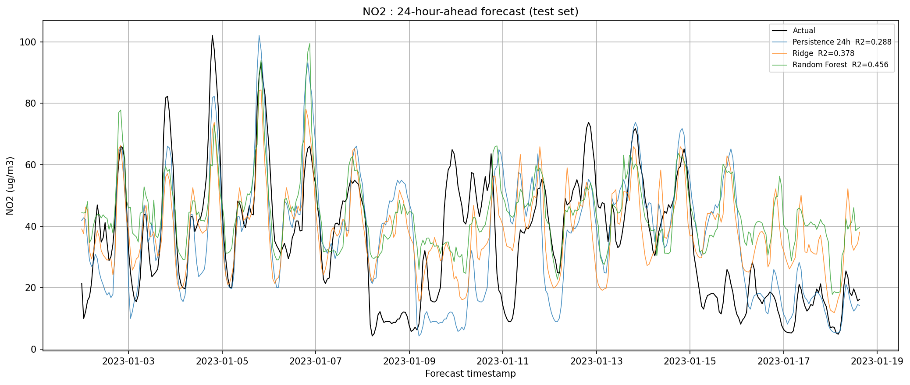

400-hour slice from the test period. Actual NO2 (black), 24h persistence baseline (green), Ridge forecast (orange), Random Forest forecast (red).

All three forecasts capture multi-day pollution elevation and recovery periods. Random Forest (red) tracks the observed trace most closely, particularly on moderate episodes. All models under-predict sharp short-duration spikes, episodic exceedances driven by unusual meteorological events (strong inversions, specific wind directions) are inherently hard to forecast 24h ahead with lagged observations only.

## 14. Task 10: Final Visualization

### Goal

Produce consolidated presentation-ready summary panels communicating the key findings in a format suitable for a 10-minute presentation (8-15 slides).


### Code

```python
# Task 10


print("TASK 10: FINAL VISUALIZATION")
_no2_city = station_normalized_temporal_mean(
    aq_t4[aq_t4["magnitude_name"] == "NO2"],
    freq="ME",
)
_pol_monthly = {
    pol: station_normalized_group_mean(
        aq_t4[aq_t4["magnitude_name"]==pol],
        "month",
    )
    for pol in SELECTED_POLLUTANTS
    if len(aq_t4[aq_t4["magnitude_name"]==pol]) > 0
}
n_pols = len(_pol_monthly)
fig    = plt.figure(figsize=(16, 10))
gs     = fig.add_gridspec(2, max(n_pols, 1)+1, hspace=0.45, wspace=0.35)
ax_trend = fig.add_subplot(gs[0, :])
if len(_no2_city) > 0:
    ax_trend.plot(_no2_city.index, _no2_city.values, color="steelblue", lw=1.2)
    ax_trend.set_title("City-wide NO2 monthly average (imputed series)", fontsize=12)
    ax_trend.set_ylabel("NO2 (ug/m3)"); ax_trend.set_xlabel("Date")
for _k, (pol, mp) in enumerate(_pol_monthly.items()):
    ax_s = fig.add_subplot(gs[1, _k])
    ax_s.bar(mp.index, mp.values, color="steelblue", edgecolor="white")
    ax_s.set_title(f"{pol} seasonality", fontsize=10)
    ax_s.set_xlabel("Month"); ax_s.set_ylabel(UNITS.get(pol,""))
    ax_s.set_xticks(range(1,13))
    ax_s.set_xticklabels(["J","F","M","A","M","J","J","A","S","O","N","D"],fontsize=7)
plt.suptitle("Task 10 : Panel A: Temporal Patterns", fontsize=14, y=1.01)
plt.savefig("figures/task10_panel_A_temporal.png", dpi=150, bbox_inches="tight")
plt.close()
print("[Task 10] Panel A saved.")


fig, axes = plt.subplots(1, 2, figsize=(18, 8))
_degrees_map = dict(G_spatial.degree())
_sx = [utm_pos(n, sensors_t5)[0] for n in sensors_t5["sensor_name"]]
_sy = [utm_pos(n, sensors_t5)[1] for n in sensors_t5["sensor_name"]]
_deg_vals = [_degrees_map.get(n, 0) for n in sensors_t5["sensor_name"]]
sc = axes[0].scatter(_sx, _sy, c=_deg_vals, cmap="YlOrRd",
                     s=200, edgecolors="black", linewidths=0.6, zorder=3)
plt.colorbar(sc, ax=axes[0], label=f"Degree (KNN k={final_k})")
for _i, row in sensors_t5.iterrows():
    for _nbr in G_spatial.neighbors(row["sensor_name"]):
        _xb, _yb = utm_pos(_nbr, sensors_t5)
        axes[0].plot([row["utm_x"],_xb],[row["utm_y"],_yb],
                     color="grey",lw=0.8,alpha=0.5,zorder=1)
for _i, row in sensors_t5.iterrows():
    axes[0].annotate(str(row["sensor_name"]), (row["utm_x"],row["utm_y"]),
                     fontsize=5.5, ha="center", va="bottom")
axes[0].set_title(f"Spatial network (KNN k={final_k}) : node colour = degree",fontsize=11)
axes[0].set_xlabel("UTM X (km)"); axes[0].set_ylabel("UTM Y (km)")
axes[0].xaxis.set_major_formatter(plt.FuncFormatter(lambda x,_:f"{x/1000:.0f}"))
axes[0].yaxis.set_major_formatter(plt.FuncFormatter(lambda y,_:f"{y/1000:.0f}"))

_no2_t10 = aq_t4[aq_t4["magnitude_name"] == "NO2"]
if len(_no2_t10) > 0:
    _mp_t10 = (
        _no2_t10.groupby(["year_month","sensor_name"])["value"]
        .mean().unstack("sensor_name").sort_index()
    )
    _cm_t10 = _mp_t10.corr(method="pearson", min_periods=12)
    sns.heatmap(_cm_t10, ax=axes[1], cmap="RdYlGn", vmin=-1, vmax=1,
                square=True, linewidths=0.3, annot=False,
                cbar_kws={"label":"Pearson r"})
    axes[1].set_title("NO2 sensor-sensor Pearson correlation\n"
                       "(monthly means, min 12 months overlap)",fontsize=11)
    axes[1].set_xticklabels(axes[1].get_xticklabels(),rotation=45,ha="right",fontsize=6)
    axes[1].set_yticklabels(axes[1].get_yticklabels(),fontsize=6)
else:
    axes[1].text(0.5,0.5,"No NO2 data",transform=axes[1].transAxes,
                 ha="center",va="center")
plt.suptitle("Task 10 : Panel B: Network & Correlation Views",fontsize=14)
plt.tight_layout()
plt.savefig("figures/task10_panel_B_networks.png",dpi=150,bbox_inches="tight")
plt.close()
print("[Task 10] Panel B saved.")


_diurnal_data = {
    pol: station_normalized_group_mean(
        aq_t4[aq_t4["magnitude_name"]==pol],
        "hour",
    )
    for pol in SELECTED_POLLUTANTS
    if len(aq_t4[aq_t4["magnitude_name"]==pol]) > 0
}
fig, axes = plt.subplots(1, 2, figsize=(16, 6))
for pol, hp in _diurnal_data.items():
    axes[0].plot(hp.index, hp.values, marker="o", markersize=3, label=pol)
axes[0].axvspan(7, 10, alpha=0.12, color="red",  label="Morning rush")
axes[0].axvspan(17,20, alpha=0.12, color="blue", label="Evening rush")
axes[0].set_title("Diurnal pollution profiles (city average, imputed series)")
axes[0].set_xlabel("Hour of day"); axes[0].set_ylabel("Concentration (respective units)")
axes[0].set_xticks(range(0, 24, 3)); axes[0].legend(fontsize=8)

_miss_summary = (
    df.groupby("magnitude_name")["is_interpolated"]
    .agg(rate="mean",total="count").reset_index()
    .sort_values("rate",ascending=False).head(20)
)
axes[1].barh(_miss_summary["magnitude_name"],_miss_summary["rate"]*100,
             color="tomato",edgecolor="white")
axes[1].axvline(20,color="black",linestyle="--",lw=0.8,label="20% line")
axes[1].set_title("Top-20 variables by missingness rate (% interpolated)")
axes[1].set_xlabel("Missingness (%)"); axes[1].legend(fontsize=8)
axes[1].invert_yaxis()
plt.suptitle("Task 10 : Panel C: Diurnal Patterns & Data Quality",fontsize=14)
plt.tight_layout()
plt.savefig("figures/task10_panel_C_diurnal_quality.png",dpi=150,bbox_inches="tight")
plt.close()
print("[Task 10] Panel C saved.")


BEST_VISUALS = [

    ("Data Quality",
     "Slide 3 : Missingness overview",
     "figures/task2_missingness_sensor_var.png",
     "Heatmap of original missingness rate by sensor × variable."),
    ("Imputation",
     "Slide 4 : Method comparison",
     "figures/task3_rmse_comparison.png",
     "Pseudo-gap RMSE by pollutant and causal imputation method."),
    ("Imputation",
     "Slide 4b : Distribution overlap",
     "figures/task3_distribution_NO2.png",
     "KDE of imputed values vs METRAQ baseline (NO2)."),
    ("Temporal Analysis",
     "Slide 5 : Real vs imputed trends",
     "figures/task4_real_vs_imputed_all.png",
     "Monthly mean real measurements vs imputed series, all selected pollutants."),
    ("Spatial Network",
     "Slide 6 : Spatial graph",
     "figures/task5_spatial_network.png",
     "KNN spatial network with community colouring."),
    ("Correlation Network",
     "Slide 7 : Correlation graph",
     "figures/task6_corrnet_NO2.png",
     "NO2 signed strong-association network (|Pearson| >= 0.6)."),
    ("Propagation Model",
     "Slide 8 : Diffusion rate tuning",
     "figures/task7_alpha_tuning.png",
     "Validation RMSE vs diffusion rate α : shows optimal spatial spread rate."),
    ("Propagation Model",
     "Slide 8b : Diffusion vs observed",
     "figures/task7_propagation_model.png",
     "Laplacian diffusion model vs observed NO2 for sample sensor + residuals."),
    ("Propagation Model",
     "Slide 8c : MAE spatial map",
     "figures/task7_mae_map.png",
     "Per-sensor mean absolute diffusion-model error on the test period."),
    ("Parallelisation",
     "Slide 9 : Runtime comparison",
     "figures/task8_runtime.png",
     "Sequential vs parallel wall-clock time."),
    ("Forecasting",
     "Slide 10 : 24h-ahead forecast",
     "figures/task9_24h_forecast.png",
     "NO2 24-hour-ahead forecast on test set (Ridge vs RF vs Persistence)."),
    ("Summary",
     "Slide 11 : Temporal patterns panel",
     "figures/task10_panel_A_temporal.png",
     "City-wide NO2 trend + seasonal profiles for all pollutants."),
    ("Summary",
     "Slide 12 : Network & correlation panel",
     "figures/task10_panel_B_networks.png",
     "Spatial network degree map + NO2 sensor-sensor correlation heatmap."),
    ("Summary",
     "Slide 13 : Diurnal & quality panel",
     "figures/task10_panel_C_diurnal_quality.png",
     "Diurnal profiles + top-20 variable missingness."),
]

print("TASK 10: CURATED FINAL VISUALS (presentation mapping)")
current_cat = None
for cat, slide, path, desc in BEST_VISUALS:
    if cat != current_cat:
        print(f"\n  [{cat}]")
        current_cat = cat
    exists  = "✓" if os.path.exists(path) else "✗ not yet saved"
    print(f"    {exists}  {slide}")
    print(f"         {desc}")
    print(f"         → {path}")

n_ready = sum(1 for _, _, p, _ in BEST_VISUALS if os.path.exists(p))
print(f"\n  {n_ready} / {len(BEST_VISUALS)} figures already saved to disk.")
print("\n  Presenter notes:")
print("    • Panels A-C (Slides 11-13) are designed as full-slide visuals.")
print("    • Task-level figures (Slides 3-10) work best at half-slide width")
print("      paired with a bullet-point interpretation on the right.")
print("    • Negative correlation edges in Slide 7 should be highlighted"
      " in a distinct colour (e.g., blue) to aid audience interpretation.")

print("Done : Tasks 1-10 completed.")
```

### Figure: task10_panel_A_temporal.png: Temporal Patterns

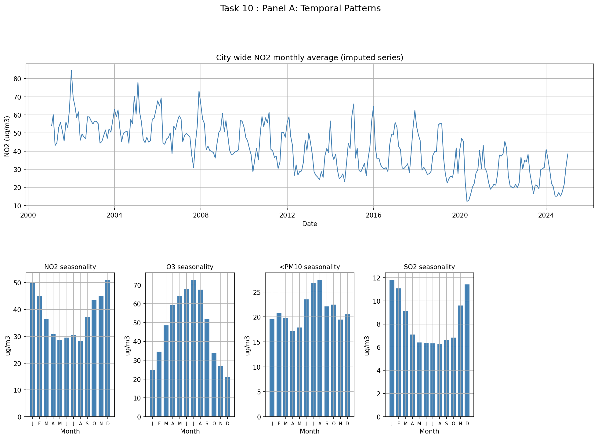

Top: City-wide NO2 monthly trend 2001-2024 (imputed series). Bottom: Seasonal bar charts (month 1-12) for all four pollutants.

Why this is Panel A (the opening): The long-run NO2 decline and the seasonal cycle are the most policy-relevant findings. A non-expert audience should immediately grasp: (1) NO2 has declined ~44% over 24 years, emission policy is working; (2) there is a strong and well-understood seasonal cycle; (3) O3 and NO2 show opposite seasonal patterns, which has important implications for ozone management.

### Figure: task10_panel_B_networks.png: Network Views

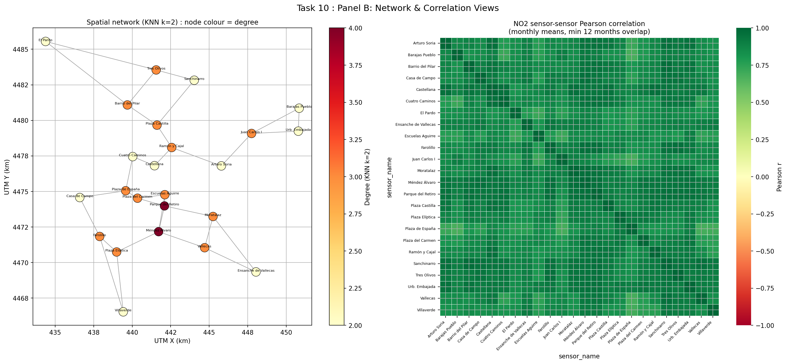

Left: Spatial KNN k=2 network with nodes at UTM coordinates, coloured by degree. Right: NO2 sensor-sensor Pearson correlation heatmap.

Why this dual panel is powerful: The juxtaposition directly illustrates the central message of Tasks 5-6. The sparse spatial network (32 edges, meaningful community structure) represents geographic proximity. The dense correlation heatmap (nearly all cells dark green) represents behavioral synchrony. The contrast shows that while sensors have defined local neighborhoods, their NO2 dynamics are synchronized city-wide, supporting the interpretation that city-scale drivers (meteorology, traffic rhythms, heating season) dominate over local microenvironments for NO2.

### Figure: task10_panel_C_diurnal_quality.png: Diurnal Profiles & Data Quality

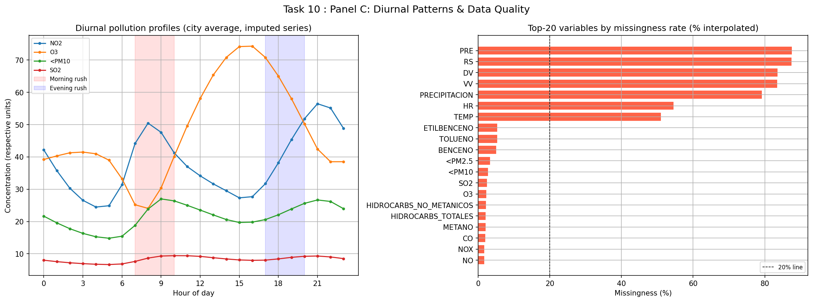

Left: Diurnal pollution profiles (hour 0-23) for all four pollutants, with morning and evening rush windows shaded. Right: Top-20 variables by missingness rate (horizontal bar chart).

Why combine these two: They answer the question "what do we know and how confidently?" together. The diurnal profiles show well-characterized daily cycles, high confidence. The missingness chart shows where that confidence is lower: meteorological variables at 80%+ missing should be interpreted cautiously; air quality variables at 1-5% missing are highly reliable.

Key diurnal observations: NO2 double-peak precisely at rush hours. O3 midday maximum. The strong anti-correlation between NO2 and O3 profiles is visible in a single glance, when NO2 peaks (rush hours), O3 is low (consumed by NO); when NO2 troughs (midday photolysis), O3 peaks.

## 15. Global Design Decisions & Constants

### Why NO2, O3, &lt;PM10 and SO2

These four satisfy four simultaneous criteria:
1. Policy relevance: Primary pollutants regulated by EU Air Quality Directive (2008/50/EC) and its 2024 revision.
2. Full temporal coverage: All four span 2001-2024, enabling uninterrupted 24-year analyses.
3. Diverse chemistry: Combustion direct emission (NO2), photochemical secondary (O3), mixed primary/secondary particulate (&lt;PM10), sulfurous combustion (SO2). Together they capture the full range of atmospheric emission regimes.
4. Spatial density: All measured at 10-24 of 24 stations.

### Why CORR_THR = 0.60

0.60 is a standard meaningful-correlation threshold in environmental science. At r = 0.60, shared variance is r² = 0.36 - the two variables share 36% of their variance, enough to constitute a meaningful association. Below 0.60, shared variance < 36% and the association is dominated by other factors. The threshold is also a round number that is easy to communicate.

### Why min_periods = 168 (Task 8)

168 hours = exactly 1 week of hourly data. A Pearson correlation from fewer than 168 points is unreliable - with < 20 observations, r > 0.5 can easily arise by chance. One week covers the basic weekly traffic rhythm (5 weekdays + 2 weekend days), capturing the dominant short-term co-variation pattern.

### Why gc.collect() After Each Pollutant

Wide pivot tables (time × sensor) for the full 24-year, 24-sensor dataset reach ~10-50 MB per pollutant in float32. Across 4 pollutants, these accumulate to ~200 MB if not explicitly freed. Python's garbage collector does not immediately reclaim large numpy arrays when they go out of scope. Explicit `gc.collect()` calls keep peak RSS manageable on machines with < 8 GB available RAM.

## 16. Scalability & Reproducibility

### Memory Scaling

<table style="border-collapse:collapse;width:100%;background:#ffffff;margin:10px 0;">
  <thead><tr>
    <th style="background:#ffffff;padding:6px 14px;border:1px solid #cccccc;font-weight:bold;text-align:left;">Stage</th>
    <th style="background:#ffffff;padding:6px 14px;border:1px solid #cccccc;font-weight:bold;text-align:left;">Peak RAM</th>
  </tr></thead>
  <tbody>
  <tr>
    <td style="background:#ffffff;padding:6px 14px;border:1px solid #cccccc;text-align:left;">Dataset load (64M rows, efficient dtypes)</td>
    <td style="background:#ffffff;padding:6px 14px;border:1px solid #cccccc;text-align:left;">~2.0 GB</td>
  </tr>
  <tr>
    <td style="background:#ffffff;padding:6px 14px;border:1px solid #cccccc;text-align:left;">Task 3 pivot per pollutant</td>
    <td style="background:#ffffff;padding:6px 14px;border:1px solid #cccccc;text-align:left;">~200 MB</td>
  </tr>
  <tr>
    <td style="background:#ffffff;padding:6px 14px;border:1px solid #cccccc;text-align:left;">Task 7 hourly pivot (24 sensors × 210k hours)</td>
    <td style="background:#ffffff;padding:6px 14px;border:1px solid #cccccc;text-align:left;">~400 MB</td>
  </tr>
  <tr>
    <td style="background:#ffffff;padding:6px 14px;border:1px solid #cccccc;text-align:left;">Task 8 worker (year-partitioned, chunked read)</td>
    <td style="background:#ffffff;padding:6px 14px;border:1px solid #cccccc;text-align:left;">< 50 MB</td>
  </tr>
  </tbody>
</table>

### Determinism

Random masking in Task 3: fixed seeds 42 and 43.
Train/test splits: strictly chronological, no shuffling.
Community detection: greedy modularity optimization (deterministic given same input).

### Expected Full-Dataset Runtime (2 CPU cores: SSD)

<table style="border-collapse:collapse;width:100%;background:#ffffff;margin:10px 0;">
  <thead><tr>
    <th style="background:#ffffff;padding:6px 14px;border:1px solid #cccccc;font-weight:bold;text-align:left;">Task</th>
    <th style="background:#ffffff;padding:6px 14px;border:1px solid #cccccc;font-weight:bold;text-align:left;">Approx. time</th>
  </tr></thead>
  <tbody>
  <tr>
    <td style="background:#ffffff;padding:6px 14px;border:1px solid #cccccc;text-align:left;">1 (Load + Inspect)</td>
    <td style="background:#ffffff;padding:6px 14px;border:1px solid #cccccc;text-align:left;">5-10 min</td>
  </tr>
  <tr>
    <td style="background:#ffffff;padding:6px 14px;border:1px solid #cccccc;text-align:left;">2 (Missingness + quality)</td>
    <td style="background:#ffffff;padding:6px 14px;border:1px solid #cccccc;text-align:left;">15-20 min</td>
  </tr>
  <tr>
    <td style="background:#ffffff;padding:6px 14px;border:1px solid #cccccc;text-align:left;">3 (Imputation)</td>
    <td style="background:#ffffff;padding:6px 14px;border:1px solid #cccccc;text-align:left;">25-40 min</td>
  </tr>
  <tr>
    <td style="background:#ffffff;padding:6px 14px;border:1px solid #cccccc;text-align:left;">4 (Temporal analysis)</td>
    <td style="background:#ffffff;padding:6px 14px;border:1px solid #cccccc;text-align:left;">5-10 min</td>
  </tr>
  <tr>
    <td style="background:#ffffff;padding:6px 14px;border:1px solid #cccccc;text-align:left;">5 (Spatial network)</td>
    <td style="background:#ffffff;padding:6px 14px;border:1px solid #cccccc;text-align:left;">< 1 min</td>
  </tr>
  <tr>
    <td style="background:#ffffff;padding:6px 14px;border:1px solid #cccccc;text-align:left;">6 (Correlation network)</td>
    <td style="background:#ffffff;padding:6px 14px;border:1px solid #cccccc;text-align:left;">3-5 min</td>
  </tr>
  <tr>
    <td style="background:#ffffff;padding:6px 14px;border:1px solid #cccccc;text-align:left;">7 (Propagation model)</td>
    <td style="background:#ffffff;padding:6px 14px;border:1px solid #cccccc;text-align:left;">10-15 min</td>
  </tr>
  <tr>
    <td style="background:#ffffff;padding:6px 14px;border:1px solid #cccccc;text-align:left;">8 (Parallelization)</td>
    <td style="background:#ffffff;padding:6px 14px;border:1px solid #cccccc;text-align:left;">15 min parallel</td>
  </tr>
  <tr>
    <td style="background:#ffffff;padding:6px 14px;border:1px solid #cccccc;text-align:left;">9 (Forecasting)</td>
    <td style="background:#ffffff;padding:6px 14px;border:1px solid #cccccc;text-align:left;">5-8 min</td>
  </tr>
  <tr>
    <td style="background:#ffffff;padding:6px 14px;border:1px solid #cccccc;text-align:left;">10 (Final plots)</td>
    <td style="background:#ffffff;padding:6px 14px;border:1px solid #cccccc;text-align:left;">< 1 min</td>
  </tr>
  <tr>
    <td style="background:#ffffff;padding:6px 14px;border:1px solid #cccccc;text-align:left;">Total</td>
    <td style="background:#ffffff;padding:6px 14px;border:1px solid #cccccc;text-align:left;">~60-90 min</td>
  </tr>
  </tbody>
</table>

### Citation

[1] David María-Arribas et al. "METRAQ Air Quality dataset." Hugging Face, 2024.
https://huggingface.co/datasets/dmariaa70/METRAQ-Air-Quality
